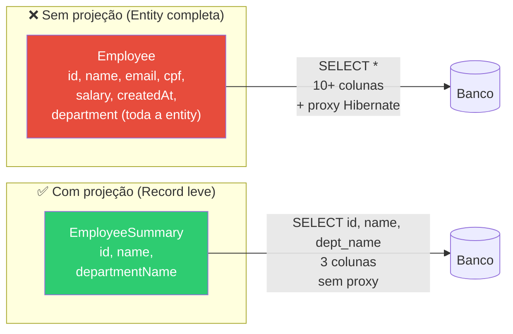
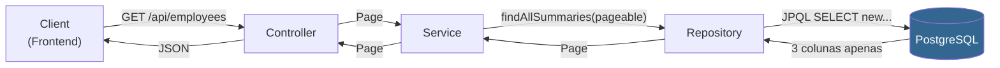
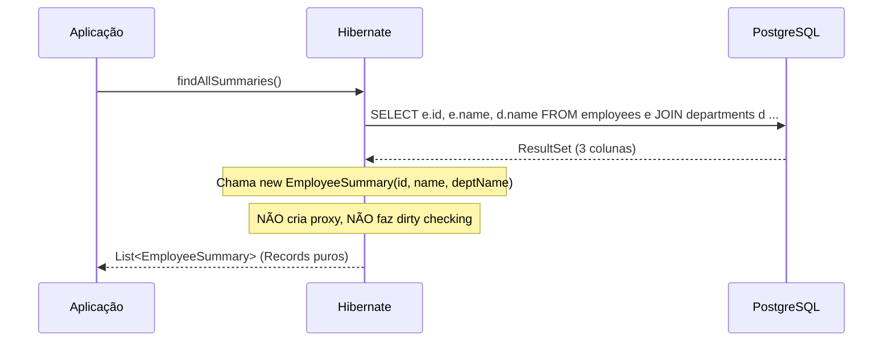
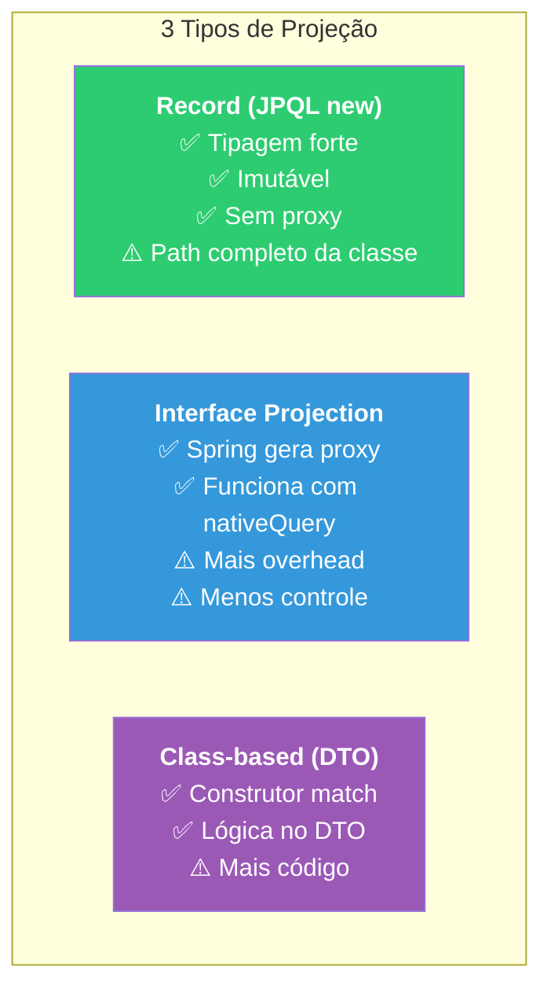
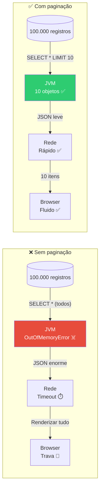
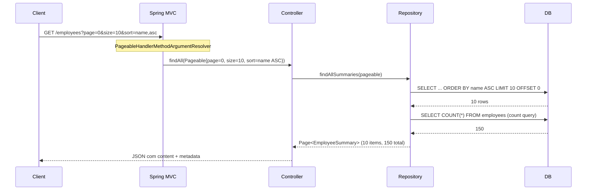
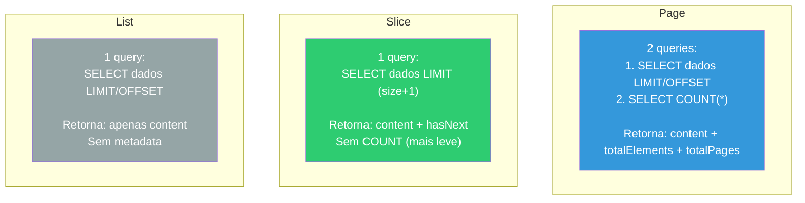
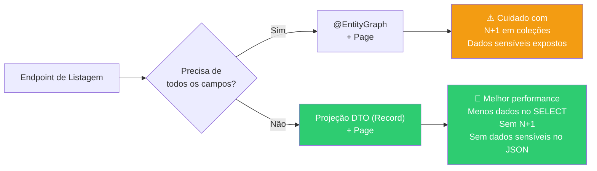

# Slide 5: Projeções DTO e Paginação

**Horário:** 11:00 - 11:30 (após Coffee Break)

---

## Projeções DTO — Por que carregar menos?

Na maioria das listagens, você **não precisa de todos os campos** da entidade. Se a tela mostra apenas nome e departamento, por que carregar email, CPF, salário, endereço...?



### Benefícios Detalhados

| Aspecto | Sem projeção | Com projeção | Ganho |
|---------|:---:|:---:|:---|
| Colunas no SELECT | 10+ (tudo) | 3 (necessário) | Menos I/O de rede |
| Memória JVM | Entity + proxy Hibernate | Record leve, sem proxy | ~60% menos memória |
| Serialização JSON | Pode vazar dados sensíveis (CPF, salário) | Apenas campos públicos | Segurança |
| Performance SQL | `SELECT *` | `SELECT id, name, dept_name` | Banco otimiza melhor |
| Dirty checking | Hibernate rastreia mudanças | Não há rastreamento | Menos overhead |

### Arquitetura — Onde o DTO se encaixa



> **Nota**: O DTO (Record) viaja da camada de Repository até o Client **sem nenhuma conversão** — é criado direto na query JPQL.

---

## Criando uma Projeção DTO

### Passo 1: Criar o Record

```java
public record EmployeeSummary(
    Long id,
    String name,
    String departmentName
) {}
```

> **Records** do Java 17+ são perfeitos para projeções: imutáveis, com `equals`, `hashCode` e `toString` automáticos. São mais leves que classes POJO tradicionais.

### Passo 2: Query JPQL com `new`

```java
public interface EmployeeRepository extends JpaRepository<Employee, Long> {

    @Query("SELECT new com.example.employee.dto.EmployeeSummary(" +
           "e.id, e.name, d.name) " +
           "FROM Employee e JOIN e.department d")
    List<EmployeeSummary> findAllSummaries();
}
```

### Como o Hibernate processa a projeção



### SQL Gerado

```sql
-- Apenas 3 colunas, com JOIN automático
SELECT e.id, e.name, d.name
FROM employees e
INNER JOIN departments d ON e.department_id = d.id;
```

> **Vantagem**: o Hibernate nem cria proxy — retorna diretamente o Record.

---

## Projeções com Interface (alternativa)

O Spring Data JPA suporta projeções **baseadas em interface**:

```java
public interface EmployeeSummaryProjection {
    Long getId();
    String getName();
    String getDepartmentName();
}

public interface EmployeeRepository extends JpaRepository<Employee, Long> {

    @Query(value = "SELECT e.id as id, e.name as name, d.name as departmentName " +
                   "FROM employees e JOIN departments d ON e.department_id = d.id",
           nativeQuery = true)
    List<EmployeeSummaryProjection> findAllProjections();
}
```

### Comparação de Abordagens de Projeção



| Tipo | Vantagem | Desvantagem | Recomendação |
|------|----------|-------------|:---:|
| **Record (JPQL new)** | Tipagem forte, imutável, performático | Precisa do path completo da classe | ⭐ **Recomendado** |
| **Interface projection** | Spring gera proxy automático | Mais overhead, menos controle | Bom para nativeQuery |
| **Class-based DTO** | Permite lógica no construtor | Mais verboso | Para transformações complexas |

> **Recomendação**: Use **Records** para projeções JPQL — mais simples e performático.

---

## Paginação com Pageable

### Por que paginar?

```java
// ❌ NUNCA faça isso em produção!
@GetMapping
public List<Employee> findAll() {
    return employeeRepository.findAll(); // 100.000 registros?!
}
```



### Implementando Paginação

```java
@RestController
@RequestMapping("/api/employees")
public class EmployeeController {

    @GetMapping
    public Page<EmployeeSummary> findAll(Pageable pageable) {
        return employeeRepository.findAllSummaries(pageable);
    }
}
```

```java
// No Repository
@Query("SELECT new com.example.dto.EmployeeSummary(e.id, e.name, d.name) " +
       "FROM Employee e JOIN e.department d")
Page<EmployeeSummary> findAllSummaries(Pageable pageable);
```

### Como o Spring resolve Pageable automaticamente



### Chamada na API

```
GET /api/employees?page=0&size=10&sort=name,asc
```

### Resposta com Metadata

```json
{
  "content": [
    { "id": 1, "name": "Ana Silva", "departmentName": "Engenharia" },
    { "id": 2, "name": "Bruno Costa", "departmentName": "Marketing" }
  ],
  "totalElements": 150,
  "totalPages": 15,
  "number": 0,
  "size": 10,
  "first": true,
  "last": false,
  "sort": {
    "sorted": true,
    "direction": "ASC",
    "property": "name"
  }
}
```

---

## Page vs. Slice vs. List



| Tipo | Conta total? | Quando usar | SQL extra |
|------|:---:|-------------|:---:|
| `Page<T>` | ✅ Sim (`COUNT` query extra) | Quando precisa mostrar "Página 1 de 15" | Sim |
| `Slice<T>` | ❌ Não | Scroll infinito (só sabe se tem "próxima") | Não |
| `List<T>` | ❌ Não | Quando não precisa de metadata | Não |

```java
// Slice — mais leve (sem COUNT)
Slice<EmployeeSummary> findAllSummaries(Pageable pageable);

// Page — com total (COUNT query adicional)
Page<EmployeeSummary> findAllSummaries(Pageable pageable);
```

> **Dica**: Se a tabela tem milhões de registros, `COUNT(*)` pode ser lento. Use `Slice` para scroll infinito ou paginação "Carregar mais".

---

## Parâmetros do Pageable

| Parâmetro | Default | Exemplo | SQL gerado |
|-----------|---------|---------|-----------|
| `page` | 0 | `?page=2` (terceira página) | `OFFSET 20` |
| `size` | 20 | `?size=10` (10 por página) | `LIMIT 10` |
| `sort` | unsorted | `?sort=name,asc` | `ORDER BY name ASC` |
| `sort` (múltiplo) | — | `?sort=department,asc&sort=name,desc` | `ORDER BY department ASC, name DESC` |

### Configurando defaults

```yaml
spring:
  data:
    web:
      pageable:
        default-page-size: 10    # Padrão se não passar ?size=
        max-page-size: 100       # Limite máximo (proteção contra ?size=999999)
        one-indexed-parameters: false  # page começa em 0 (padrão)
```

---

## 🎯 Resumo — Projeções + Paginação



### Checklist — Listagem em API de Produção

- [ ] Usar **Record** como DTO de projeção (não expor Entity)
- [ ] Usar **JPQL com `SELECT new`** para projeção
- [ ] Receber **`Pageable`** no Controller
- [ ] Retornar **`Page<DTO>`** (ou `Slice<DTO>` para scroll infinito)
- [ ] Configurar **`max-page-size`** para evitar `?size=999999`
- [ ] **Nunca retornar dados sensíveis** (CPF, salário) em listagens

> **Combinar projeção DTO + paginação é a melhor prática** para endpoints de listagem em APIs de produção.
