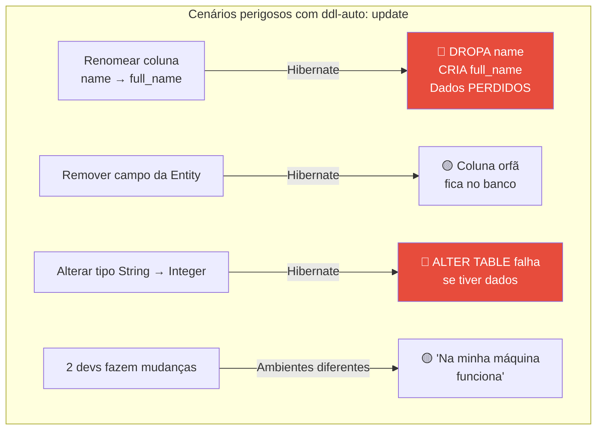
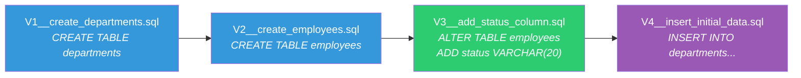
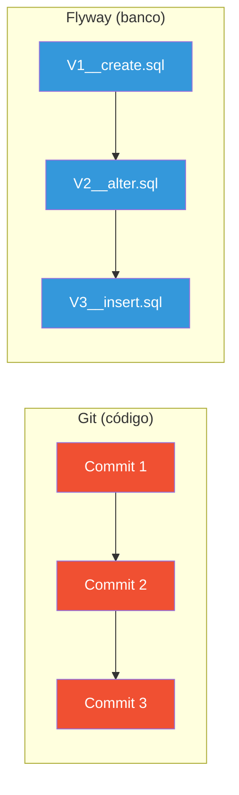
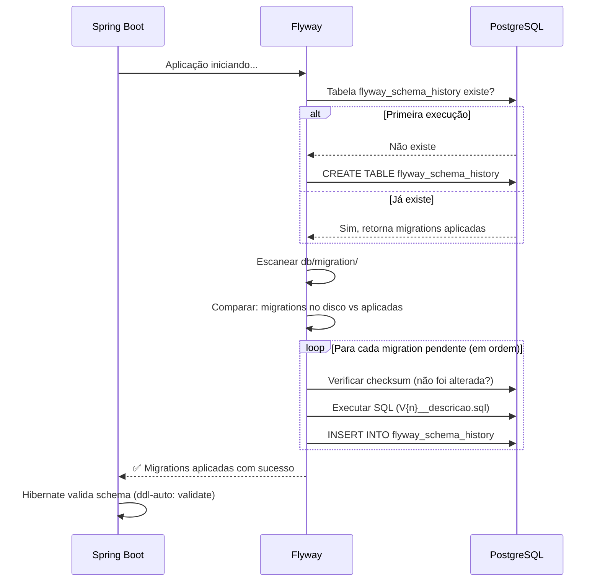
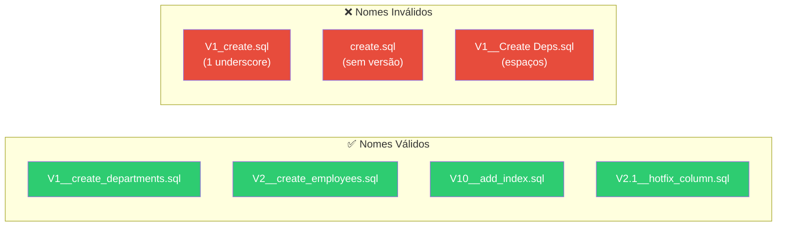
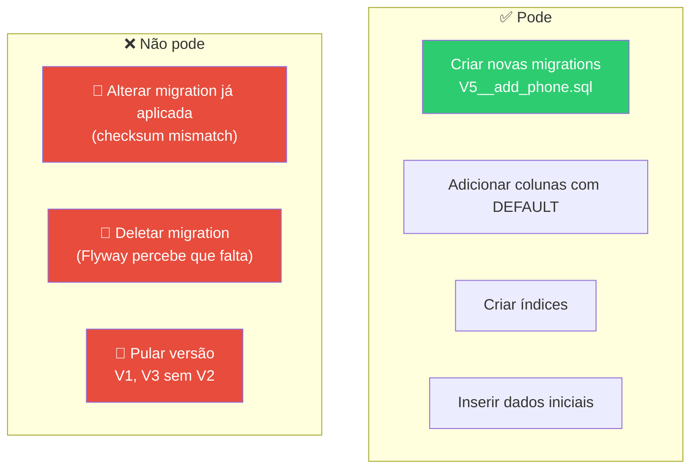
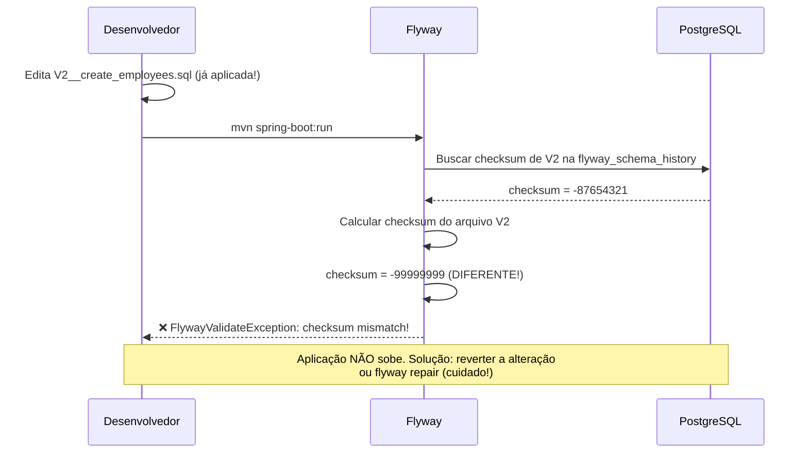

# Slide 6: Migrations com Flyway

**Horário:** 11:30 - 12:00

---

## O Problema: `ddl-auto: update` em Produção

```yaml
# ❌ Nunca em produção!
spring:
  jpa:
    hibernate:
      ddl-auto: update
```

### O que pode dar errado?



| Cenário | O que o Hibernate faz | Risco |
|---------|----------------------|-------|
| Renomear coluna `name` → `full_name` | **Dropa** `name` e **cria** `full_name` | 🔴 Perda de dados |
| Remover campo da Entity | Não remove a coluna | 🟡 Colunas órfãs |
| Alterar tipo de `String` → `Integer` | Tenta `ALTER TABLE` | 🔴 Falha se tiver dados |
| Dois devs fazem mudanças diferentes | Cada ambiente fica diferente | 🟡 "Na minha máquina funciona" |

### Valores de ddl-auto — Quando usar cada um?

| Valor | O que faz | Quando usar |
|-------|----------|-------------|
| `none` | Nada | Produção com Flyway |
| `validate` | Verifica se entities = schema | **Recomendado com Flyway** |
| `update` | Cria/altera tabelas automaticamente | Prototipação rápida (nunca prod) |
| `create` | Dropa e recria tudo a cada start | Testes com banco in-memory |
| `create-drop` | Cria no start, dropa no shutdown | Testes unitários |

> **Em consultorias e fintechs**: `ddl-auto: update` é **proibido** em qualquer ambiente que não seja local de desenvolvimento.

---

## Flyway — Git para o Banco de Dados

O **Flyway** versiona o schema do banco usando **scripts SQL incrementais**. Cada alteração é um arquivo `.sql` com versão.



### Analogia: Flyway é como Git para o banco



| Git | Flyway |
|-----|--------|
| Commits são incrementais | Migrations são incrementais |
| Cada commit tem um hash único | Cada migration tem versão + checksum |
| `git log` mostra histórico | `flyway_schema_history` mostra histórico |
| Não se altera commit já pushado | Não se altera migration já aplicada |

### Como funciona — Fluxo de Execução



1. Flyway examina a pasta `db/migration/`
2. Verifica a tabela `flyway_schema_history` no banco
3. Executa **apenas** as migrations ainda não aplicadas
4. Registra cada migration executada com sucesso

```sql
-- Tabela flyway_schema_history (criada automaticamente)
SELECT version, description, checksum, installed_on, execution_time, success
FROM flyway_schema_history;

-- Resultado:
-- 1 | create departments | -12345678 | 2026-02-22 09:00:00 | 45  | true
-- 2 | create employees   | -87654321 | 2026-02-22 09:00:01 | 120 | true
-- 3 | add status column  | -11223344 | 2026-02-22 09:00:02 | 30  | true
```

---

## Convenção de Nomes

```
V{versão}__{descrição}.sql
 ↑            ↑
 |            └── Descrição com underscores (obrigatório)
 └── Número da versão (sequencial)

⚠️ DOIS underscores entre versão e descrição!
```



| Arquivo | Válido? | Motivo |
|---------|:---:|--------|
| `V1__create_departments.sql` | ✅ | Formato correto |
| `V2__create_employees.sql` | ✅ | Formato correto |
| `V10__add_index.sql` | ✅ | Versão pode ter múltiplos dígitos |
| `V1_create_departments.sql` | ❌ | Apenas UM underscore |
| `create_departments.sql` | ❌ | Sem prefixo de versão |
| `V1__Create Departments.sql` | ❌ | Espaços no nome |

### Tipos de Migration

| Prefixo | Tipo | Uso |
|---------|------|-----|
| `V` | **Versioned** | DDL (CREATE, ALTER) — executada uma vez |
| `U` | **Undo** (Pro) | Rollback de uma versioned — apenas Flyway Teams |
| `R` | **Repeatable** | Re-executada quando alterada (views, procedures) |

---

## Estrutura de Pastas

```
src/main/resources/
└── db/
    └── migration/
        ├── V1__create_departments.sql     ← DDL: estrutura
        ├── V2__create_employees.sql       ← DDL: estrutura + índices
        ├── V3__add_status_column.sql      ← DDL: evolução do schema
        └── V4__insert_initial_data.sql    ← DML: dados iniciais (seed)
```

---

## Exemplos de Migrations

### V1 — Criar tabela de departamentos

```sql
-- V1__create_departments.sql
CREATE TABLE departments (
    id BIGSERIAL PRIMARY KEY,
    name VARCHAR(100) NOT NULL,
    code VARCHAR(10) NOT NULL UNIQUE,
    created_at TIMESTAMP DEFAULT CURRENT_TIMESTAMP
);
```

### V2 — Criar tabela de funcionários

```sql
-- V2__create_employees.sql
CREATE TABLE employees (
    id BIGSERIAL PRIMARY KEY,
    name VARCHAR(150) NOT NULL,
    email VARCHAR(200) NOT NULL UNIQUE,
    cpf VARCHAR(11) NOT NULL UNIQUE,
    salary DECIMAL(10,2) NOT NULL,
    department_id BIGINT NOT NULL,
    created_at TIMESTAMP DEFAULT CURRENT_TIMESTAMP,
    CONSTRAINT fk_employee_department
        FOREIGN KEY (department_id) REFERENCES departments(id)
);

-- Índices para queries frequentes
CREATE INDEX idx_employee_email ON employees(email);
CREATE INDEX idx_employee_department ON employees(department_id);
```

> **Boas práticas SQL**: Sempre crie índices para colunas usadas em WHERE, JOIN e ORDER BY. Foreign keys não criam índice automaticamente no PostgreSQL.

### V3 — Adicionar coluna (evolução do schema)

```sql
-- V3__add_status_column.sql
ALTER TABLE employees
    ADD COLUMN status VARCHAR(20) DEFAULT 'ACTIVE' NOT NULL;
```

### V4 — Dados iniciais (seed data)

```sql
-- V4__insert_initial_data.sql
INSERT INTO departments (name, code) VALUES
    ('Engenharia', 'ENG'),
    ('Marketing', 'MKT'),
    ('Recursos Humanos', 'RH'),
    ('Financeiro', 'FIN');
```

---

## Configuração no Spring Boot

### pom.xml

```xml
<dependency>
    <groupId>org.flywaydb</groupId>
    <artifactId>flyway-core</artifactId>
</dependency>
<dependency>
    <groupId>org.flywaydb</groupId>
    <artifactId>flyway-database-postgresql</artifactId>
</dependency>
```

### application.yml

```yaml
spring:
  flyway:
    enabled: true
    locations: classpath:db/migration
    baseline-on-migrate: true    # Cria baseline se banco não está vazio

  jpa:
    hibernate:
      ddl-auto: validate          # Apenas VALIDA, não altera schema
```

> **`ddl-auto: validate`**: o Hibernate verifica se as entities Java batem com o schema no banco. Se não bater, a aplicação **não sobe** — evitando surpresas.

---

## Regras de Ouro do Flyway



### O que acontece ao violar as regras?



### Rollback

```sql
-- Para reverter uma migration, crie uma NOVA migration corretiva:
-- V6__rollback_status_column.sql
ALTER TABLE employees DROP COLUMN status;
```

> **Rollback no Flyway Community é manual** — você cria um novo script SQL que desfaz a alteração. Flyway Teams (pago) suporta `U` (Undo) migrations.

---

## Flyway vs. Liquibase

| Aspecto | Flyway | Liquibase |
|---------|--------|-----------|
| **Formato** | SQL puro | XML, YAML, JSON ou SQL |
| **Curva de aprendizado** | 🟢 Fácil (é só SQL) | 🟠 Moderada (changelog XML) |
| **Rollback** | Manual (nova migration) | Automático (rollback tag) |
| **Database diff** | ❌ Não | ✅ Sim |
| **Popularidade Spring** | ⭐ Mais usado | ⭐ Muito usado também |

> **Flyway é a escolha natural para Spring Boot** — mais simples, SQL puro, e integração out-of-the-box.

---

## 🎯 Resumo — Flyway

| Conceito | Detalhe |
|----------|---------|
| **O que é** | Versionamento de schema via scripts SQL |
| **Onde ficam** | `src/main/resources/db/migration/` |
| **Nomenclatura** | `V{n}__{descrição}.sql` (dois underscores) |
| **Execução** | Automática ao subir a aplicação |
| **Histórico** | Tabela `flyway_schema_history` (checksum!) |
| **ddl-auto** | Usar `validate` (nunca `update` em prod) |
| **Regra de ouro** | Nunca alterar migration já aplicada |
| **Rollback** | Criar nova migration corretiva |

> **Almoço!** 🍽️ Voltem prontos para mensageria com RabbitMQ e cache com Redis.
