# Slide 7: Mensageria com RabbitMQ — Conceitos

**Horário:** 13:00 - 13:10

---

## O que é Mensageria?

**Mensageria** é um padrão de comunicação **assíncrona** entre serviços, mediada por um **message broker** (intermediário). O conceito central: **"fire and forget"** — publica e segue.

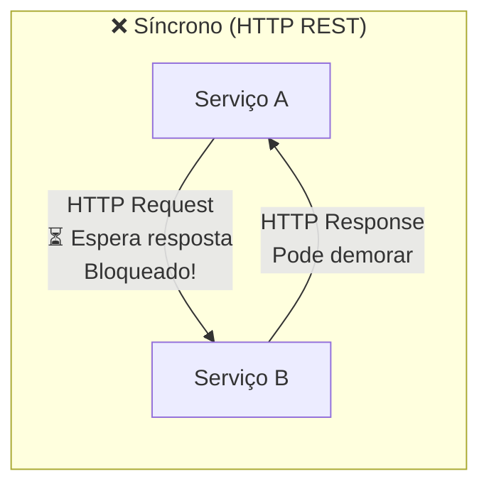

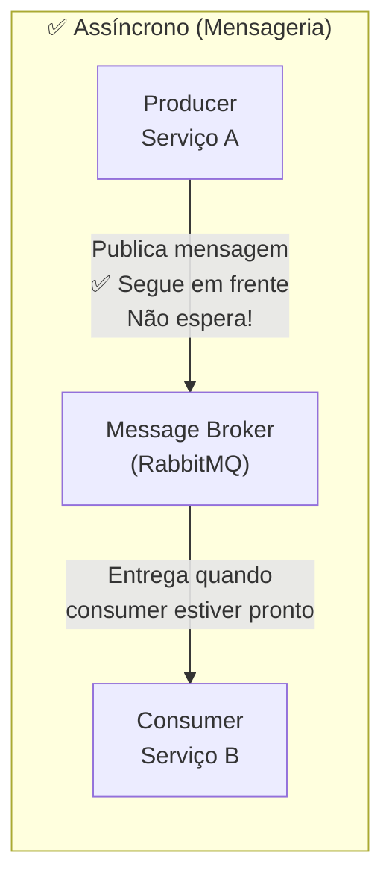

> **Diferença fundamental**: no HTTP, o producer **espera** a resposta. Na mensageria, o producer **publica e segue** — o consumer processa quando puder.

### Síncrono vs. Assíncrono — Comparação Detalhada

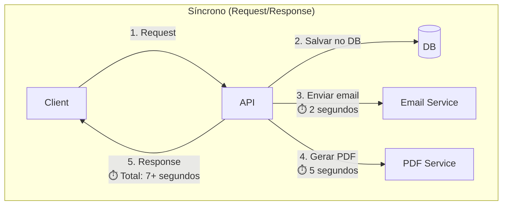

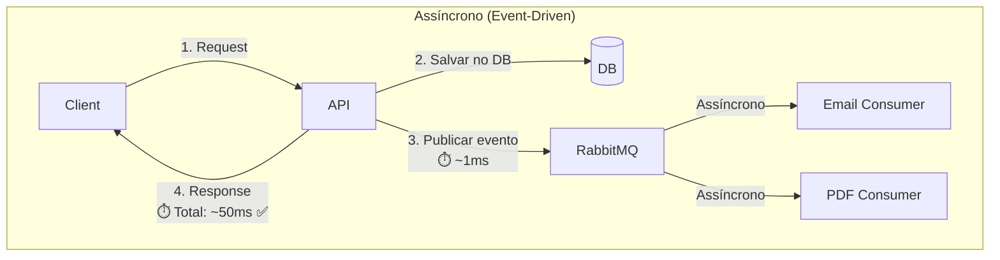

| Aspecto | Síncrono (HTTP) | Assíncrono (RabbitMQ) |
|---------|:---:|:---:|
| Tempo de resposta | Soma de todos os passos | Apenas DB + publish |
| Acoplamento | Forte (depende de todos os serviços) | Fraco (producer não conhece consumers) |
| Se destino estiver fora | Request falha | Mensagem fica na fila |
| Escalabilidade | Vertical | Horizontal (mais consumers) |

---

## Quando usar Mensageria?

| Cenário | HTTP (síncrono) | RabbitMQ (assíncrono) |
|---------|:---:|:---:|
| Criar funcionário e retornar dados | ✅ | ❌ |
| Enviar email de boas-vindas após criar | ❌ Bloqueia a API | ✅ |
| Gerar relatório PDF pesado | ❌ Timeout | ✅ |
| Notificar outro serviço | ❌ Acoplamento | ✅ |
| Serviço destino fora do ar | ❌ Falha | ✅ Mensagem fica na fila |
| Processar pagamento em background | ❌ Timeout | ✅ |
| Atualizar cache distribuído | ❌ Acoplamento | ✅ |

### Exemplo Real — Fluxo Completo

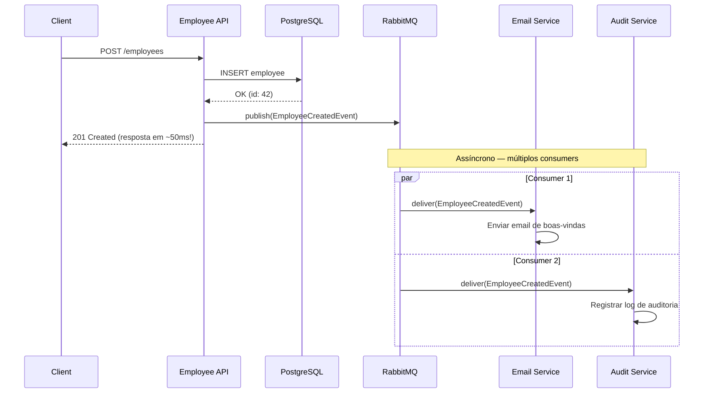

> **A API responde em 50ms** — o envio de email e auditoria acontecem depois, na fila.

---

## 📡 Protocolo AMQP

RabbitMQ usa o protocolo **AMQP** (Advanced Message Queuing Protocol) — um padrão aberto para mensageria.

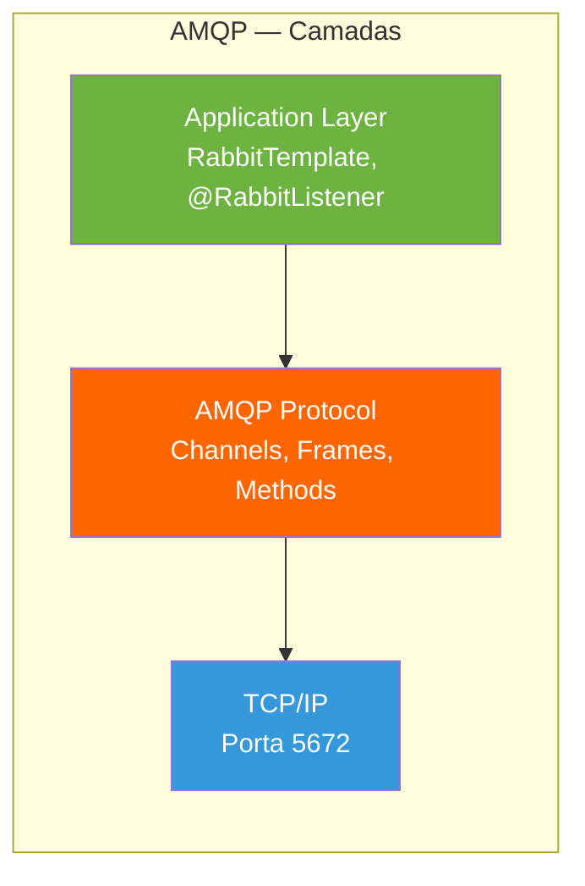

| Conceito AMQP | O que é | Spring AMQP |
|:---|:---|:---|
| **Connection** | Conexão TCP com o broker | `ConnectionFactory` (gerenciado pelo Spring) |
| **Channel** | Canal multiplexado dentro da conexão | Automático (1 por thread) |
| **Exchange** | Roteador de mensagens | `DirectExchange`, `TopicExchange`, `FanoutExchange` |
| **Queue** | Fila de mensagens | `Queue` bean |
| **Binding** | Regra Exchange → Queue | `BindingBuilder.bind(queue).to(exchange).with(key)` |
| **Message** | Payload + headers + properties | Serializado por `MessageConverter` |

---

## RabbitMQ — Conceitos Fundamentais

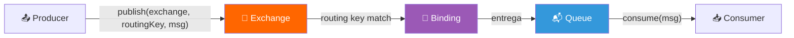

| Componente | O que é | Analogia |
|-----------|---------|----------|
| **Producer** | Quem envia a mensagem | Remetente de uma carta |
| **Exchange** | Roteador de mensagens | Agência dos Correios |
| **Binding** | Regra de roteamento (Exchange → Queue) | Rota de entrega |
| **Queue** | Fila onde mensagens ficam armazenadas | Caixa de correio |
| **Consumer** | Quem processa a mensagem | Destinatário |
| **Routing Key** | "Endereço" da mensagem | CEP / endereço |
| **Message** | Dados serializados (JSON) | A carta em si |

---

## Tipos de Exchange — Detalhado

### 1. Direct Exchange (usado no nosso projeto)

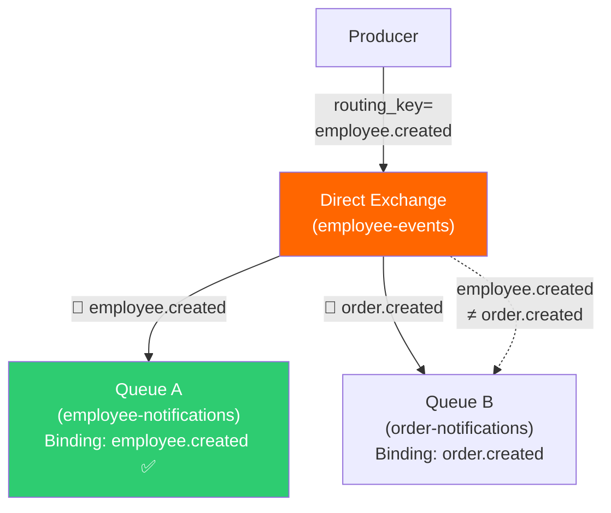

> Entregue à queue com routing key **exata**. Perfeito para eventos específicos.

### 2. Topic Exchange

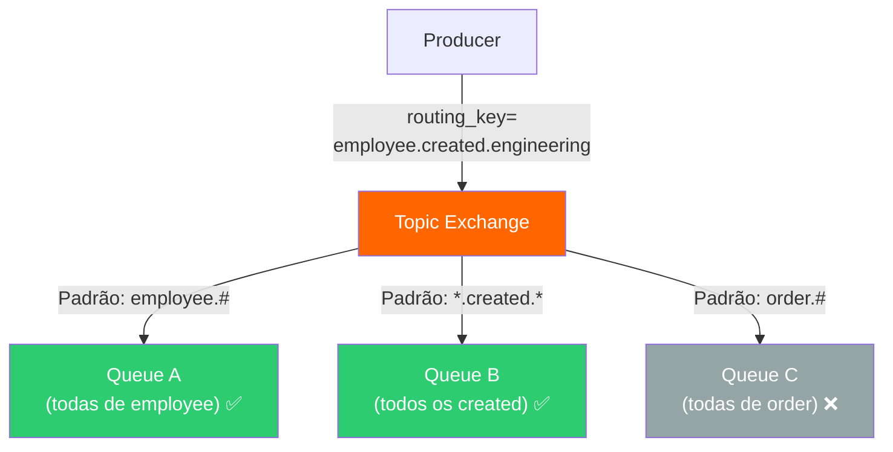

> `*` = uma palavra, `#` = zero ou mais palavras. Para categorias e hierarquias.

### 3. Fanout Exchange

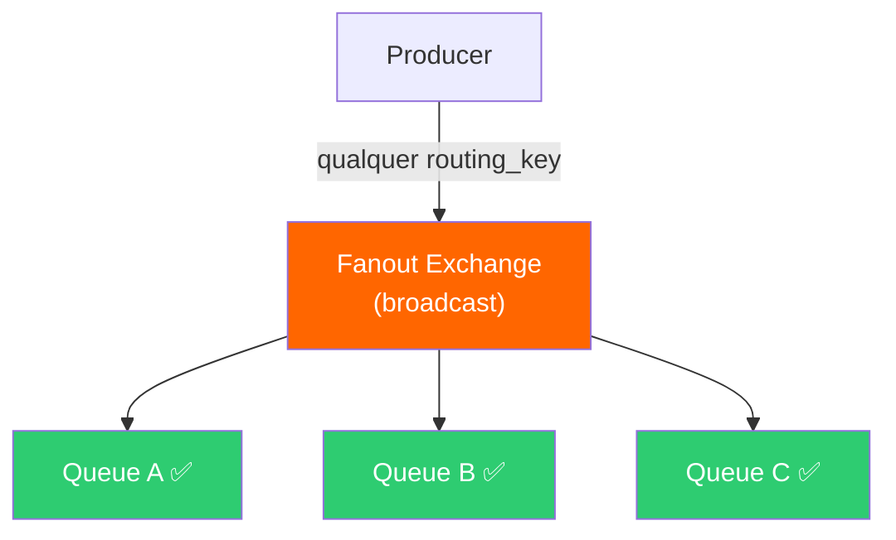

> Ignora routing key — envia para **todas** as queues conectadas. Para broadcast.

### Resumo dos Tipos

| Tipo | Comportamento | Quando usar | Exemplo |
|------|-------------|-------------|---------|
| **Direct** | Routing key **exata** | Eventos específicos | `employee.created` |
| **Topic** | Padrão com `*` e `#` | Eventos categorizados | `employee.*.engineering` |
| **Fanout** | **Todas** as queues | Broadcast | Logs, notificações globais |
| **Headers** | Match por headers | Casos especiais | Roteamento complexo |

> **Para nosso caso**: usaremos **Direct Exchange** — cada evento vai para uma fila específica.

---

## 🔄 Ciclo de Vida da Mensagem

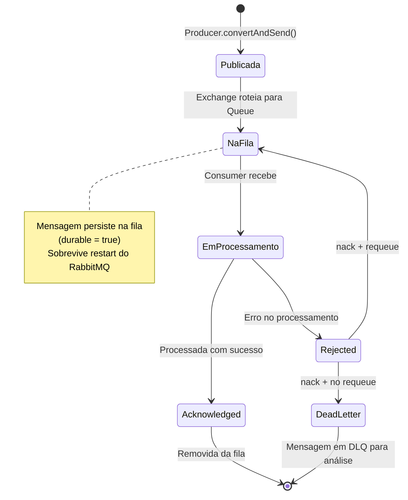

### Garantias de Entrega

| Garantia | Como funciona | Config |
|----------|:---|:---|
| **At-most-once** | Pode perder mensagem | `autoAck = true` (padrão) |
| **At-least-once** | Pode processar 2x | `autoAck = false` + manual ack |
| **Exactly-once** | Nunca perde, nunca duplica | Idempotência no consumer |

> **Spring AMQP usa `autoAck = false` por padrão** — o consumer precisa confirmar (ack) que processou. Se não ack, a mensagem volta para a fila.

---

## RabbitMQ vs. Kafka

| Aspecto | RabbitMQ | Kafka |
|---------|----------|-------|
| **Modelo** | Filas (mensagem consumida = removida) | Log (mensagens retidas por tempo) |
| **Caso de uso** | Notificações, tarefas assíncronas | Event streaming, analytics, logs |
| **Garantia de ordem** | Por fila | Por partição |
| **Reprocessamento** | ❌ Mensagem consumida some | ✅ Replay from offset |
| **Complexidade** | 🟢 Simples (broker inteligente) | 🟠 Mais complexo (consumer inteligente) |
| **Throughput** | Milhares/seg | Milhões/seg |
| **Quando escolher** | Microsserviços, filas de trabalho | Big data, event sourcing, CQRS |
| **Spring Integration** | `spring-boot-starter-amqp` | `spring-kafka` |

> **Para microsserviços típicos**: RabbitMQ é mais simples e resolve 90% dos casos.

---

## 🎯 Resumo — Por que RabbitMQ?

- ✅ **Desacoplamento**: producer não depende do consumer
- ✅ **Resiliência**: mensagem persiste na fila se o consumer cair
- ✅ **Performance**: API responde rápido, processamento pesado vai para fila
- ✅ **Escalabilidade**: múltiplos consumers podem processar a mesma fila
- ✅ **Flexibilidade**: Exchange types permitem roteamento inteligente
- ✅ **Observabilidade**: Management UI mostra filas, mensagens, taxas

> **No próximo slide**: código Java com Producer e Consumer usando Spring AMQP.
