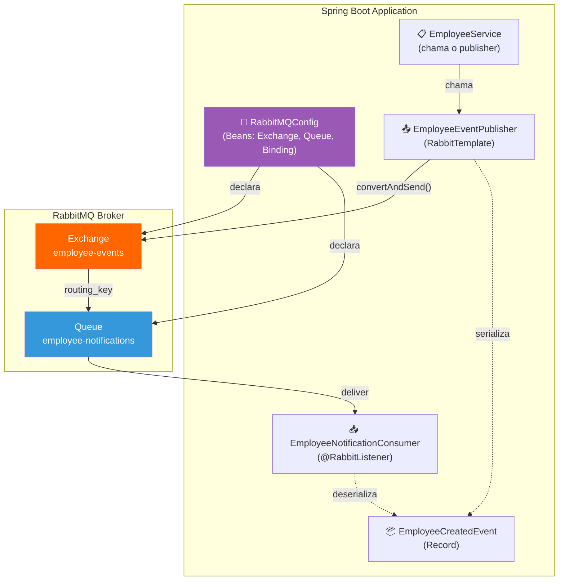
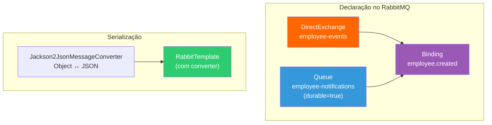
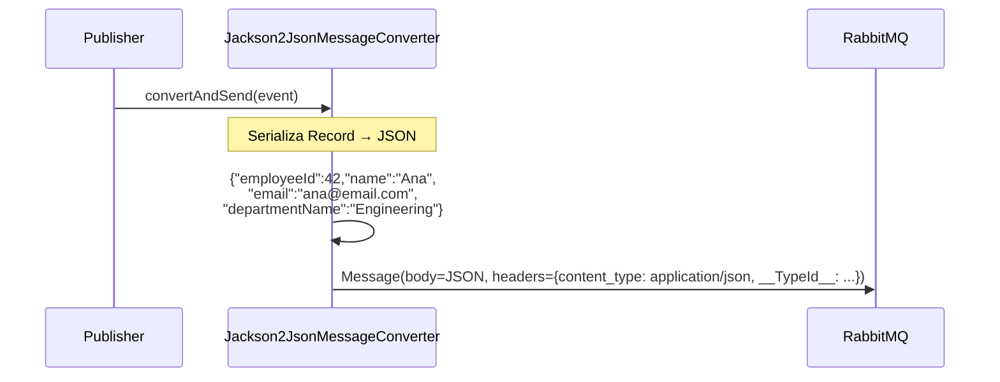
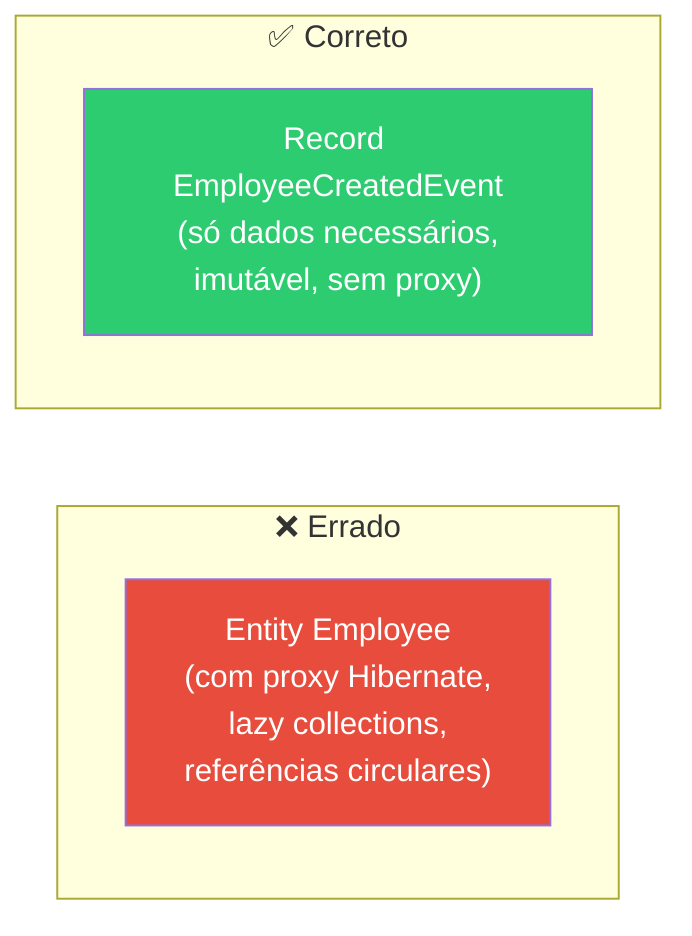
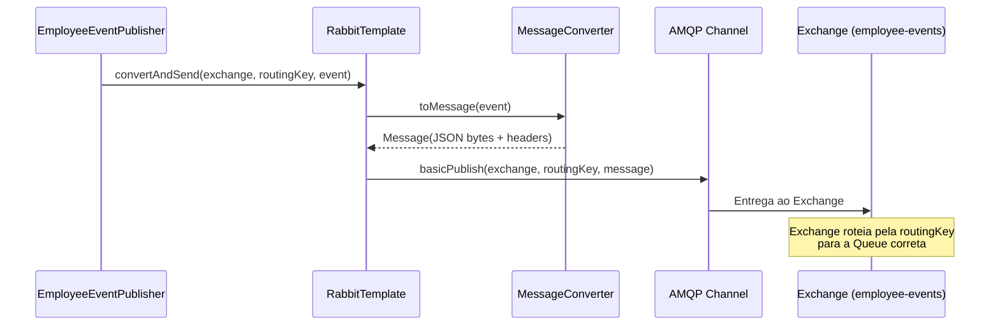
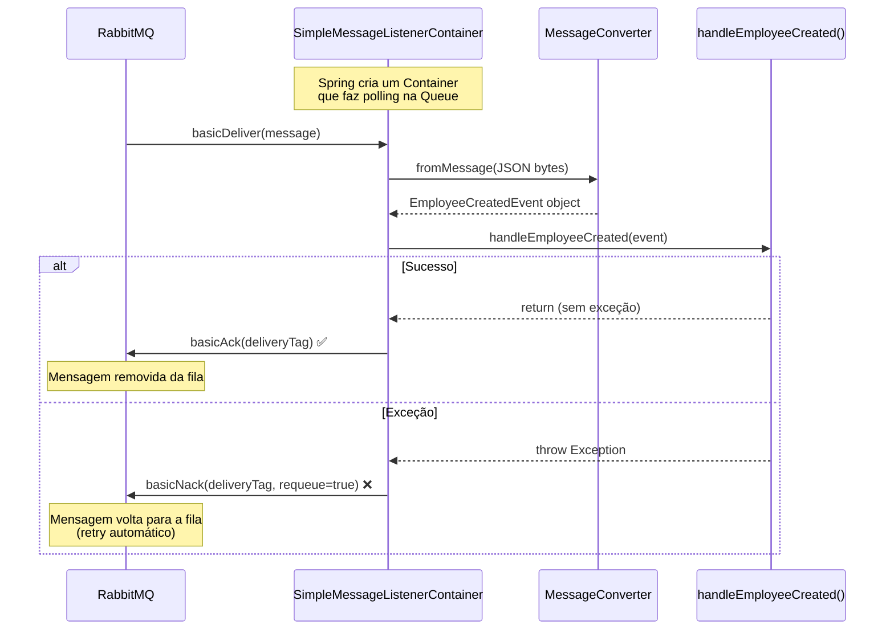
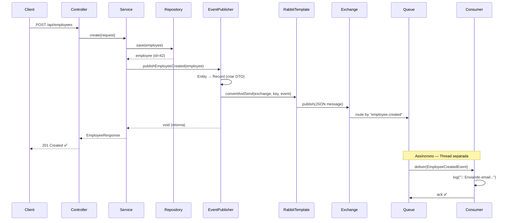
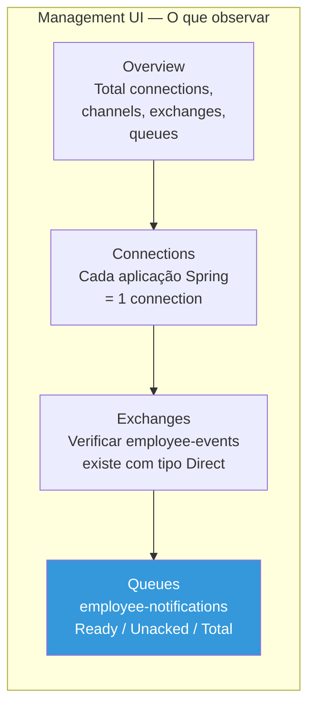
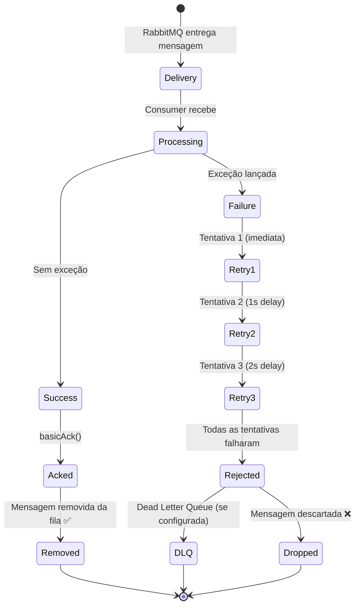

# Slide 8: Mensageria com RabbitMQ — Producer e Consumer

**Horário:** 13:10 - 13:20

---

## Visão Geral — O que vamos configurar



---

## 1. Configuração do Spring AMQP

### Dependência (pom.xml)

```xml
<dependency>
    <groupId>org.springframework.boot</groupId>
    <artifactId>spring-boot-starter-amqp</artifactId>
</dependency>
```

> Inclui: `spring-amqp`, `spring-rabbit`, `amqp-client` (driver Java do RabbitMQ).

### application.yml

```yaml
spring:
  rabbitmq:
    host: localhost       # hostname do container RabbitMQ
    port: 5672            # porta AMQP (não confundir com 15672 = Management UI)
    username: guest       # usuário padrão
    password: guest       # senha padrão
```

### O que cada porta faz

| Porta | Protocolo | Uso |
|:---:|:---|:---|
| **5672** | AMQP | Comunicação producer/consumer (protocolo binário) |
| **15672** | HTTP | Management UI (browser) — monitorar filas, exchanges |
| **25672** | Erlang Distribution | Clustering entre nodes RabbitMQ (não usamos) |

---

## 2. Configuração das Filas (RabbitMQConfig)

```java
@Configuration
public class RabbitMQConfig {

    // Constantes para reuso entre Producer e Consumer
    public static final String EXCHANGE_NAME = "employee-events";
    public static final String QUEUE_NAME = "employee-notifications";
    public static final String ROUTING_KEY = "employee.created";

    // 1. Fila onde mensagens serão armazenadas
    @Bean
    public Queue employeeNotificationsQueue() {
        return new Queue(QUEUE_NAME, true); // durable = true (sobrevive restart)
    }

    // 2. Exchange que roteia mensagens
    @Bean
    public DirectExchange employeeExchange() {
        return new DirectExchange(EXCHANGE_NAME);
    }

    // 3. Binding = regra: Exchange + RoutingKey → Queue
    @Bean
    public Binding binding(Queue employeeNotificationsQueue,
                           DirectExchange employeeExchange) {
        return BindingBuilder
                .bind(employeeNotificationsQueue)       // qual fila
                .to(employeeExchange)                   // qual exchange
                .with(ROUTING_KEY);                     // com qual routing key
    }

    // 4. Conversor de mensagem: Java Object → JSON (e vice-versa)
    @Bean
    public Jackson2JsonMessageConverter messageConverter() {
        return new Jackson2JsonMessageConverter();
    }

    // 5. RabbitTemplate com conversor JSON configurado
    @Bean
    public RabbitTemplate rabbitTemplate(ConnectionFactory connectionFactory,
                                         Jackson2JsonMessageConverter converter) {
        RabbitTemplate template = new RabbitTemplate(connectionFactory);
        template.setMessageConverter(converter);
        return template;
    }
}
```

### Como os Beans se conectam



### Parâmetro `durable`

| durable | Comportamento | Quando usar |
|:---:|:---|:---|
| `true` | Queue e mensagens sobrevivem ao restart do RabbitMQ | ✅ Produção — sempre |
| `false` | Queue e mensagens são perdidas ao restart | ❌ Nunca em produção |

---

## 3. O Evento (DTO da Mensagem)

```java
public record EmployeeCreatedEvent(
    Long employeeId,
    String name,
    String email,
    String departmentName
) {}
```

### Serialização — O que acontece internamente



> **Records** são perfeitos para eventos:
> - ✅ **Imutáveis** — ninguém altera os dados do evento
> - ✅ **Serializáveis** — Jackson serializa/deserializa automaticamente
> - ✅ **Autodocumentados** — nome dos campos = documentação

### ⚠️ Nunca envie a Entity JPA como mensagem!



| Problema de enviar Entity | Consequência |
|:---|:---|
| Lazy collections não inicializadas | `LazyInitializationException` ao serializar |
| Referências circulares | `StackOverflowError` ou JSON infinito |
| Dados desnecessários | Mensagem pesada, lenta |
| Acoplamento com schema do DB | Consumer precisa conhecer a Entity |

---

## 4. Producer — Publicando Mensagens

```java
@Service
@Slf4j
public class EmployeeEventPublisher {

    private final RabbitTemplate rabbitTemplate;

    public EmployeeEventPublisher(RabbitTemplate rabbitTemplate) {
        this.rabbitTemplate = rabbitTemplate;
    }

    public void publishEmployeeCreated(Employee employee) {
        // 1. Converter Entity → Event (DTO leve)
        var event = new EmployeeCreatedEvent(
            employee.getId(),
            employee.getName(),
            employee.getEmail(),
            employee.getDepartment().getName()
        );

        // 2. Publicar: exchange + routing key + mensagem
        rabbitTemplate.convertAndSend(
            RabbitMQConfig.EXCHANGE_NAME,    // exchange = "employee-events"
            RabbitMQConfig.ROUTING_KEY,      // routing key = "employee.created"
            event                            // mensagem (serializada para JSON)
        );

        log.info("📤 Evento publicado: EmployeeCreatedEvent (id={}, name={})",
                employee.getId(), employee.getName());
    }
}
```

### Anatomia do `convertAndSend()`



### Uso no Service

```java
@Service
public class EmployeeService {

    private final EmployeeRepository employeeRepository;
    private final EmployeeEventPublisher eventPublisher;

    public EmployeeResponse create(EmployeeRequest request) {
        // 1. Salvar no banco
        Employee employee = employeeRepository.save(toEntity(request));

        // 2. Publicar evento (assíncrono — não bloqueia a resposta)
        eventPublisher.publishEmployeeCreated(employee);

        // 3. Retornar resposta imediatamente
        return toResponse(employee);
    }
}
```

> ⚠️ **Atenção**: `convertAndSend()` é síncrono até o broker confirmar o recebimento, mas o **processamento** pelo consumer é assíncrono.

---

## 5. Consumer — Consumindo Mensagens

```java
@Component
@Slf4j
public class EmployeeNotificationConsumer {

    @RabbitListener(queues = RabbitMQConfig.QUEUE_NAME)
    public void handleEmployeeCreated(EmployeeCreatedEvent event) {
        log.info("📧 Enviando email de boas-vindas para {} ({})",
                event.name(), event.email());

        // Aqui você faria:
        // - Enviar email real via SendGrid/SES
        // - Criar notificação in-app
        // - Atualizar sistema de RH
        // - Disparar workflow de onboarding

        log.info("✅ Notificação processada para funcionário id={}",
                event.employeeId());
    }
}
```

### Como `@RabbitListener` funciona internamente



### Opções do `@RabbitListener`

| Parâmetro | Uso | Exemplo |
|:---|:---|:---|
| `queues` | Nome da fila | `@RabbitListener(queues = "employee-notifications")` |
| `concurrency` | Consumers paralelos | `@RabbitListener(concurrency = "3-10")` |
| `ackMode` | Modo de acknowledgment | `@RabbitListener(ackMode = "MANUAL")` |
| `containerFactory` | Container customizado | Para configurações avançadas |

---

## 6. Fluxo Completo — End to End



---

## 7. Verificando no RabbitMQ Management UI

Após publicar uma mensagem:

1. Abra **http://localhost:15672** (guest/guest)
2. Vá em **Queues** → `employee-notifications`
3. Veja:
   - **Messages Ready**: mensagens aguardando consumo
   - **Messages Unacked**: mensagens sendo processadas
   - **Message rates**: taxa de publicação/consumo



> **Se o consumer estiver rodando**: as mensagens são consumidas imediatamente e a fila fica vazia. Se parar o consumer, as mensagens **acumulam na fila** até ele voltar.

---

## 8. Tratamento de Erros

### O que acontece quando o Consumer falha?



### Configurando Retry no Spring

```yaml
spring:
  rabbitmq:
    listener:
      simple:
        retry:
          enabled: true           # habilitar retry automático
          initial-interval: 1000  # 1 segundo entre tentativas
          max-attempts: 3         # máximo 3 tentativas
          multiplier: 2.0         # backoff: 1s, 2s, 4s
```

### Idempotência — Regra de Ouro

> Se a mensagem for processada **2 vezes**, o resultado deve ser o **mesmo**.

```java
@RabbitListener(queues = RabbitMQConfig.QUEUE_NAME)
public void handleEmployeeCreated(EmployeeCreatedEvent event) {
    // ✅ Idempotente — verificar se já processou
    if (notificationRepository.existsByEmployeeId(event.employeeId())) {
        log.warn("⚠️ Notificação já enviada para employee={}", event.employeeId());
        return;
    }

    // Processar normalmente...
    sendWelcomeEmail(event);
    notificationRepository.save(new Notification(event.employeeId()));
}
```

---

## ⚠️ Boas Práticas — Checklist

| Prática | Por quê | Impacto |
|---------|---------|---------|
| Mensagem = Record/DTO leve | Não envie a Entity JPA inteira (proxy, lazy) | 🔴 Crítico |
| Serialização JSON | Mais interoperável que Java serialization | 🟡 Importante |
| Exchange + Routing Key | Desacopla producer da queue (pode rotear para múltiplas filas) | 🟡 Importante |
| Queue durable = true | Mensagens sobrevivem ao restart do RabbitMQ | 🔴 Crítico |
| Idempotência no consumer | Se mensagem for processada 2x, resultado é o mesmo | 🔴 Crítico |
| Não fazer operações longas | Consumer thread é blocking — manter processamento leve | 🟡 Importante |
| Logging: publicação + consumo | Visibilidade para debugging e monitoramento | 🟢 Bom ter |
| Retry com backoff | Evitar flood de retries em caso de erro temporário | 🟡 Importante |

> **Próximo**: Cache com Redis — acelerando consultas frequentes!
