# Slide 9: Cache com Redis

**Horário:** 13:20 - 13:40

---

## Por que Cachear?

Muitas consultas retornam **os mesmos dados repetidamente**. Ir ao banco toda vez é desperdício:

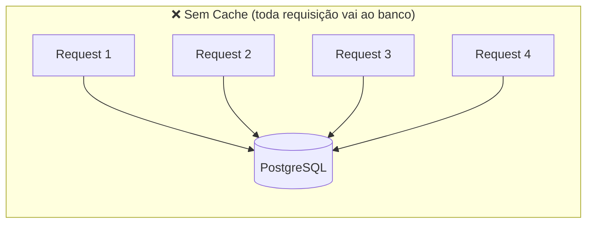

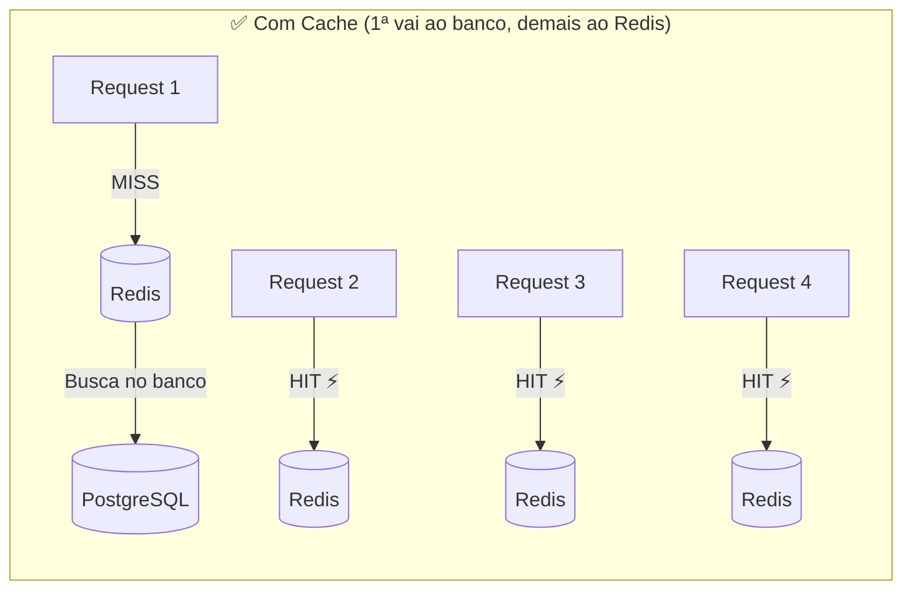

### Impacto na Performance

| Métrica | Sem cache | Com cache | Melhoria |
|---------|:---:|:---:|:---:|
| Latência da consulta | ~50ms (disco) | ~2ms (memória) | **25x mais rápido** |
| Carga no PostgreSQL | Alta (todas as queries) | Baixa (só 1ª + após TTL) | **-90% carga** |
| Requests/segundo | ~200 | 5.000+ | **25x mais throughput** |
| CPU usado no banco | Alto | Mínimo | Libera para escritas |

---

## O que é o Redis?

**Redis** (Remote Dictionary Server) é um **banco de dados in-memory** do tipo key-value.

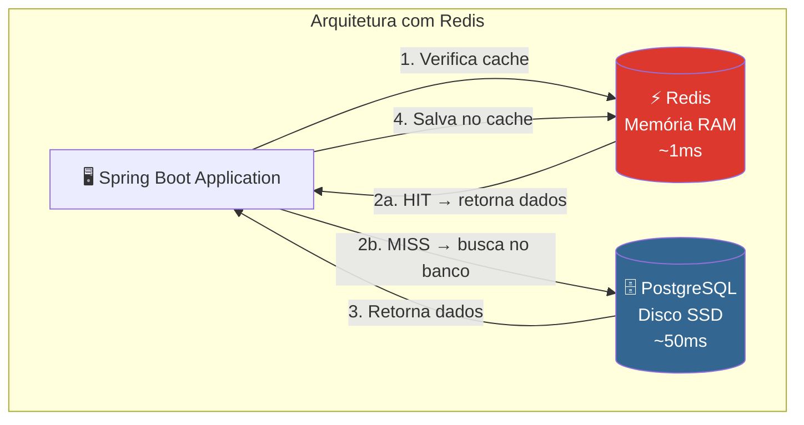

> Esse padrão é chamado **Cache-Aside** (ou Lazy Loading).

### Redis vs. PostgreSQL

| Aspecto | Redis | PostgreSQL |
|---------|-------|-----------|
| Tipo | Key-Value (NoSQL) | Relacional (SQL) |
| Armazenamento | **Memória RAM** | Disco (SSD/HDD) |
| Latência | ~1ms | ~50ms |
| Persistência | Opcional (snapshot/AOF) | Obrigatória (WAL) |
| Caso de uso | Cache, sessões, filas, contadores | Dados de negócio, transações |
| Tamanho de dados | Limitado pela RAM | Limitado pelo disco |
| Queries complexas | ❌ Só key lookup | ✅ SQL completo (JOIN, GROUP BY) |

> **Redis não substitui o banco** — ele **complementa**, servindo dados frequentes sem ir ao disco.

---

## 🔑 Estruturas de Dados do Redis

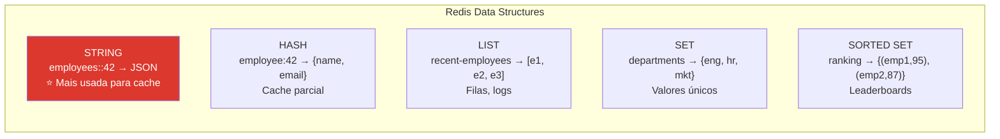

> **Spring Cache usa STRING** — serializa o objeto inteiro como JSON e armazena como value.

---

## Padrão Cache-Aside — Fluxo Detalhado

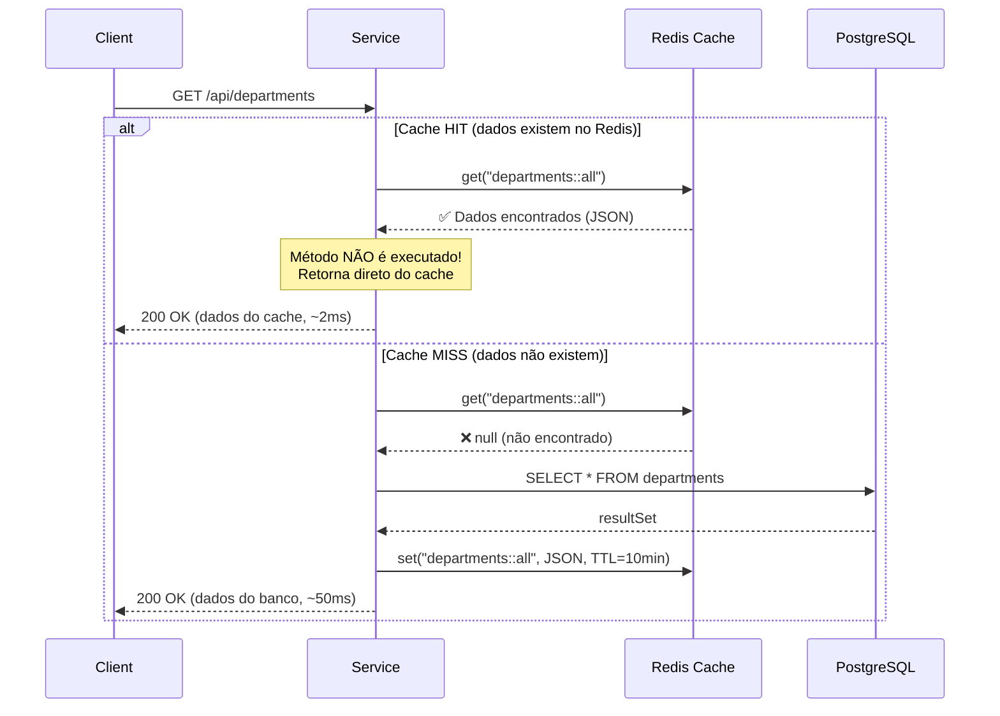

### Padrões de Cache

| Padrão | Descrição | Spring Cache |
|:---|:---|:---:|
| **Cache-Aside** (Lazy Loading) | App verifica cache → se MISS, busca no DB e salva no cache | ✅ `@Cacheable` |
| **Write-Through** | App escreve no cache E no DB simultaneamente | ✅ `@CachePut` |
| **Write-Behind** | App escreve no cache → cache escreve no DB depois (assíncrono) | ❌ Não nativo |
| **Cache Invalidation** | App limpa o cache quando dados mudam | ✅ `@CacheEvict` |

---

## Configuração no Spring Boot

### Dependências (pom.xml)

```xml
<!-- Cliente Redis -->
<dependency>
    <groupId>org.springframework.boot</groupId>
    <artifactId>spring-boot-starter-data-redis</artifactId>
</dependency>

<!-- Abstração Spring Cache -->
<dependency>
    <groupId>org.springframework.boot</groupId>
    <artifactId>spring-boot-starter-cache</artifactId>
</dependency>
```

### application.yml

```yaml
spring:
  data:
    redis:
      host: localhost          # hostname do container Redis
      port: 6379               # porta padrão do Redis

  cache:
    type: redis                # usar Redis como provedor de cache
    redis:
      time-to-live: 600000     # 10 minutos em milissegundos (TTL padrão)
```

### Habilitar cache na aplicação

```java
@SpringBootApplication
@EnableCaching  // ← Ativa o Spring Cache (obrigatório!)
public class Application { ... }
```

### O que `@EnableCaching` faz internamente

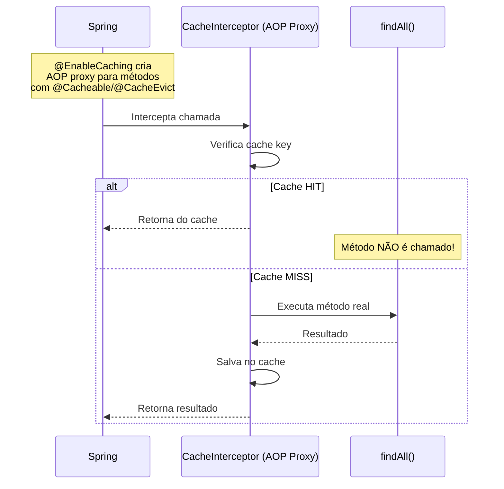

---

## Anotações de Cache — Detalhado

### @Cacheable — Cachear resultado de leitura

```java
@Service
public class DepartmentService {

    @Cacheable(value = "departments", key = "'all'")
    public List<DepartmentResponse> findAll() {
        log.info("🔍 Buscando departamentos no banco...");
        return departmentRepository.findAll()
                .stream()
                .map(DepartmentMapper::toResponse)
                .toList();
    }
}
```

**Comportamento passo a passo:**

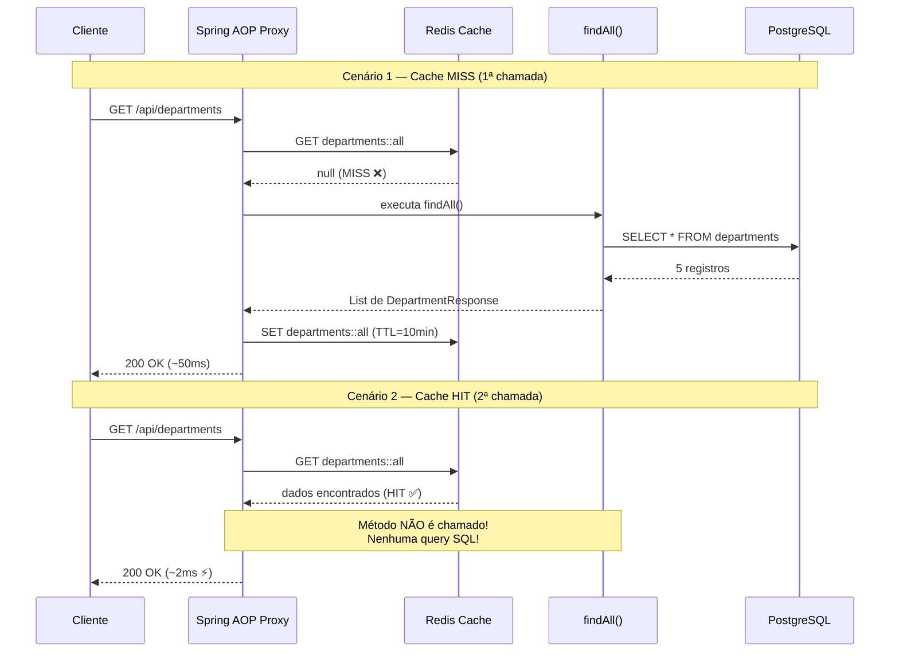

**Chave do cache (key)**:
- `value` = nome do cache (namespace) → `"departments"`
- `key` = chave específica → `"'all'"` (aspas simples = literal SpEL)
- Redis key resultante: `departments::all`

| Exemplos de key SpEL | Chave gerada | Uso |
|:---|:---|:---|
| `key = "'all'"` | `departments::all` | Listas completas |
| `key = "#id"` | `departments::42` | Busca por ID |
| `key = "#name"` | `departments::Engineering` | Busca por nome |
| `key = "#request.page"` | `departments::0` | Busca paginada |

### @CacheEvict — Invalidar cache após escrita

```java
@CacheEvict(value = "departments", allEntries = true)
public DepartmentResponse create(DepartmentRequest request) {
    log.info("📝 Criando departamento e limpando cache...");
    Department dept = departmentRepository.save(toEntity(request));
    return toResponse(dept);
}
```

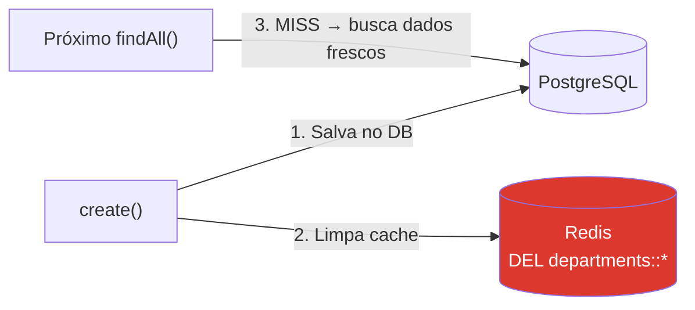

| Parâmetro | Descrição |
|:---|:---|
| `allEntries = true` | Limpa **todas** as chaves do cache "departments" |
| `allEntries = false` | Limpa apenas a chave específica (padrão) |
| `beforeInvocation = true` | Limpa **antes** de executar o método |
| `beforeInvocation = false` | Limpa **depois** (padrão — só limpa se não houve exceção) |

### @CachePut — Atualizar cache sem invalidar tudo

```java
@CachePut(value = "departments", key = "#id")
public DepartmentResponse update(Long id, DepartmentRequest request) {
    // SEMPRE executa o método e atualiza o cache com o resultado
    Department dept = departmentRepository.findById(id).orElseThrow();
    dept.setName(request.name());
    return toResponse(departmentRepository.save(dept));
}
```

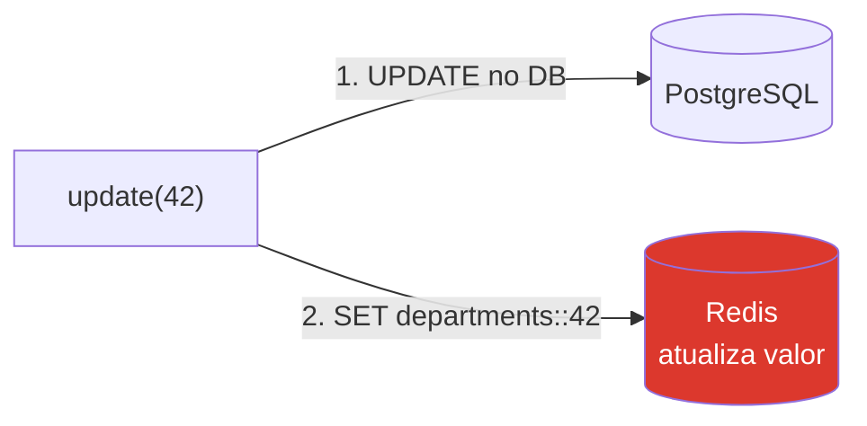

> **Diferença CacheEvict vs CachePut**: `@CacheEvict` remove do cache (próxima leitura vai ao banco). `@CachePut` atualiza o cache diretamente (próxima leitura pega do cache atualizado).

---

## Resumo das Anotações

| Anotação | Quando usar | O que faz | Executa método? |
|----------|-------------|-----------|:---:|
| `@Cacheable` | **GET** (leitura) | Retorna do cache se existir; senão, executa e cacheia | Só no MISS |
| `@CacheEvict` | **POST/PUT/DELETE** | Limpa o cache (dados mudaram, stale data) | ✅ Sempre |
| `@CachePut` | **PUT** (atualização) | Sempre executa e atualiza o cache com novo valor | ✅ Sempre |

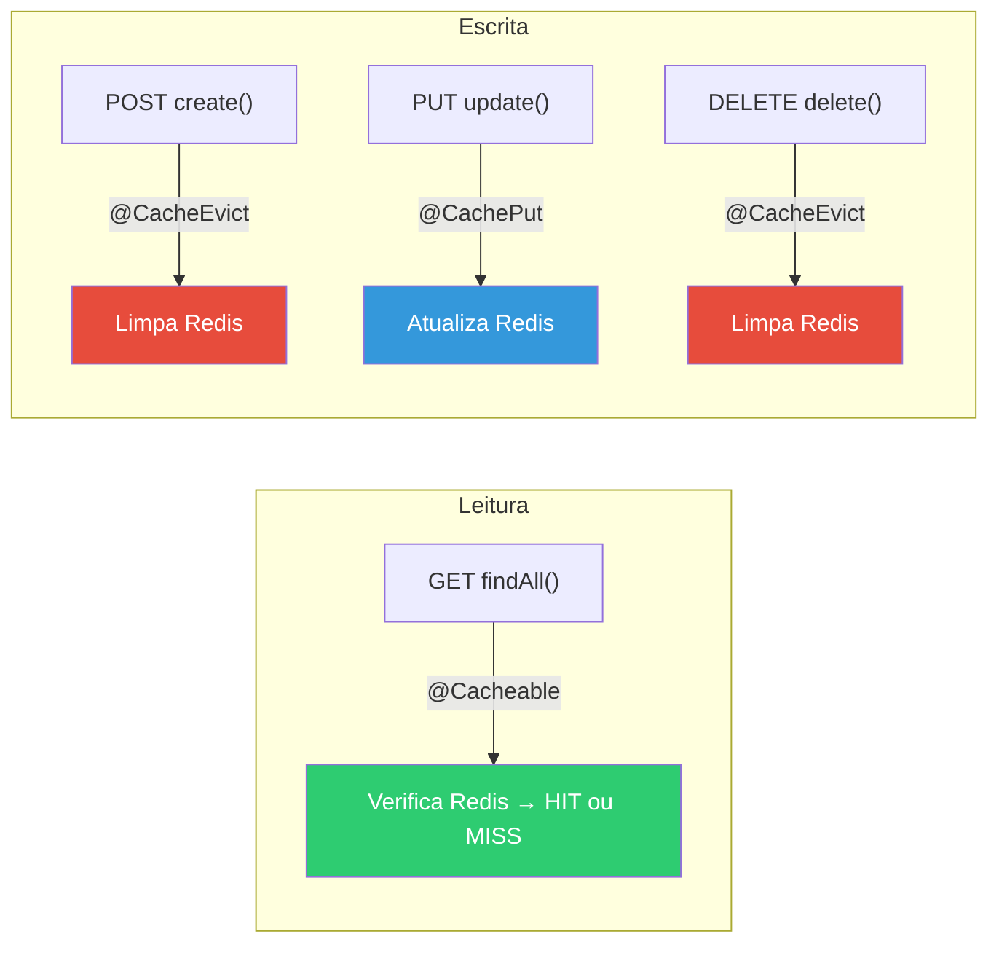

---

## Visualizando o Cache

### Log com e sem cache

```
# 1ª chamada — MISS (vai ao banco)
INFO  DepartmentService : 🔍 Buscando departamentos no banco...
Hibernate: SELECT d.id, d.name, d.code FROM departments d

# 2ª chamada — HIT (Redis) ← NENHUM LOG! Método nem executou!
# (silêncio total...)

# 3ª chamada — HIT
# (silêncio total...)

# Criar novo departamento — EVICT
INFO  DepartmentService : 📝 Criando departamento e limpando cache...
Hibernate: INSERT INTO departments (name, code) VALUES (?, ?)

# Próxima listagem — MISS novamente (cache foi limpo)
INFO  DepartmentService : 🔍 Buscando departamentos no banco...
Hibernate: SELECT d.id, d.name, d.code FROM departments d
```

### Verificando no Redis CLI

```bash
podman exec -it redis-dia06 redis-cli

# Listar todas as chaves de cache
KEYS *
# 1) "departments::all"

# Ver o valor cacheado (JSON serializado)
GET "departments::all"
# [{"id":1,"name":"Engineering","code":"ENG"},...]

# Ver o TTL restante (em segundos)
TTL "departments::all"
# (integer) 540 → 9 minutos restantes

# Apagar manualmente (simular evict)
DEL "departments::all"

# Ver tipo da chave
TYPE "departments::all"
# string
```

---

## TTL — Time-to-Live

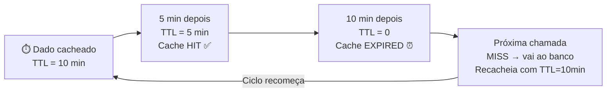

### Como escolher o TTL

| Tipo de dado | TTL sugerido | Justificativa |
|:---|:---|:---|
| Departamentos (mudam raramente) | 30 minutos | Dados estáveis |
| Funcionários (mudam às vezes) | 5 minutos | Equilíbrio |
| Dados de sessão | 30 minutos | Padrão de sessão |
| Dados de dashboard | 1 minuto | Quase real-time |
| Configurações | 1 hora | Mudam muito raramente |

### Configuração por cache (RedisCacheManager)

```java
@Configuration
@EnableCaching
public class CacheConfig {

    @Bean
    public RedisCacheManager cacheManager(RedisConnectionFactory factory) {
        // Configuração padrão para todos os caches
        RedisCacheConfiguration defaultConfig = RedisCacheConfiguration
                .defaultCacheConfig()
                .entryTtl(Duration.ofMinutes(10))                      // TTL padrão
                .serializeValuesWith(
                    SerializationPair.fromSerializer(
                        new GenericJackson2JsonRedisSerializer()));     // JSON!

        // TTLs diferentes por cache (sobrescrevem o padrão)
        Map<String, RedisCacheConfiguration> cacheConfigs = Map.of(
            "departments", defaultConfig.entryTtl(Duration.ofMinutes(30)),  // 30min
            "employees", defaultConfig.entryTtl(Duration.ofMinutes(5))     // 5min
        );

        return RedisCacheManager.builder(factory)
                .cacheDefaults(defaultConfig)             // padrão para caches não listados
                .withInitialCacheConfigurations(cacheConfigs)  // TTLs customizados
                .build();
    }
}
```

### Por que `GenericJackson2JsonRedisSerializer`?

| Serializador | Formato | Legibilidade | Interoperabilidade |
|:---|:---|:---:|:---:|
| JdkSerializationRedisSerializer (padrão) | Bytes binários Java | ❌ | ❌ Só Java |
| **GenericJackson2JsonRedisSerializer** | JSON | ✅ `redis-cli` mostra JSON legível | ✅ Qualquer linguagem |
| StringRedisSerializer | String | ✅ | ✅ |

---

## ⚠️ Armadilhas do Cache — Problemas Comuns

### 1. Cache Stampede (Thundering Herd)

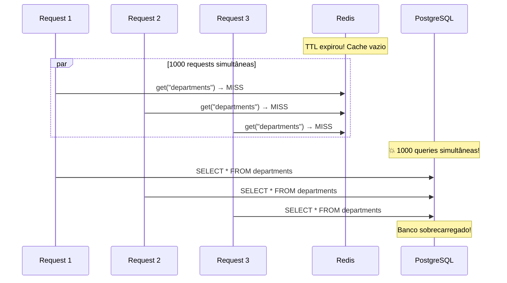

> **Solução**: Lock distribuído (`@Cacheable(sync = true)`) — apenas 1 thread busca no DB, as outras esperam.

### 2. Dados Stale (obsoletos)

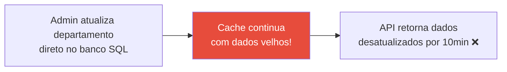

> **Solução**: Sempre usar `@CacheEvict` ao alterar dados. Nunca alterar dados direto no banco sem limpar o cache.

### Tabela resumo de armadilhas

| Problema | O que é | Solução |
|----------|---------|---------|
| **Dados stale** | Cache tem dado velho, banco tem novo | `@CacheEvict` ao alterar dados |
| **Cache stampede** | TTL expira → N requests vão ao banco | `sync = true`, lock distribuído |
| **Cache null** | Cacheia resultado "não encontrado" (null) | `unless = "#result == null"` |
| **Objetos grandes** | Entity JPA inteira no cache (proxy, lazy) | Cachear DTOs/Records leves |
| **Serialização** | Entidade com proxy Hibernate no cache | Sempre cachear DTOs, nunca Entities |
| **Sem TTL** | Dados ficam no cache para sempre | Sempre configurar TTL |

```java
// ✅ Evitar cachear null
@Cacheable(value = "employees", key = "#id", unless = "#result == null")
public EmployeeResponse findById(Long id) { ... }

// ✅ Evitar stampede
@Cacheable(value = "departments", key = "'all'", sync = true)
public List<DepartmentResponse> findAll() { ... }
```

---

## 🎯 Resumo — Redis Cache

| Conceito | Detalhe |
|----------|---------|
| **O que cachear** | Dados lidos com frequência e que mudam pouco (departamentos, configurações) |
| **O que NÃO cachear** | Dados em tempo real, dados sensíveis, dados que mudam toda hora |
| **@Cacheable** | Leitura — retorna do cache se existir, senão executa e cacheia |
| **@CacheEvict** | Escrita — limpa o cache quando dados são alterados |
| **@CachePut** | Atualização — executa e atualiza o cache com novo valor |
| **TTL** | Tempo de vida — evita dados eternamente obsoletos |
| **Serialização** | Usar JSON (GenericJackson2JsonRedisSerializer) — nunca JDK serialization |
| **Padrão** | Cache-Aside (Lazy Loading) — verifica cache → se MISS, busca no DB |

> **Agora vamos ver tudo isso funcionando junto no walkthrough do demo!** 🚀
