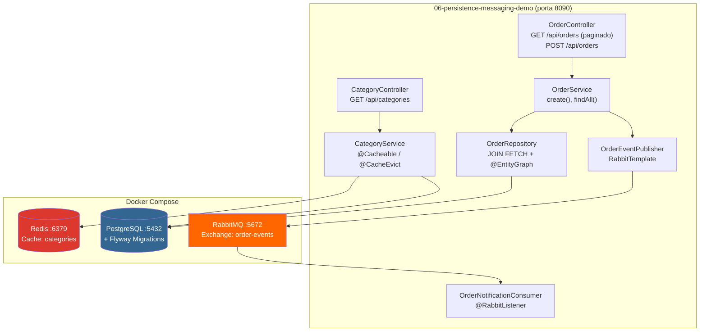
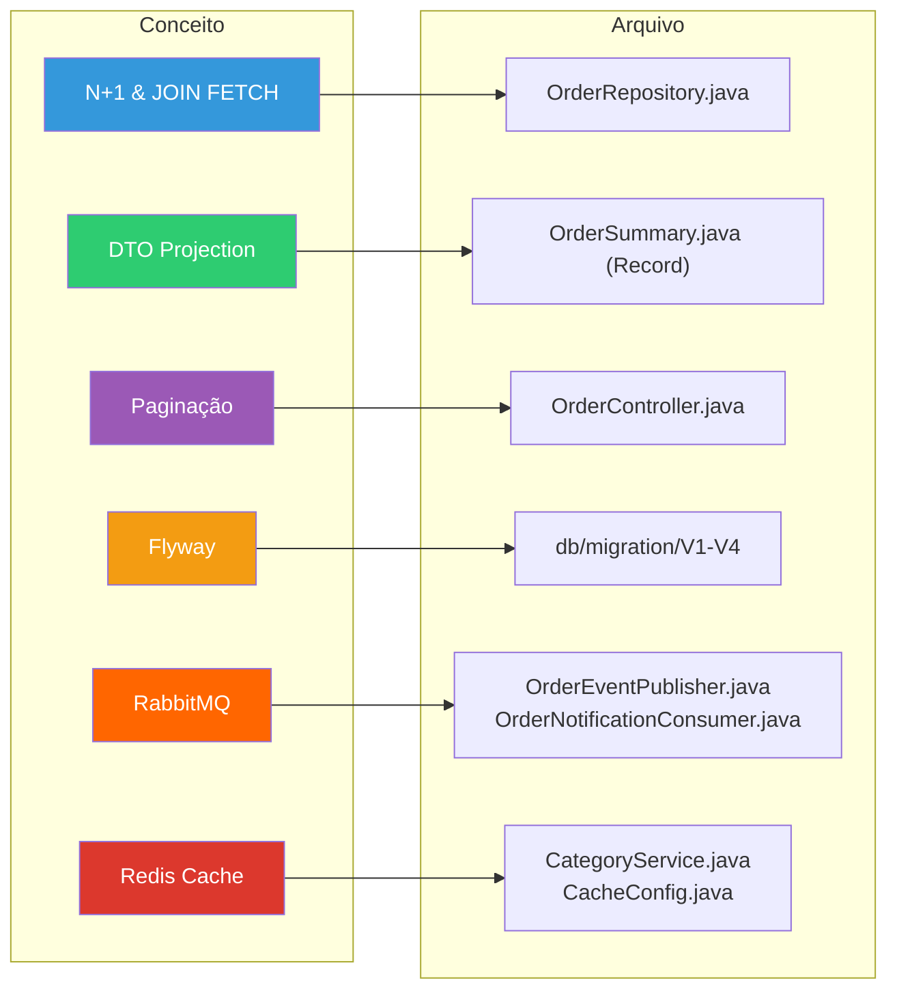
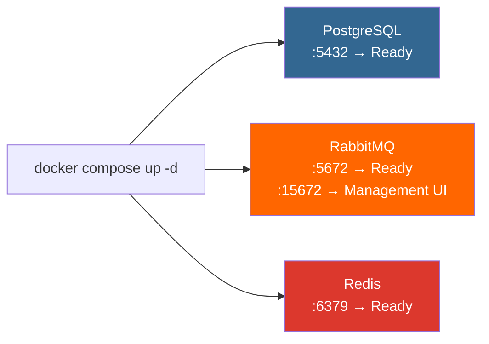
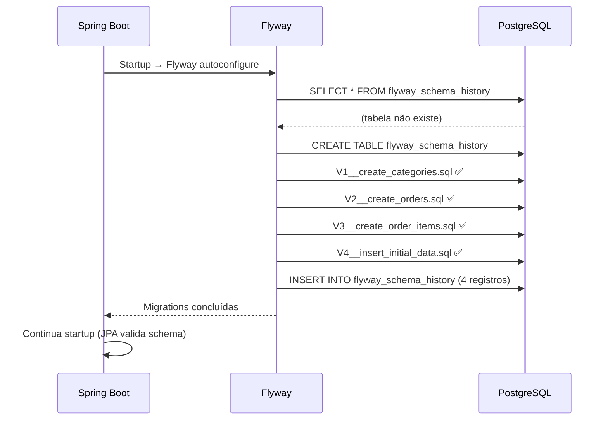
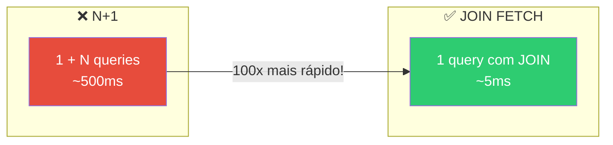
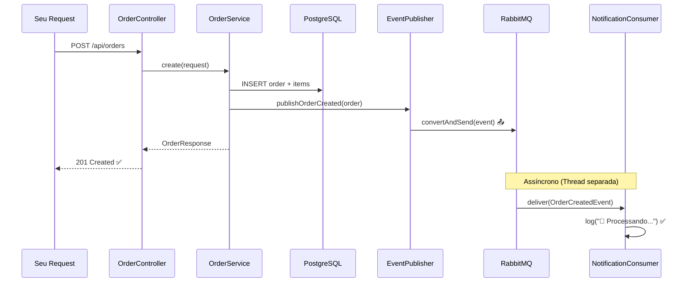
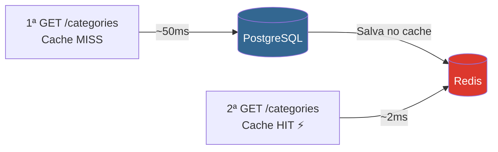

# Slide 10: Walkthrough — 06-persistence-messaging-demo

**Horário:** 13:40 - 13:50

---

## Objetivo do Walkthrough

> **"Mostrar código real é o que convence."**  
> — Pragmatic Programmer

Projeto completo demonstrando **todos os conceitos do Dia 6** integrados em uma única aplicação. Vamos percorrer cada camada juntos.

### Visão Geral da Arquitetura



### Mapa de Conceitos → Código



---

## Demo 1: Docker Compose — Setup

```bash
cd 06-persistence-messaging-demo
docker compose up -d
docker compose ps  # verificar 3 containers healthy
```

### O que observar



**Validação:**
```bash
# Verificar que todos estão healthy
docker compose ps
# NAME          STATUS          PORTS
# postgres      Up (healthy)    5432
# rabbitmq      Up (healthy)    5672, 15672
# redis         Up (healthy)    6379
```

---

## Demo 2: Flyway Migrations

```
src/main/resources/db/migration/
├── V1__create_categories.sql       ← Tabela de categorias
├── V2__create_orders.sql           ← Tabela de pedidos (FK → categories)
├── V3__create_order_items.sql      ← Tabela de itens (FK → orders)
└── V4__insert_initial_data.sql     ← Dados iniciais de teste
```

> Ao subir a aplicação, o Flyway executa as migrations automaticamente. Verifique nos logs:

```
Flyway: Migrating schema "public" to version 1 - create categories
Flyway: Migrating schema "public" to version 2 - create orders
Flyway: Migrating schema "public" to version 3 - create order items
Flyway: Migrating schema "public" to version 4 - insert initial data
Flyway: Successfully applied 4 migrations
```

### O que acontece internamente



---

## Demo 3: N+1 — Antes e Depois

### Endpoint com N+1 (propositalmente ruim)

```
GET /api/orders/n-plus-one
```

📋 **O que observar nos logs SQL:**

```sql
-- 1 query principal
SELECT o.id, o.customer_name, o.total FROM orders o

-- N queries adicionais (uma para cada order)
SELECT c.id, c.name FROM categories c WHERE c.id = ?
SELECT c.id, c.name FROM categories c WHERE c.id = ?
SELECT c.id, c.name FROM categories c WHERE c.id = ?
-- ... (repete para CADA order!)
```

### Endpoint otimizado (JOIN FETCH)

```
GET /api/orders
```

📋 **Comparem — UMA ÚNICA query:**

```sql
SELECT o.id, o.customer_name, o.total, c.id, c.name
FROM orders o
LEFT JOIN categories c ON o.category_id = c.id
-- Apenas 1 query! ✅
```



---

## Demo 4: Projeção DTO + Paginação

```
GET /api/orders?page=0&size=5&sort=createdAt,desc
```

### O que observar no response:

```json
{
  "content": [
    { "orderId": 10, "customerName": "João", "total": 299.90, "status": "COMPLETED" }
  ],
  "pageable": {
    "pageNumber": 0,
    "pageSize": 5,
    "sort": { "orders": [{ "property": "createdAt", "direction": "DESC" }] }
  },
  "totalElements": 50,
  "totalPages": 10,
  "first": true,
  "last": false
}
```

### O que observar no SQL gerado:

```sql
-- Query com paginação automática
SELECT o.id, o.customer_name, o.total, o.status
FROM orders o
ORDER BY o.created_at DESC
LIMIT 5 OFFSET 0

-- Count query (para totalElements)
SELECT COUNT(*) FROM orders
```

---

## Demo 5: RabbitMQ — Producer/Consumer

### Criar um pedido (dispara evento)

```http
POST /api/orders
Content-Type: application/json

{
  "customerId": 1,
  "items": [
    { "productId": 1, "quantity": 2 }
  ]
}
```

### O que observar no log (sequência):

```
📤 Evento publicado: OrderCreatedEvent (orderId=11)
📧 Processando pedido 11: atualizando estoque...
✅ Estoque atualizado para pedido 11
```



### Verificar no RabbitMQ Management UI

1. Abra **http://localhost:15672** (guest/guest)
2. **Exchanges** → `order-events` (tipo: Direct)
3. **Queues** → `order-notifications`
   - Messages Ready: 0 (consumer processou)
   - Message rates: publish/deliver

---

## Demo 6: Cache Redis — Hit/Miss

### Primeira chamada (MISS — vai ao banco)

```
GET /api/categories
```

Log:
```
🔍 Buscando categorias no banco...
Hibernate: SELECT c.id, c.name, c.description FROM categories c
```

### Segunda chamada (HIT — Redis, sem log!)

```
GET /api/categories
```

Log:
```
(nenhum log! Método nem foi executado — veio direto do Redis ⚡)
```

### Verificar no Redis CLI

```bash
docker exec -it redis-dia06 redis-cli

KEYS *
# 1) "categories::all"

GET "categories::all"
# [{"id":1,"name":"Electronics",...},...]

TTL "categories::all"
# (integer) 580  ← faltam ~9 minutos para expirar
```



---

## 📁 Estrutura do Projeto

```
06-persistence-messaging-demo/
├── docker-compose.yml              ← PostgreSQL + RabbitMQ + Redis
├── pom.xml                         ← spring-data-jpa, amqp, redis, flyway
├── api-requests.http               ← Requests de teste (VS Code REST Client)
└── src/main/
    ├── java/com/example/demo/
    │   ├── config/                  ← RabbitMQConfig, CacheConfig
    │   ├── controller/              ← OrderController, CategoryController
    │   ├── dto/                     ← OrderSummary, OrderRequest, OrderCreatedEvent
    │   ├── exception/               ← GlobalExceptionHandler
    │   ├── messaging/               ← OrderEventPublisher, OrderNotificationConsumer
    │   ├── model/                   ← Order, OrderItem, Category
    │   ├── repository/              ← OrderRepository (JOIN FETCH, @EntityGraph)
    │   └── service/                 ← OrderService, CategoryService (@Cacheable)
    └── resources/
        ├── application.yml          ← Conexões: PG + RabbitMQ + Redis
        └── db/migration/            ← V1, V2, V3, V4 (Flyway)
```

---

## ✅ Checklist de Observação para o Aluno

| # | O que observar | Onde ver | Esperado |
|:---:|:---|:---|:---|
| 1 | Container 3x healthy | Terminal (`docker compose ps`) | STATUS: Up |
| 2 | Flyway migrations aplicadas | Log de startup da app | "Successfully applied 4 migrations" |
| 3 | N+1 queries | Console (GET /n-plus-one) | Múltiplas SELECTs |
| 4 | JOIN FETCH | Console (GET /orders) | Uma única SELECT com JOIN |
| 5 | Paginação response | Response JSON | `totalElements`, `totalPages` |
| 6 | Evento RabbitMQ publicado | Console (POST /orders) | "📤 Evento publicado" |
| 7 | Evento RabbitMQ consumido | Console | "📧 Processando..." + "✅ Atualizado" |
| 8 | RabbitMQ Management UI | http://localhost:15672 | Exchange + Queue visíveis |
| 9 | Cache MISS (1ª chamada) | Console (GET /categories) | "🔍 Buscando no banco..." |
| 10 | Cache HIT (2ª+ chamada) | Console | Nenhum log (silêncio!) |
| 11 | TTL no Redis | `redis-cli TTL "categories::all"` | Inteiro decrementando |

> **Agora é com vocês!** Vamos para o exercício `06-employee-api-advanced`.
