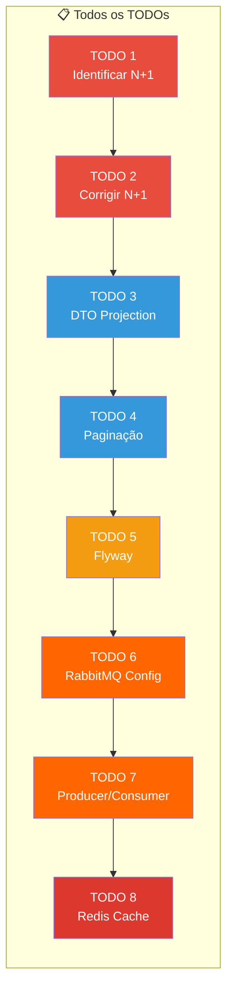
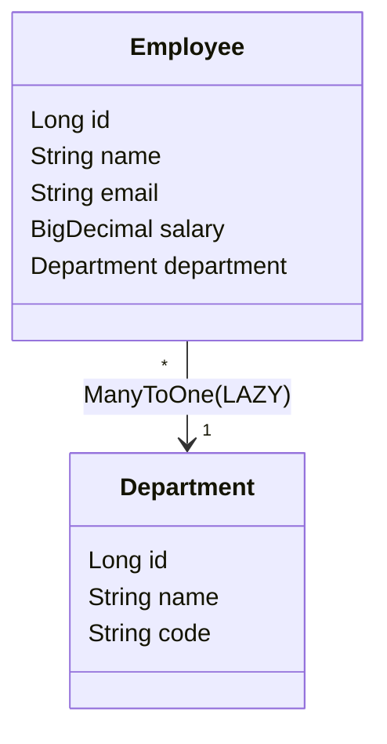
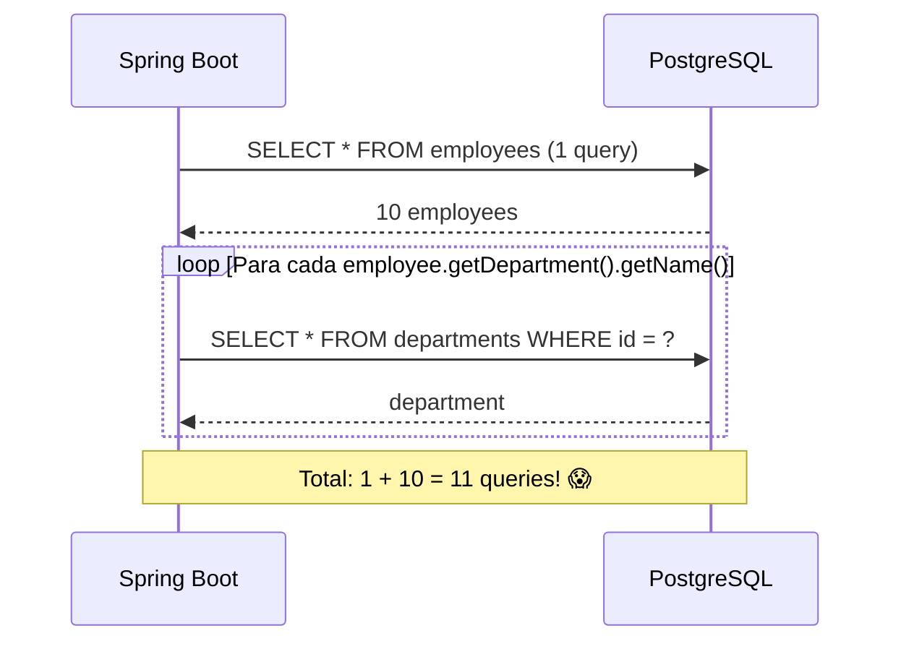
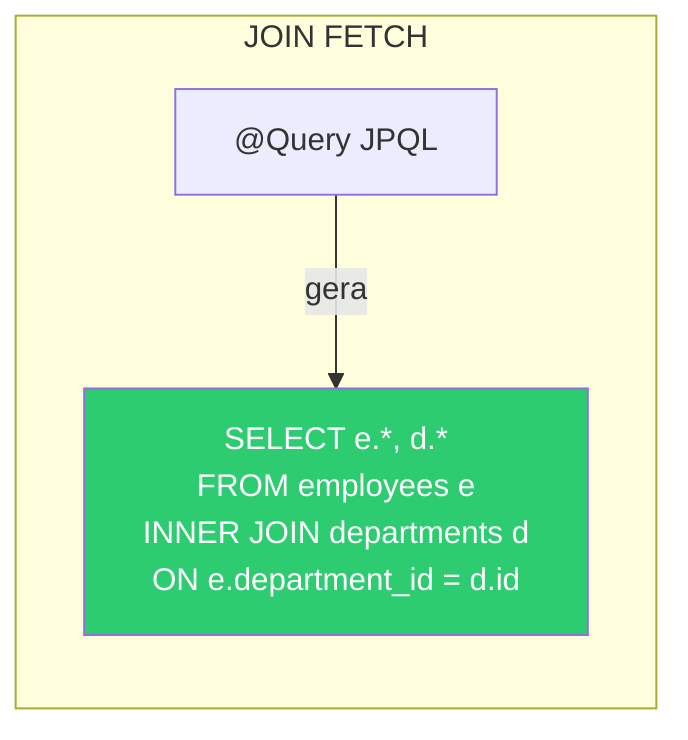
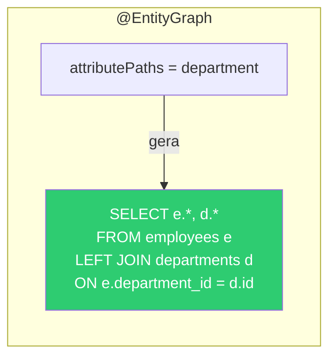
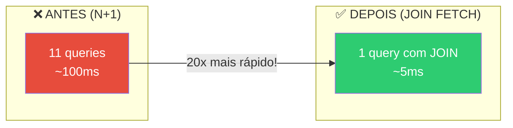

# Slide 11: Exercício — TODOs 1-2 (N+1)

**Horário:** 13:50 - 14:30

---

## 🎯 Exercício: `06-employee-api-advanced`

> Otimizar persistência, adicionar migrations, mensageria e cache à API de Funcionários.

### Visão Geral dos 8 TODOs



> Neste slide: **TODO 1 e TODO 2** (N+1 Problem)

### Setup Inicial

```bash
cd 06-employee-api-advanced
podman compose up -d        # Suba PostgreSQL + RabbitMQ + Redis
podman compose ps           # Verifique 3 containers healthy
mvn spring-boot:run          # Inicie a aplicação (porta 8091)
```

---

## TODO 1: Identificar o N+1

**Arquivo**: `EmployeeController.java` / `EmployeeRepository.java`

### Modelo de dados



### O que fazer

1. Certifique-se de que `show-sql: true` está no `application.yml`
2. Acesse `GET /api/employees` (usando `api-requests.http` ou Postman)
3. **Observe os logs SQL** no console da aplicação
4. **Conte quantas queries** são geradas

### O que esperar nos logs

```sql
-- 1ª query: buscar todos os funcionários
SELECT e.id, e.name, e.email, e.salary, e.department_id FROM employees e;

-- Para CADA funcionário: buscar o departamento (lazy loading)
SELECT d.id, d.name, d.code FROM departments d WHERE d.id = 1;
SELECT d.id, d.name, d.code FROM departments d WHERE d.id = 2;
SELECT d.id, d.name, d.code FROM departments d WHERE d.id = 1;  -- mesmo dept, outra query!
-- ... +N queries (uma por funcionário)
```

### Visualização do Problema



### Dica

- A aplicação já tem dados iniciais (Flyway seed data ou `data.sql`)
- Use o `api-requests.http` para fazer as requisições
- **Anote quantas queries você viu** — vamos comparar depois da correção

<details>
<summary>💡 Pergunta: Se tiver 100 funcionários em 5 departamentos, quantas queries?</summary>

**101 queries!** (1 + 100). O Hibernate faz 1 query por employee, mesmo que vários compartilhem o mesmo departamento — porque o proxy é por instância do Employee, não por Department.

> Com `@BatchSize(size=10)` seriam 1 + 10 = 11 queries.  
> Com `JOIN FETCH` seria apenas **1 query**.

</details>

---

## TODO 2: Corrigir o N+1

**Arquivo**: `EmployeeRepository.java`

### O que implementar

Corrija o N+1 de **duas formas** — uma por método:

#### Opção A: JOIN FETCH na JPQL

```java
public interface EmployeeRepository extends JpaRepository<Employee, Long> {

    // TODO 2A: Corrigir N+1 com JOIN FETCH
    @Query("SELECT e FROM Employee e JOIN FETCH e.department")
    List<Employee> findAllWithDepartment();
}
```



#### Opção B: @EntityGraph

```java
public interface EmployeeRepository extends JpaRepository<Employee, Long> {

    // TODO 2B: Corrigir N+1 com @EntityGraph
    @EntityGraph(attributePaths = {"department"})
    @Override
    List<Employee> findAll();
}
```



### Diferença: INNER vs LEFT JOIN

| Aspecto | JOIN FETCH | @EntityGraph |
|:---|:---:|:---:|
| Tipo de JOIN | **INNER JOIN** | **LEFT JOIN** |
| Employee sem Department | ❌ Não retorna | ✅ Retorna com department null |
| Personalização | ✅ JPQL livre | ✅ Só marca atributos |
| Uso com `findAll()` | Precisa de `@Query` | Override direto |

### Verificação — Antes e Depois



Acesse `GET /api/employees` novamente e observe os logs:

```sql
-- ANTES (N+1): 1 + N queries
-- DEPOIS: 1 query com JOIN ✅
SELECT e.id, e.name, e.email, e.salary,
       d.id, d.name, d.code
FROM employees e
INNER JOIN departments d ON e.department_id = d.id;
```

### Checklist

- [ ] Consegui identificar o N+1 nos logs SQL
- [ ] Contei corretamente o número de queries N+1
- [ ] Implementei `findAllWithDepartment()` com `JOIN FETCH`
- [ ] Implementei `findAll()` com `@EntityGraph`
- [ ] Logs SQL mostram **1 query com JOIN** (não N+1)
- [ ] Endpoint `GET /api/employees` funciona e retorna dados corretos

---

## ⏰ Tempo estimado: 40 minutos

| Atividade | Tempo |
|-----------|-------|
| Setup + subir Podman Compose | 5 min |
| Analisar logs SQL e identificar N+1 | 10 min |
| Implementar JOIN FETCH | 10 min |
| Implementar @EntityGraph | 10 min |
| Testar e comparar logs | 5 min |

> **Dúvida?** Levante a mão. O N+1 é o conceito mais importante do dia — vale investir tempo aqui.
