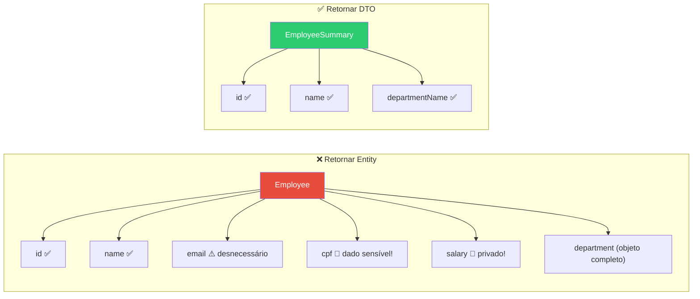
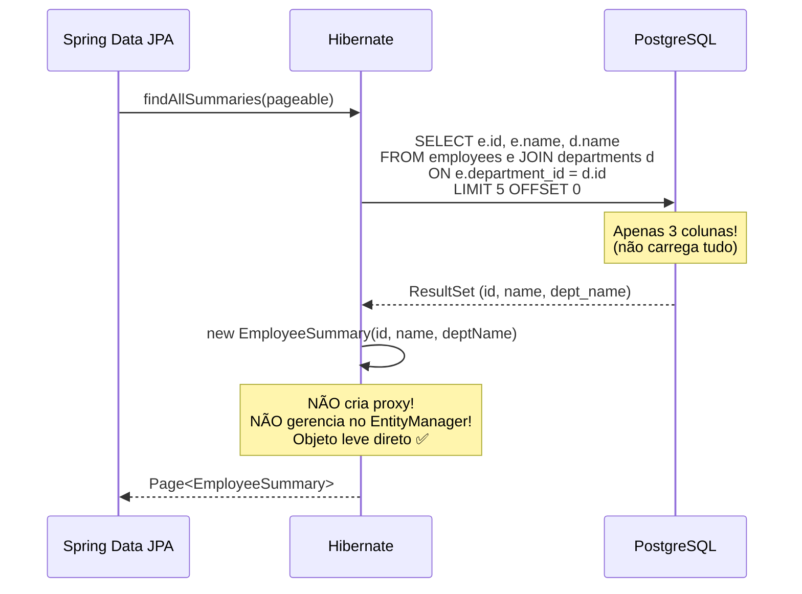
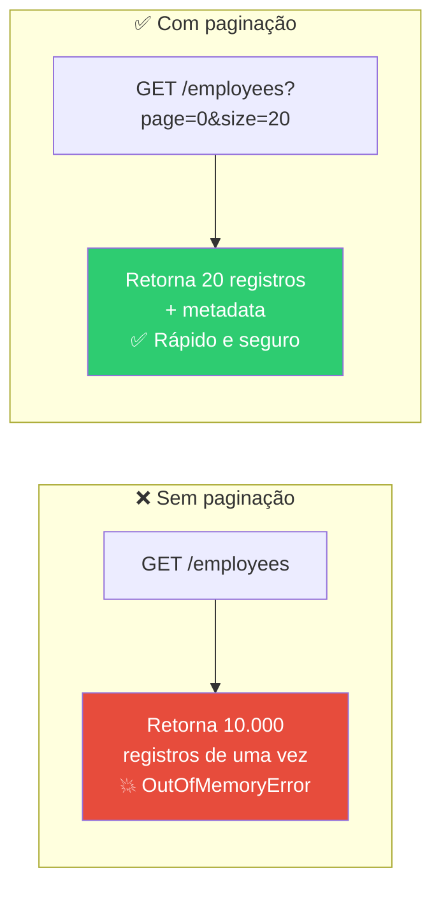
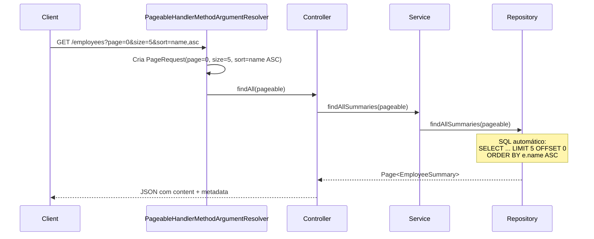
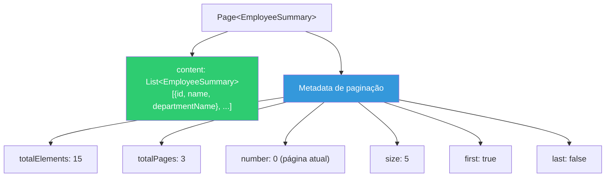

# Slide 12: Exercício — TODOs 3-4 (Projeção DTO e Paginação)

**Horário:** 14:30 - 15:10

---

## TODO 3: Criar Projeção DTO `EmployeeSummary`

**Arquivos**: `dto/EmployeeSummary.java`, `EmployeeRepository.java`

### Conceito — Por que projeção DTO?



### O que criar

Um Record com apenas os campos necessários para a listagem:

```java
// TODO 3: Criar EmployeeSummary no pacote dto
public record EmployeeSummary(
    Long id,
    String name,
    String departmentName
) {}
```

> **Record**: classe imutável do Java 16+ com `equals()`, `hashCode()`, `toString()` automáticos. Perfeita para DTOs!

### Query JPQL com projeção

```java
// No EmployeeRepository
@Query("SELECT new com.example.employee.dto.EmployeeSummary(" +
       "e.id, e.name, d.name) " +
       "FROM Employee e JOIN e.department d")
Page<EmployeeSummary> findAllSummaries(Pageable pageable);
```

### Como funciona internamente



### Diferença na resposta

```json
// ❌ Antes (Employee completo — dados sensíveis expostos!)
{
  "id": 1,
  "name": "Ana Silva",
  "email": "ana@email.com",        // desnecessário para listagem
  "cpf": "12345678901",            // 🔴 dado sensível!
  "salary": 5000.00,               // 🔴 privado!
  "department": { "id": 1, "name": "Engenharia", "code": "ENG" },
  "createdAt": "2026-02-22T10:00:00"
}

// ✅ Depois (EmployeeSummary — apenas dados necessários)
{
  "id": 1,
  "name": "Ana Silva",
  "departmentName": "Engenharia"
}
```

### Vantagens da Projeção

| Aspecto | Entity completa | DTO Projection |
|:---|:---:|:---:|
| Dados no response | Todos (inclusive sensíveis) | Só os necessários |
| SQL gerado | `SELECT *` | `SELECT id, name, dept_name` |
| Proxy Hibernate | Sim (pesado) | Não (leve) |
| Segurança | ❌ Expõe salary, CPF | ✅ Só dados públicos |
| Performance | Mais dados trafegam | Menos dados |

---

## TODO 4: Adicionar Paginação

**Arquivo**: `EmployeeController.java`

### Conceito — Por que paginar?



### O que implementar

Receber `Pageable` como parâmetro e retornar `Page<EmployeeSummary>`:

```java
// Controller
@GetMapping
public Page<EmployeeSummary> findAll(Pageable pageable) {
    return employeeService.findAllSummaries(pageable);
}
```

```java
// Service
public Page<EmployeeSummary> findAllSummaries(Pageable pageable) {
    return employeeRepository.findAllSummaries(pageable);
}
```

### Como Spring resolve o `Pageable` automaticamente



### Testar

```
GET /api/employees?page=0&size=5&sort=name,asc
```

Resposta esperada:
```json
{
  "content": [
    { "id": 3, "name": "Ana Silva", "departmentName": "Engenharia" },
    { "id": 7, "name": "Bruno Costa", "departmentName": "Marketing" },
    { "id": 1, "name": "Carlos Souza", "departmentName": "Financeiro" }
  ],
  "pageable": {
    "pageNumber": 0,
    "pageSize": 5,
    "sort": { "orders": [{ "property": "name", "direction": "ASC" }] }
  },
  "totalElements": 15,
  "totalPages": 3,
  "number": 0,
  "size": 5,
  "first": true,
  "last": false
}
```

### Parâmetros para testar

| Request | Descrição | SQL gerado |
|:---|:---|:---|
| `?page=0&size=5&sort=name,asc` | 1ª página, 5 itens, por nome | `LIMIT 5 OFFSET 0 ORDER BY name ASC` |
| `?page=1&size=5&sort=name,asc` | 2ª página | `LIMIT 5 OFFSET 5 ORDER BY name ASC` |
| `?page=0&size=10&sort=departmentName,desc` | Ordenar por dept desc | `LIMIT 10 ORDER BY d.name DESC` |
| `?page=0&size=20` | Sem sort (default) | `LIMIT 20 OFFSET 0` |

### Anatomy do Response `Page<T>`



---

## Checklist

- [ ] `EmployeeSummary` record criado com `id`, `name`, `departmentName`
- [ ] Query JPQL com `SELECT new ... EmployeeSummary(...)` no Repository
- [ ] Query retorna `Page<EmployeeSummary>` (não List)
- [ ] Controller recebe `Pageable` e retorna `Page<EmployeeSummary>`
- [ ] Paginação funciona com `page`, `size` e `sort`
- [ ] Resposta inclui metadata (`totalElements`, `totalPages`, `first`, `last`)
- [ ] Dados sensíveis (salary, CPF) **não aparecem** no response

---

## ⏰ Tempo estimado: 40 minutos

| Atividade | Tempo |
|-----------|-------|
| Criar `EmployeeSummary` Record | 5 min |
| Implementar query JPQL com projeção | 15 min |
| Adicionar `Pageable` no Controller/Service | 10 min |
| Testar paginação e sorting | 10 min |

> **Próximo**: Flyway Migrations — versionando o schema do banco!
