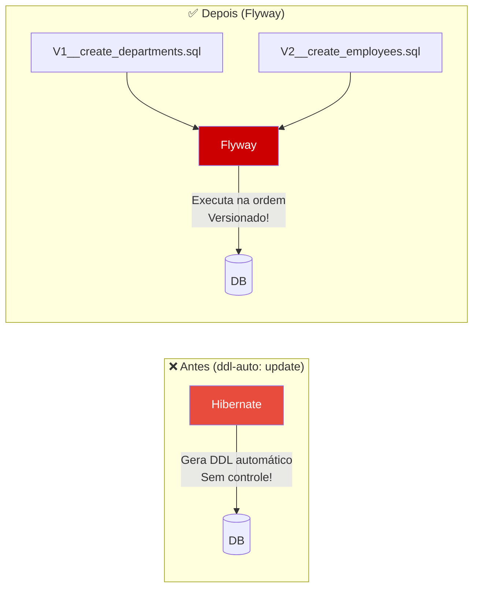
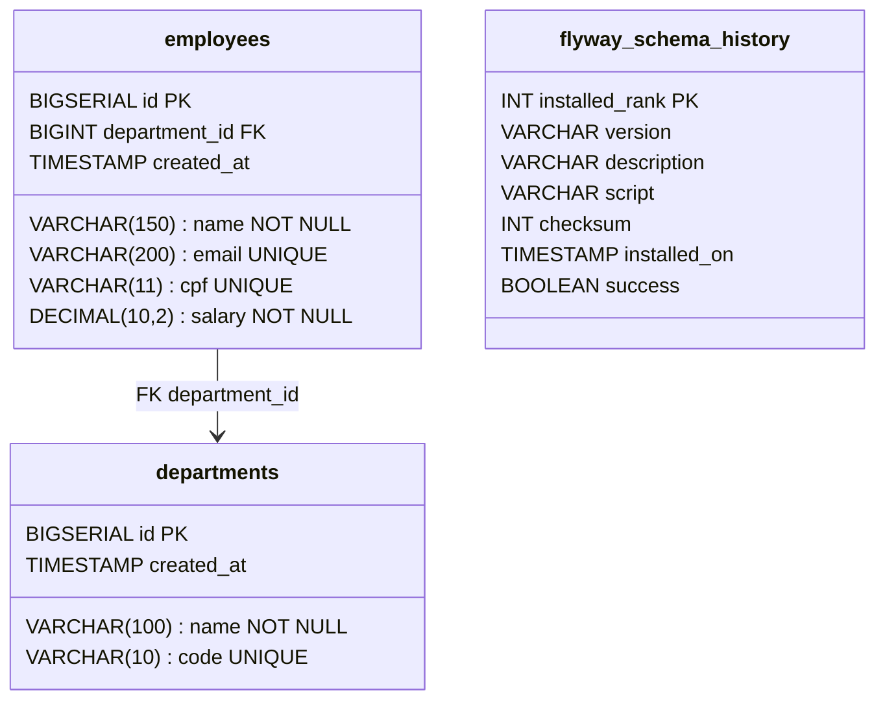
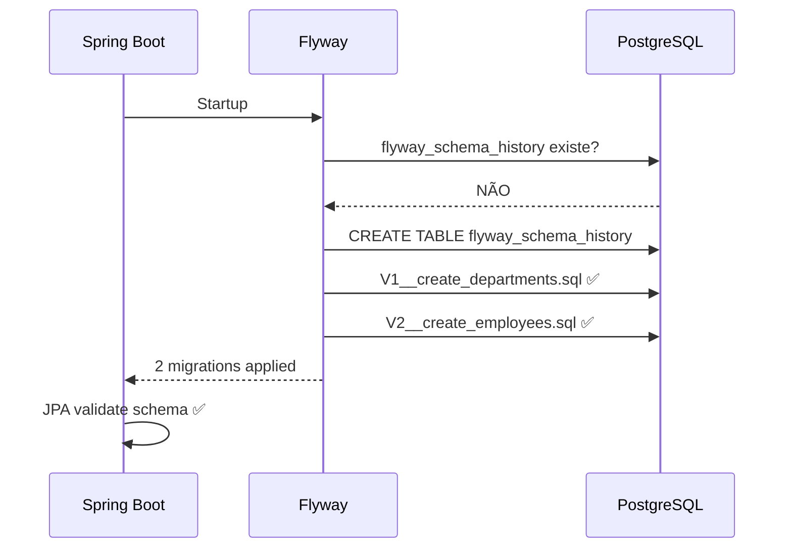

# Slide 13: Exercício — TODO 5 (Flyway)

**Horário:** 15:10 - 15:30

---

## TODO 5: Criar Migrations Flyway

**Arquivos**: `src/main/resources/db/migration/V1__create_departments.sql`, `V2__create_employees.sql`

### Conceito — O que vamos fazer

Substituir `ddl-auto: update` (Hibernate cria tabelas) por migrations Flyway (SQL versionado).



### O que fazer

1. Criar a pasta `db/migration/` em `src/main/resources/`
2. Criar os scripts SQL versionados (nomenclatura V{n}__{descrição}.sql)
3. Remover `spring.jpa.hibernate.ddl-auto` do `application.yml` (ou trocar para `validate`)

---

### V1__create_departments.sql

```sql
CREATE TABLE departments (
    id BIGSERIAL PRIMARY KEY,
    name VARCHAR(100) NOT NULL,
    code VARCHAR(10) NOT NULL UNIQUE,
    created_at TIMESTAMP DEFAULT CURRENT_TIMESTAMP
);

-- Dados iniciais
INSERT INTO departments (name, code) VALUES
    ('Engenharia', 'ENG'),
    ('Marketing', 'MKT'),
    ('Recursos Humanos', 'RH'),
    ('Financeiro', 'FIN'),
    ('Vendas', 'VND');
```

> ⚠️ **V1 deve criar departments ANTES** porque V2 (employees) tem FK para departments.

---

### V2__create_employees.sql

```sql
CREATE TABLE employees (
    id BIGSERIAL PRIMARY KEY,
    name VARCHAR(150) NOT NULL,
    email VARCHAR(200) NOT NULL UNIQUE,
    cpf VARCHAR(11) NOT NULL UNIQUE,
    salary DECIMAL(10,2) NOT NULL,
    department_id BIGINT NOT NULL,
    created_at TIMESTAMP DEFAULT CURRENT_TIMESTAMP,
    CONSTRAINT fk_employee_department
        FOREIGN KEY (department_id) REFERENCES departments(id)
);

-- Índices para performance
CREATE INDEX idx_employee_email ON employees(email);
CREATE INDEX idx_employee_department ON employees(department_id);

-- Dados iniciais (15 funcionários para testar paginação)
INSERT INTO employees (name, email, cpf, salary, department_id) VALUES
    ('Ana Silva', 'ana.silva@email.com', '12345678901', 5000.00, 1),
    ('Bruno Costa', 'bruno.costa@email.com', '23456789012', 4500.00, 2),
    ('Carlos Souza', 'carlos.souza@email.com', '34567890123', 6000.00, 3),
    ('Diana Oliveira', 'diana.oliveira@email.com', '45678901234', 5500.00, 1),
    ('Eduardo Santos', 'eduardo.santos@email.com', '56789012345', 4000.00, 4),
    ('Fernanda Lima', 'fernanda.lima@email.com', '67890123456', 7000.00, 1),
    ('Gabriel Rocha', 'gabriel.rocha@email.com', '78901234567', 3500.00, 5),
    ('Helena Martins', 'helena.martins@email.com', '89012345678', 8000.00, 2),
    ('Igor Pereira', 'igor.pereira@email.com', '90123456789', 4200.00, 3),
    ('Julia Almeida', 'julia.almeida@email.com', '01234567890', 5800.00, 4),
    ('Kevin Barbosa', 'kevin.barbosa@email.com', '11234567890', 3200.00, 5),
    ('Laura Ferreira', 'laura.ferreira@email.com', '22345678901', 6500.00, 1),
    ('Marcos Ribeiro', 'marcos.ribeiro@email.com', '33456789012', 4800.00, 2),
    ('Natalia Cardoso', 'natalia.cardoso@email.com', '44567890123', 5200.00, 3),
    ('Oscar Mendes', 'oscar.mendes@email.com', '55678901234', 3800.00, 5);
```

### Estrutura do Schema Resultante



---

### Configurar application.yml

```yaml
spring:
  flyway:
    enabled: true                     # Habilitar Flyway
    locations: classpath:db/migration  # Onde estão os scripts
    baseline-on-migrate: true          # Criar baseline se DB já existir

  jpa:
    hibernate:
      ddl-auto: validate  # ← TROCAR de "update" para "validate"
    show-sql: true
```

> `validate` = Hibernate VERIFICA se as Entities correspondem ao schema (mas NÃO altera). Se não corresponder, a aplicação **falha ao subir** — ótimo para detectar erros!

---

## Verificação

### Ao subir a aplicação

```
Flyway Community Edition by Redgate
Database: jdbc:postgresql://localhost:5432/employeedb (PostgreSQL 16.x)
Successfully validated 2 migrations
Migrating schema "public" to version "1 - create departments"
Migrating schema "public" to version "2 - create employees"
Successfully applied 2 migrations to schema "public"
```



### Verificar tabela de histórico

```sql
-- Via psql ou DBeaver
SELECT version, description, installed_on, success
FROM flyway_schema_history;
```

| version | description | success |
|:---:|:---|:---:|
| 1 | create departments | true |
| 2 | create employees | true |

---

## ⚠️ Erros Comuns

| Erro | Causa | Solução |
|:---|:---|:---|
| `Validate failed: Migration checksum mismatch` | Editou um script já aplicado | `podman compose down -v && podman compose up -d` |
| `Detected resolved migration not applied` | Criou V1 depois de V2 | Recriar DB limpo |
| `relation already exists` | Tabela já existe (ddl-auto criou antes) | Limpar DB ou usar `baseline-on-migrate` |
| `SchemaManagementException` | JPA validate falhou | Verificar nomes de colunas Entity vs SQL |

---

## Checklist

- [ ] Pasta `db/migration/` criada em `src/main/resources/`
- [ ] `V1__create_departments.sql` com `CREATE TABLE` + dados iniciais (5 departamentos)
- [ ] `V2__create_employees.sql` com `CREATE TABLE` + FK + índices + 15 funcionários
- [ ] Nomenclatura correta: `V{número}__{descrição}.sql` (dois underscores!)
- [ ] `ddl-auto` alterado para `validate` no `application.yml`
- [ ] `flyway.enabled: true` configurado
- [ ] Aplicação sobe sem erros com as migrations
- [ ] `flyway_schema_history` mostra 2 migrations com `success = true`

---

## ⏰ Tempo estimado: 20 minutos

| Atividade | Tempo |
|-----------|-------|
| Criar pasta e scripts SQL | 10 min |
| Configurar application.yml | 5 min |
| Testar (reiniciar app e verificar logs) | 5 min |

> **⚠️ Importante**: Se der erro de checksum, reinicie com banco limpo: `podman compose down -v && podman compose up -d`

> **Próximo**: RabbitMQ — publicar e consumir eventos!
