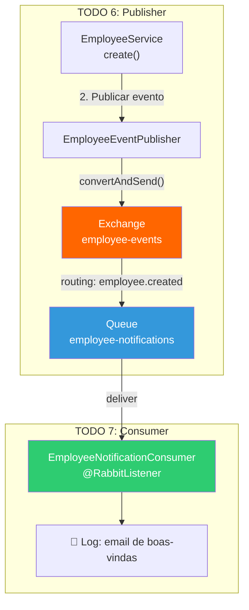
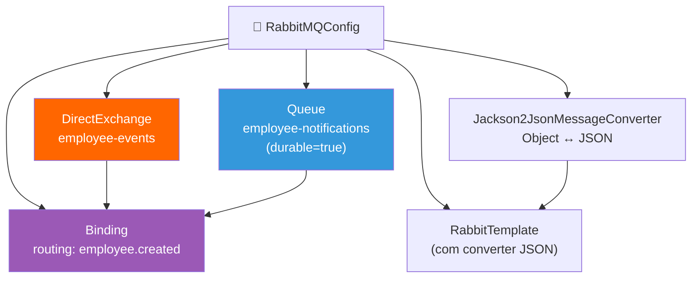
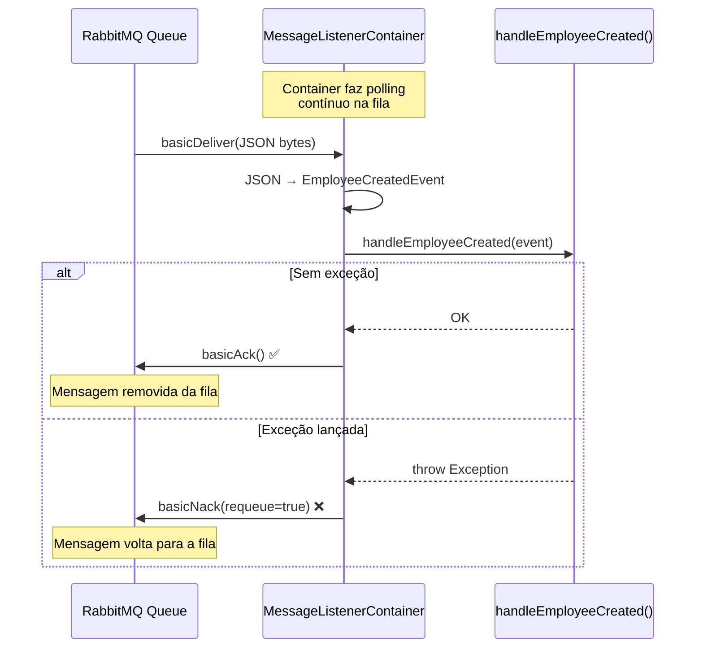

# Slide 14: Exercício — TODOs 6-7 (RabbitMQ)

**Horário:** 15:30 - 16:10

---

## Visão Geral — O que vamos construir



> **4 arquivos para criar** + **1 arquivo para alterar** = mensageria completa!

---

## TODO 6: Publicar Evento EmployeeCreatedEvent

**Arquivos**: `dto/EmployeeCreatedEvent.java`, `config/RabbitMQConfig.java`, `messaging/EmployeeEventPublisher.java`, `service/EmployeeService.java`

---

### Passo 1: Criar o evento (Record)

```java
// dto/EmployeeCreatedEvent.java
public record EmployeeCreatedEvent(
    Long employeeId,
    String name,
    String email,
    String departmentName
) {}
```

> **Record** = DTO imutável. NÃO envie a Entity `Employee` — ela tem proxy Hibernate, lazy collections, e pode causar `LazyInitializationException`.

---

### Passo 2: Configurar Exchange, Queue e Binding

```java
// config/RabbitMQConfig.java
@Configuration
public class RabbitMQConfig {

    public static final String EXCHANGE_NAME = "employee-events";
    public static final String QUEUE_NAME = "employee-notifications";
    public static final String ROUTING_KEY = "employee.created";

    @Bean
    public Queue employeeNotificationsQueue() {
        return new Queue(QUEUE_NAME, true);  // durable = true!
    }

    @Bean
    public DirectExchange employeeExchange() {
        return new DirectExchange(EXCHANGE_NAME);
    }

    @Bean
    public Binding binding(Queue employeeNotificationsQueue,
                           DirectExchange employeeExchange) {
        return BindingBuilder
                .bind(employeeNotificationsQueue)       // que fila
                .to(employeeExchange)                   // que exchange
                .with(ROUTING_KEY);                     // com que routing key
    }

    @Bean
    public Jackson2JsonMessageConverter messageConverter() {
        return new Jackson2JsonMessageConverter();      // Object → JSON!
    }

    @Bean
    public RabbitTemplate rabbitTemplate(ConnectionFactory connectionFactory,
                                         Jackson2JsonMessageConverter converter) {
        RabbitTemplate template = new RabbitTemplate(connectionFactory);
        template.setMessageConverter(converter);
        return template;
    }
}
```

### Mapa dos 5 Beans



---

### Passo 3: Criar o Publisher

```java
// messaging/EmployeeEventPublisher.java
@Service
@Slf4j
public class EmployeeEventPublisher {

    private final RabbitTemplate rabbitTemplate;

    public EmployeeEventPublisher(RabbitTemplate rabbitTemplate) {
        this.rabbitTemplate = rabbitTemplate;
    }

    public void publishEmployeeCreated(Employee employee) {
        // 1. Converter Entity → Record (DTO leve)
        var event = new EmployeeCreatedEvent(
            employee.getId(),
            employee.getName(),
            employee.getEmail(),
            employee.getDepartment().getName()
        );

        // 2. Publicar no RabbitMQ
        rabbitTemplate.convertAndSend(
            RabbitMQConfig.EXCHANGE_NAME,    // exchange
            RabbitMQConfig.ROUTING_KEY,      // routing key
            event                            // mensagem (será JSON)
        );

        log.info("📤 Evento publicado: EmployeeCreatedEvent (id={}, name={})",
                employee.getId(), employee.getName());
    }
}
```

---

### Passo 4: Integrar no EmployeeService.create()

```java
// Em EmployeeService.java — ALTERAR método create()
@Service
public class EmployeeService {

    private final EmployeeRepository employeeRepository;
    private final EmployeeEventPublisher eventPublisher;  // ← Injetar

    public EmployeeResponse create(EmployeeRequest request) {
        // 1. Validações e salvamento no banco
        Employee employee = employeeRepository.save(toEntity(request));

        // 2. TODO 6: Publicar evento APÓS salvar com sucesso
        eventPublisher.publishEmployeeCreated(employee);

        // 3. Retornar resposta (não espera o consumer)
        return toResponse(employee);
    }
}
```

> ⚠️ **Ordem importante**: salvar no banco ANTES de publicar. Se o save falhar, não queremos publicar o evento.

---

## TODO 7: Criar Consumer

**Arquivo**: `messaging/EmployeeNotificationConsumer.java`

```java
@Component
@Slf4j
public class EmployeeNotificationConsumer {

    @RabbitListener(queues = RabbitMQConfig.QUEUE_NAME)
    public void handleEmployeeCreated(EmployeeCreatedEvent event) {
        log.info("📧 Enviando email de boas-vindas para {} ({})",
                event.name(), event.email());

        // Simular processamento (envio de email, etc.)
        // Em produção aqui seria: emailService.send(...)
        log.info("✅ Notificação processada para funcionário id={}",
                event.employeeId());
    }
}
```

### Como `@RabbitListener` funciona



---

## Verificação

### 1. Criar um funcionário via POST

```http
POST /api/employees
Content-Type: application/json

{
  "name": "Teste RabbitMQ",
  "email": "rabbit@email.com",
  "cpf": "98765432100",
  "salary": 5000.00,
  "departmentId": 1
}
```

### 2. Verificar os logs (sequência esperada)

```
INFO  EmployeeService           : Criando funcionário: Teste RabbitMQ
INFO  EmployeeEventPublisher   : 📤 Evento publicado: EmployeeCreatedEvent (id=16, name=Teste RabbitMQ)
INFO  EmployeeNotificationConsumer : 📧 Enviando email de boas-vindas para Teste RabbitMQ (rabbit@email.com)
INFO  EmployeeNotificationConsumer : ✅ Notificação processada para funcionário id=16
```

### 3. Verificar no RabbitMQ Management UI

📋 Acesse **http://localhost:15672** (guest/guest):

| Onde verificar | O que ver |
|:---|:---|
| **Exchanges** → `employee-events` | Tipo: Direct, com binding |
| **Queues** → `employee-notifications` | Messages = 0 (consumer processou) |
| **Queues** → Rates | Publish rate e Deliver rate > 0 |

---

## ⚠️ Erros Comuns

| Erro | Causa | Solução |
|:---|:---|:---|
| `ConnectException: Connection refused` | RabbitMQ não está rodando | `docker compose up -d` |
| `LazyInitializationException` | Enviou Entity com lazy collection | Converter Entity → Record antes de publicar |
| Log não mostra "📧" | Consumer não está registrado | Verificar `@Component` e `@RabbitListener` |
| Mensagem na fila mas não consumida | Nome da fila diferente no Listener | Verificar `QUEUE_NAME` é o mesmo |

---

## Checklist

- [ ] `EmployeeCreatedEvent` record criado com 4 campos
- [ ] `RabbitMQConfig` com Exchange, Queue, Binding, Converter e RabbitTemplate (5 beans)
- [ ] `EmployeeEventPublisher` publicando evento via `RabbitTemplate.convertAndSend()`
- [ ] `EmployeeService.create()` chamando `eventPublisher.publishEmployeeCreated()`
- [ ] Evento publicado **DEPOIS** de `repository.save()`
- [ ] `EmployeeNotificationConsumer` com `@RabbitListener` processando eventos
- [ ] POST de funcionário gera log de publicação 📤 E consumo 📧
- [ ] Exchange e Queue visíveis no RabbitMQ Management UI

---

## ⏰ Tempo estimado: 40 minutos

| Atividade | Tempo |
|-----------|-------|
| Criar evento Record + config RabbitMQ | 10 min |
| Implementar Publisher | 10 min |
| Integrar no EmployeeService | 5 min |
| Criar Consumer | 5 min |
| Testar e verificar no RabbitMQ UI | 10 min |

> **Próximo**: Cache com Redis — acelerar consultas frequentes!
