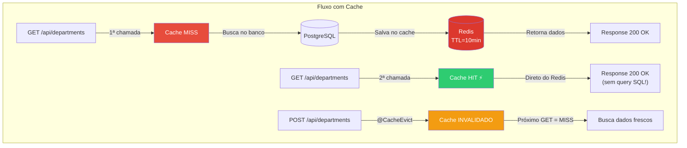
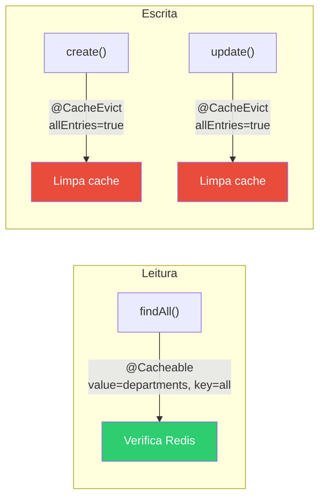
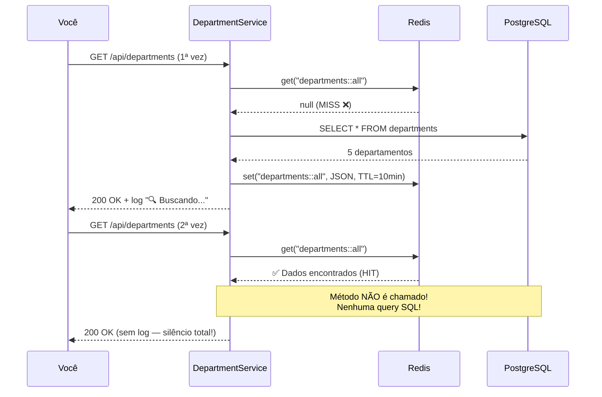

# Slide 15: Exercício — TODO 8 (Redis)

**Horário:** 16:10 - 16:30

---

## TODO 8: Cachear Listagem de Departamentos com Redis

**Arquivos**: `service/DepartmentService.java`, `config/CacheConfig.java`, `application.yml`

### Conceito — O que vamos implementar



---

### Passo 1: Habilitar caching na aplicação

Adicione `@EnableCaching` na classe principal:

```java
@SpringBootApplication
@EnableCaching    // ← Obrigatório! Ativa o AOP proxy para cache
public class EmployeeApiAdvancedApplication { ... }
```

> Sem `@EnableCaching`, as anotações `@Cacheable`/`@CacheEvict` são **ignoradas silenciosamente**.

---

### Passo 2: Adicionar anotações no DepartmentService

```java
@Service
@Slf4j
public class DepartmentService {

    private final DepartmentRepository departmentRepository;

    // TODO 8A: Cachear listagem de departamentos
    @Cacheable(value = "departments", key = "'all'")
    public List<DepartmentResponse> findAll() {
        log.info("🔍 Buscando departamentos no banco...");
        return departmentRepository.findAll()
                .stream()
                .map(this::toResponse)
                .toList();
    }

    // TODO 8B: Invalidar cache ao criar departamento
    @CacheEvict(value = "departments", allEntries = true)
    public DepartmentResponse create(DepartmentRequest request) {
        log.info("📝 Criando departamento e limpando cache...");
        Department dept = departmentRepository.save(toEntity(request));
        return toResponse(dept);
    }

    // TODO 8C: Invalidar cache ao atualizar departamento
    @CacheEvict(value = "departments", allEntries = true)
    public DepartmentResponse update(Long id, DepartmentRequest request) {
        log.info("✏️ Atualizando departamento e limpando cache...");
        Department dept = departmentRepository.findById(id)
                .orElseThrow(() -> new DepartmentNotFoundException(id));
        dept.setName(request.name());
        return toResponse(departmentRepository.save(dept));
    }

    private DepartmentResponse toResponse(Department dept) {
        return new DepartmentResponse(dept.getId(), dept.getName(), dept.getCode());
    }

    private Department toEntity(DepartmentRequest request) {
        Department dept = new Department();
        dept.setName(request.name());
        dept.setCode(request.code());
        return dept;
    }
}
```

### Mapa das Anotações



---

### Passo 3: Verificar configuração do Redis no application.yml

```yaml
spring:
  data:
    redis:
      host: localhost         # container Redis
      port: 6379              # porta padrão

  cache:
    type: redis               # usar Redis como provedor de cache
    redis:
      time-to-live: 600000    # 10 minutos em milissegundos (TTL)
```

---

## Verificação

### Teste 1: Cache MISS → HIT



```bash
# 1ª chamada — MISS (log aparece, query SQL executa)
GET /api/departments
# Console:
# INFO  DepartmentService : 🔍 Buscando departamentos no banco...
# Hibernate: SELECT d.id, d.name, d.code FROM departments d

# 2ª chamada — HIT (NENHUM log, nenhuma query SQL!!)
GET /api/departments
# Console:
# (silêncio total — veio do Redis! ⚡)
```

### Teste 2: Cache EVICT

```bash
# Criar novo departamento — cache é limpo automaticamente
POST /api/departments
{ "name": "Jurídico", "code": "JUR" }
# Console: INFO  DepartmentService : 📝 Criando departamento e limpando cache...

# Próximo GET — MISS novamente (cache foi invalidado pelo @CacheEvict)
GET /api/departments
# Console: INFO  DepartmentService : 🔍 Buscando departamentos no banco...
```

### Teste 3: Verificar no Redis CLI

```bash
docker exec -it redis-dia06 redis-cli

# Ver chaves de cache
KEYS *
# 1) "departments::all"

# Ver TTL restante
TTL "departments::all"
# (integer) 580 → faltam ~9 minutos

# Após criar departamento (cache evicted via @CacheEvict):
KEYS *
# (empty array) → cache foi limpo! ✅
```

---

## ⚠️ Erros Comuns

| Erro | Causa | Solução |
|:---|:---|:---|
| Cache não funciona (log sempre aparece) | Faltou `@EnableCaching` | Adicionar na classe principal |
| `RedisConnectionException` | Redis não está rodando | `docker compose up -d` |
| `SerializationException` | Cacheou Entity com proxy | Cachear DTOs/Records, nunca Entities |
| Cache funciona mas dados errados | TTL muito longo + dados mudaram | Adicionar `@CacheEvict` nas escritas |

---

## Checklist

- [ ] `@EnableCaching` na classe principal da aplicação
- [ ] `@Cacheable(value = "departments", key = "'all'")` no `findAll()`
- [ ] `@CacheEvict(value = "departments", allEntries = true)` no `create()`
- [ ] `@CacheEvict(value = "departments", allEntries = true)` no `update()`
- [ ] TTL configurado no `application.yml` (600000ms = 10 min)
- [ ] 1ª chamada GET gera log "🔍 Buscando..." + SQL (MISS)
- [ ] 2ª chamada GET em menos de 10 min **não gera nenhum log** (HIT)
- [ ] POST de departamento limpa o cache (próximo GET gera log novamente)
- [ ] `redis-cli KEYS *` mostra `departments::all` após GET

---

## ⏰ Tempo estimado: 20 minutos

| Atividade | Tempo |
|-----------|-------|
| Adicionar `@EnableCaching` e anotações | 5 min |
| Verificar configuração Redis no yml | 5 min |
| Testar cache MISS/HIT/EVICT sequência completa | 10 min |

> **Parabéns!** Todos os 8 TODOs estão completos. Vamos para o Review final! 🎉
