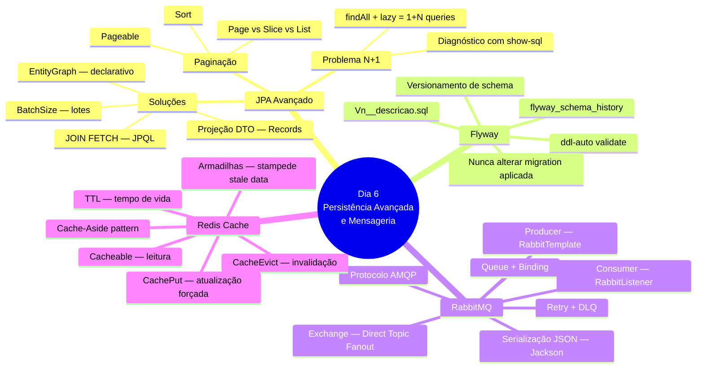
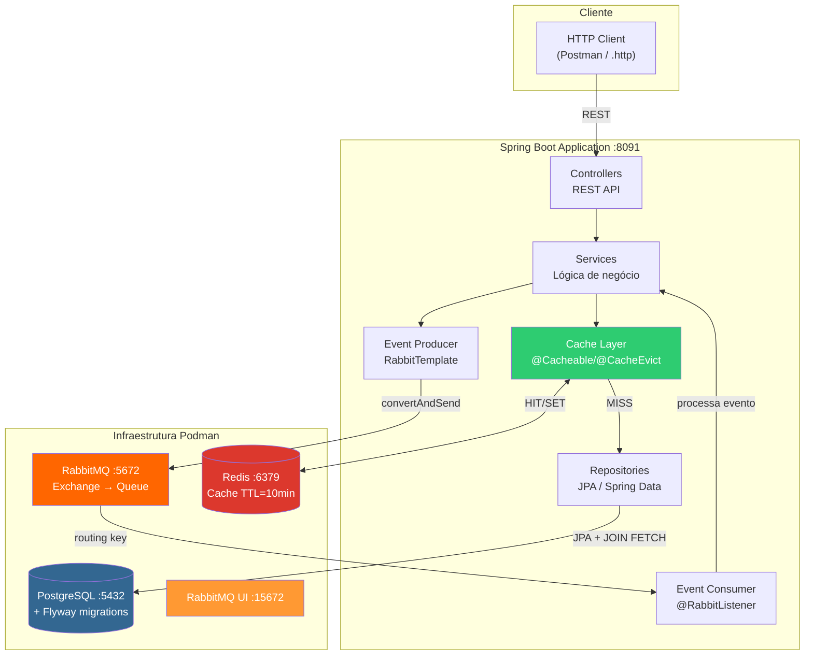
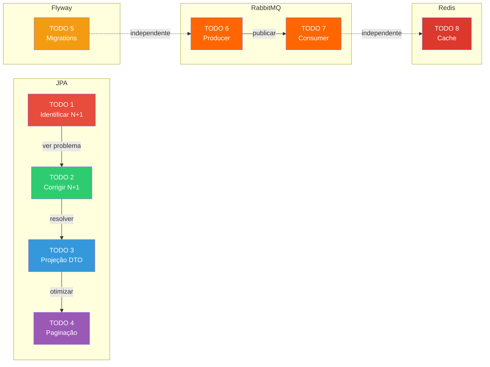
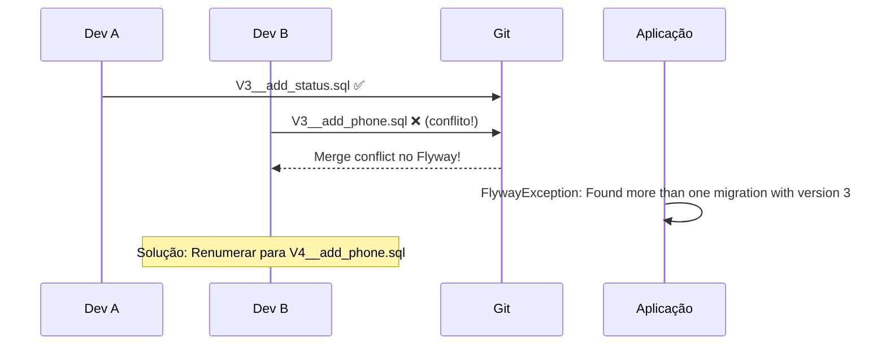
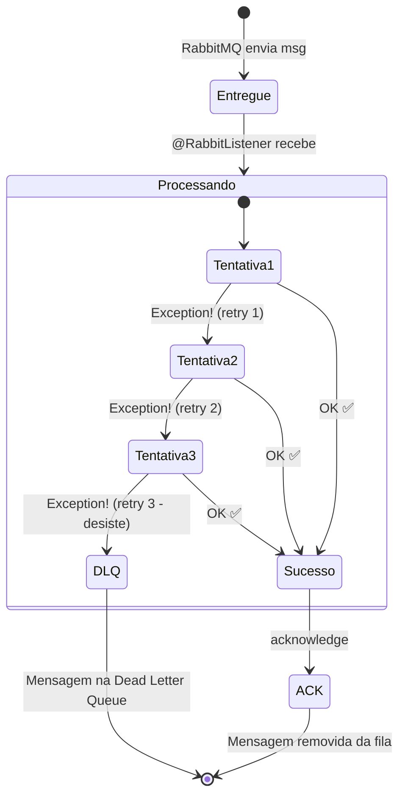
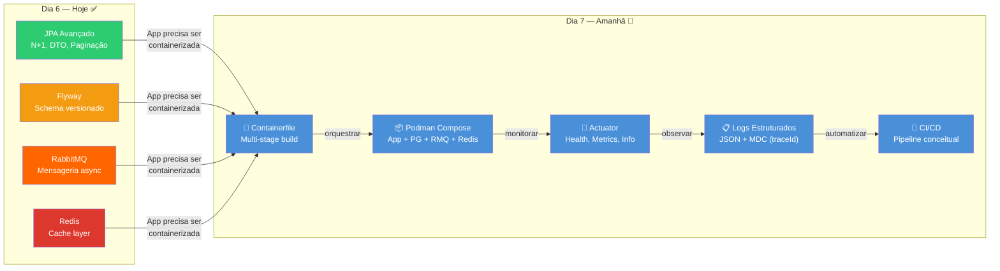

# Slide 16: Review e Q&A

**Horário:** 16:30 - 17:00

---

## 🧠 Mapa Mental — Tudo que Aprendemos Hoje

---

## 🏗️ Arquitetura Final Construída Hoje

---

## Itens vistos no Dia 6

### 1. JPA Avançado — N+1

| Conceito | Detalhe | Importância |
|:--|:--|:--:|
| Problema N+1 | `findAll()` + lazy loading = 1 + N queries | 🔴 Crítico |
| `JOIN FETCH` | JPQL: `SELECT e FROM Employee e JOIN FETCH e.department` | 🟢 Solução principal |
| `@EntityGraph` | Declarativo: `@EntityGraph(attributePaths = {"department"})` | 🟢 Alternativa limpa |
| `@BatchSize` | `@BatchSize(size=10)` — carrega em lotes de 10 | 🟡 Alternativa simples |
| Projeção DTO | `SELECT new EmployeeSummary(e.id, e.name, d.name)` | 🟢 Melhor performance |
| Diagnóstico | `spring.jpa.show-sql=true`, contar queries nos logs | 🔴 Essencial |
| Paginação + N+1 | `JOIN FETCH` com `Pageable` pagina em memória → usar projeção DTO | ⚠️ Armadilha |

### 2. Flyway Migrations

| Conceito | Detalhe | Importância |
|:--|:--|:--:|
| Nomenclatura | `V{n}__{descrição}.sql` (dois underscores!) | 🔴 Crítico |
| Local | `src/main/resources/db/migration/` | 🟢 Convenção |
| Execução | Automática ao subir a aplicação | 🟢 Zero-config |
| Histórico | `flyway_schema_history` (tabela no banco) | 🟡 Auditoria |
| `ddl-auto` | Usar `validate` em produção (nunca `update`!) | 🔴 Crítico |
| Regra de ouro | Nunca alterar migration já aplicada | ⚠️ Checksum error |
| Rollback | Flyway Community não tem rollback automático | 🟡 Criar `V(n+1)__undo` |

### 3. RabbitMQ

| Conceito | Detalhe | Importância |
|:--|:--|:--:|
| **AMQP** | Protocolo de mensageria (Application/Transport/Network) | 🟡 Fundamento |
| **Exchange** | Roteador de mensagens (Direct, Topic, Fanout) | 🟢 Core |
| **Queue** | Fila onde mensagens ficam armazenadas | 🟢 Core |
| **Binding** | Conexão Exchange → Queue via routing key | 🟢 Core |
| **Producer** | `RabbitTemplate.convertAndSend(exchange, key, event)` | 🟢 Publicação |
| **Consumer** | `@RabbitListener(queues = "employee-notifications")` | 🟢 Consumo |
| Serialização | `Jackson2JsonMessageConverter` (JSON) | 🔴 Essencial |
| Retry + DLQ | 3 tentativas → Dead Letter Queue | 🟡 Resiliência |
| Management UI | http://localhost:15672 (guest/guest) | 🟡 Monitoramento |

### 4. Redis Cache

| Conceito | Detalhe | Importância |
|:--|:--|:--:|
| Cache-Aside | Padrão: verifica cache → DB se miss → atualiza cache | 🟢 Padrão principal |
| `@EnableCaching` | Ativa AOP proxy para cache na aplicação | 🔴 Obrigatório |
| `@Cacheable` | Retorna do cache se existir; senão, executa e cacheia | 🟢 Leitura |
| `@CacheEvict` | Limpa o cache (dados mudaram) | 🟢 Invalidação |
| `@CachePut` | Sempre executa e atualiza o cache | 🟡 Atualização |
| TTL | `time-to-live: 600000` (10 minutos) | 🟢 Expiração |
| Verificação | Redis CLI: `KEYS *`, `TTL key`, `GET key` | 🟡 Debug |
| Armadilhas | Cache stampede, dados obsoletos, cachear null | ⚠️ Cuidado |

---

## 📊 Métricas de Sucesso do Dia

### ✅ O que cada aluno deve ter funcionando

| TODO | O que é | Como verificar | Resultado esperado |
|:---:|---------|---------------|-------------------|
| 1 | Identificar N+1 | Logs SQL (show-sql) | 1 + N queries no console |
| 2 | Corrigir N+1 | Logs SQL após JOIN FETCH | 1 única query com JOIN |
| 3 | Projeção DTO | GET /api/employees/summary | JSON com apenas `id`, `name`, `departmentName` |
| 4 | Paginação | GET /employees?page=0&size=5 | JSON com `content[]`, `totalElements`, `totalPages` |
| 5 | Flyway | Subir aplicação | Log "Successfully applied 2 migrations" |
| 6 | Producer | POST /api/employees | Log "📤 Evento publicado..." |
| 7 | Consumer | Após POST | Log "📧 Enviando email de boas-vindas..." |
| 8 | Redis | GET /departments 2x | 1ª com log "🔍", 2ª sem nenhum log |

---

## 🧠 Perguntas para Discussão

### 1. N+1 em Produção

> **Pergunta**: Vocês já viram N+1 em produção? Qual foi o impacto?

💡 Pontos para discussão

- N+1 é a causa **#1** de lentidão em aplicações JPA
- Em produção com 10.000 registros = **10.001 queries** por request
- Impacto: tempo de resposta de **50ms → 5 segundos** ou mais
- Solução emergencial: adicionar `@EntityGraph` ou `JOIN FETCH`
- Prevenção: **sempre** monitorar `show-sql` em desenvolvimento
- Ferramentas de detecção: [Hibernate Query Statistics](https://vladmihalcea.com/hibernate-statistics/), [p6spy](https://p6spy.readthedocs.io/)

### 2. Conflito de Migrations

> **Pergunta**: O que acontece se dois devs criarem `V3__` ao mesmo tempo?

💡 Pontos para discussão

- Flyway **não permite** duas migrations com mesmo número de versão
- Erro: `FlywayException: Found more than one migration with version 3`
- Solução: convenção de equipe (ex: tickets JIRA como versão) ou sequência coordenada
- Alternativa: usar **timestamps** como versão (ex: `V20240115143000__add_phone.sql`)

### 3. Consumer com Exception

> **Pergunta**: O que acontece com a mensagem se o consumer der exception?

💡 Pontos para discussão

- **Sem retry configurado**: mensagem é **rejeitada** e removida (perdida!)
- **Com retry (nosso caso)**: 3 tentativas antes de ir para DLQ
- **DLQ (Dead Letter Queue)**: fila especial para mensagens que falharam
- Em produção: monitorar DLQ e reprocessar manualmente ou automaticamente
- **Idempotência**: consumer deve ser seguro para reprocessar a mesma mensagem

### 4. Quando NÃO Cachear

> **Pergunta**: Quando NÃO vale a pena cachear?

💡 Pontos para discussão

| Cenário | Por que NÃO cachear |
|---------|---------------------|
| Dados mudam constantemente | Cache invalidado a cada segundo = overhead sem benefício |
| Dados únicos por usuário | Milhares de chaves de cache = muito uso de memória |
| Consultas já rápidas (< 5ms) | Overhead do Redis (rede) pode ser maior que o ganho |
| Dados sensíveis (senhas, tokens) | Risco de segurança se Redis não for protegido |
| Relatórios com dados em tempo real | Dados stale = decisões erradas |

**Regra de ouro**: cachear dados que são **lidos muito mais do que escritos** e onde **latência de segundos é aceitável**.

---

## 🔗 Conexão com o Dia 7

### O que vem no Dia 7

| Tópico | O que é | Conexão com Dia 6 |
|--------|---------|-------------------|
| **Containerfile** | Multi-stage build (build stage + runtime stage) | Empacotar a API que construímos hoje |
| **Podman Compose v2** | Orquestrar app + 3 serviços | Adicionar a app ao compose com PG, RMQ, Redis |
| **Spring Actuator** | `/actuator/health`, `/actuator/metrics` | Health check para PG, RabbitMQ e Redis |
| **Logs Estruturados** | JSON com Logback + MDC | traceId para rastrear fluxo Producer→Consumer |
| **CI/CD Conceitual** | GitHub Actions / Jenkins pipeline | Build → Test → Podman → Deploy |

> **Preparação**: Certifiquem-se de que o **Podman Desktop** está funcionando. Amanhã vamos usar bastante!

---

## 📚 Recursos para Estudo

| Tema | Recurso | Nível |
|------|---------|:-----:|
| N+1 | [Vlad Mihalcea — N+1 Query Problem](https://vladmihalcea.com/n-plus-1-query-problem/) | 🟢 Essencial |
| JPA Projections | [Baeldung — Spring Data JPA Projections](https://www.baeldung.com/spring-data-jpa-projections) | 🟡 Intermediário |
| Flyway | [Flyway Documentation](https://documentation.red-gate.com/fd) | 🟢 Referência |
| RabbitMQ | [RabbitMQ Tutorials](https://www.rabbitmq.com/tutorials) | 🟢 Essencial |
| Spring AMQP | [Spring AMQP Reference](https://docs.spring.io/spring-amqp/reference/) | 🟡 Avançado |
| Redis + Spring | [Spring Cache with Redis](https://spring.io/guides/gs/caching/) | 🟢 Essencial |
| Cache Patterns | [Caching Strategies — AWS](https://docs.aws.amazon.com/whitepapers/latest/database-caching-strategies-using-redis/) | 🟡 Avançado |

---

## 🎯 Desafios Extras (para quem terminar antes)

| # | Desafio | Dificuldade | Conceitos praticados |
|:-:|---------|:-----------:|---------------------|
| 1 | Criar endpoint `GET /api/employees/n-plus-one` que mostra o N+1 propositalmente (para comparação de performance) | ⭐ | N+1 diagnóstico |
| 2 | Adicionar migration `V3__add_status_column.sql` com `ALTER TABLE employees ADD COLUMN status VARCHAR(20)` | ⭐ | Flyway, DDL |
| 3 | Cachear listagem de funcionários com TTL de 5 minutos e `@CacheEvict` no create | ⭐⭐ | Redis, @Cacheable |
| 4 | Criar segundo consumer que gera log de auditoria ao criar funcionário (mesma fila, outro bean) | ⭐⭐ | RabbitMQ, @RabbitListener |
| 5 | Implementar `@CachePut` no update de departamento (atualizar sem invalidar tudo) | ⭐⭐⭐ | Redis avançado |
| 6 | Configurar DLQ para `employee-notifications` e testar com exception forçada | ⭐⭐⭐ | RabbitMQ DLQ |

---

## 📝 Resumo em uma frase

> **Dia 6**: Aprendemos a otimizar queries JPA (N+1 → JOIN FETCH), versionar schema (Flyway), desacoplar com mensageria (RabbitMQ) e acelerar leituras com cache (Redis) — as 4 peças fundamentais para uma API Spring Boot de produção.

---

> **Ótimo trabalho hoje! Até amanhã!** 🚀
