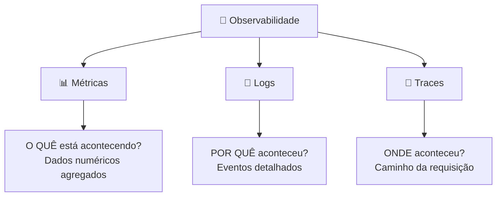
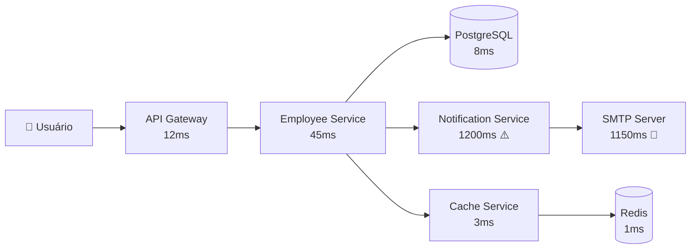
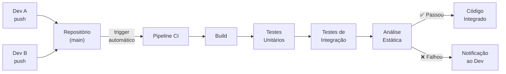
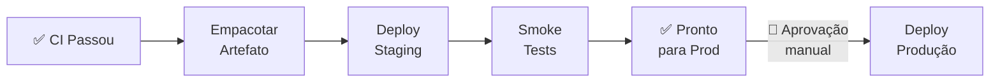
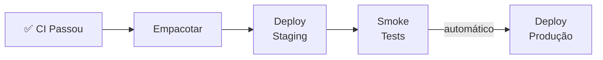
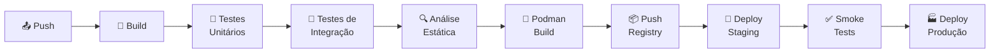

# Dia 7 - Podman, Cloud Readiness e Observabilidade

**Duração**: 5 horas  
**Objetivo**: "Na minha máquina funciona" não é desculpa — containerizar a aplicação com Podman (multi-stage build), orquestrar com Podman Compose, adicionar observabilidade com Spring Actuator e logs estruturados (JSON + MDC), e introduzir conceitos de CI/CD.

> **Pré-requisito**: Dias 1-6 concluídos (especialmente Dia 6 — Persistência Avançada e Mensageria). Podman Desktop instalado e rodando.

---

## 🎯 Agenda do Dia

| Horário | Duração | Tópico | Tipo |
|---------|---------|--------|------|
| 09:00 - 09:15 | 15min | Recap Dia 6 e Introdução ao Dia 7 | Discussão |
| 09:15 - 09:45 | 30min | Podman — Containerfile, Instruções e Conceitos | Teórico |
| 09:45 - 10:15 | 30min | Multi-stage Build e .containerignore | Teórico |
| 10:15 - 10:45 | 30min | Podman Compose — App + Infraestrutura Completa | Teórico |
| 10:45 - 11:00 | 15min | ☕ Coffee Break | - |
| 11:00 - 11:30 | 30min | Spring Actuator — Health, Metrics, Info | Teórico |
| 11:30 - 12:00 | 30min | Logs Estruturados — Logback JSON + MDC | Teórico |
| 12:00 - 13:00 | 1h | 🍽️ Almoço | - |
| 13:00 - 13:20 | 20min | Observabilidade e CI/CD (Conceitual) | Teórico |
| 13:20 - 13:50 | 30min | Walkthrough `07-podman-actuator-demo` | Demo |
| 13:50 - 15:30 | 1h40 | Exercício `07-employee-api-production` (TODOs 1-4) | Hands-on |
| 15:30 - 16:30 | 1h | Exercício `07-employee-api-production` (TODOs 5-7) | Hands-on |
| 16:30 - 17:00 | 30min | Review: imagem < 100MB, Actuator respondendo, logs JSON | Discussão |

---

## 📦 Material Necessário (Checklist Instrutor)

### Software
- [ ] JDK 21 instalado
- [ ] Maven 3.8+
- [ ] IDE com suporte a Java (IntelliJ ou VS Code)
- [ ] Podman Desktop rodando
- [ ] _(Opcional)_ Postman ou extensão REST Client no VS Code

### Preparação
- [ ] Executar `podman compose up` no projeto `07-podman-actuator-demo` e verificar:
  - [ ] PostgreSQL acessível na porta 5432
  - [ ] RabbitMQ Management UI em http://localhost:15672 (guest/guest)
  - [ ] Redis acessível na porta 6379
  - [ ] App respondendo em http://localhost:8080/api/products
  - [ ] Actuator respondendo em http://localhost:8080/actuator/health
- [ ] Projeto `07-podman-actuator-demo` rodando com logs JSON no container
- [ ] Projeto `07-employee-api-production` com TODOs prontos e dependências configuradas

---

## 📋 Conteúdo Programático

---

### 1. Podman — Containerizando a Aplicação

#### Por que Podman?

O clássico "na minha máquina funciona" acontece porque ambientes são diferentes: versão do Java, variáveis de ambiente, serviços rodando. **Podman resolve isso empacotando tudo em um container reprodutível.**

```
Sem Podman:    Dev (Java 21) → Staging (Java 17) → Prod (Java 11) → 💥 FALHA
Com Podman:    Dev (Container) → Staging (Container) → Prod (Container) → ✅ FUNCIONA
```

#### Containerfile — A Receita

O **Containerfile** é a receita para construir uma imagem Podman. Cada instrução cria uma **camada (layer)**:

```podmanfile
# Imagem base
FROM eclipse-temurin:21-jdk-alpine

# Diretório de trabalho dentro do container
WORKDIR /app

# Copiar arquivos do projeto
COPY target/*.jar app.jar

# Porta que a app expõe
EXPOSE 8080

# Comando para executar a aplicação
ENTRYPOINT ["java", "-jar", "app.jar"]
```

#### Instruções Principais

| Instrução | O que faz | Exemplo |
|-----------|-----------|---------|
| `FROM` | Imagem base | `FROM eclipse-temurin:21-jdk-alpine` |
| `WORKDIR` | Define diretório de trabalho | `WORKDIR /app` |
| `COPY` | Copia arquivos para dentro da imagem | `COPY target/*.jar app.jar` |
| `RUN` | Executa comando durante o build | `RUN mvn package -DskipTests` |
| `EXPOSE` | Documenta a porta (não abre de verdade) | `EXPOSE 8080` |
| `ENTRYPOINT` | Comando executado ao iniciar o container | `ENTRYPOINT ["java", "-jar", "app.jar"]` |
| `ENV` | Define variáveis de ambiente | `ENV SPRING_PROFILES_ACTIVE=prod` |
| `ARG` | Variável de build-time | `ARG JAR_FILE=target/*.jar` |

> **EXPOSE** apenas documenta a porta — para acessar externamente, use `-p 8080:8080` no `podman run` ou `ports:` no Compose.

#### Cache de Layers

Podman **cacheia cada layer** — se uma instrução não mudou, usa o cache. A **ordem importa**:

```podmanfile
# ❌ Ruim: qualquer mudança no código invalida o cache do mvn package
COPY . .
RUN mvn package -DskipTests

# ✅ Bom: mudou o pom.xml → recache deps. Mudou apenas src → só rebuild
COPY pom.xml .
RUN mvn dependency:go-offline
COPY src/ src/
RUN mvn package -DskipTests
```

---

### 2. Multi-stage Build — Imagem de Produção

#### O Problema das Imagens Grandes

```podmanfile
# Imagem com JDK + Maven + sources + target = ~800MB 😱
FROM maven:3.9-eclipse-temurin-21
COPY . .
RUN mvn package -DskipTests
ENTRYPOINT ["java", "-jar", "target/app.jar"]
```

Para rodar a aplicação, **não precisamos do Maven, JDK nem do código-fonte** — só do JAR e do JRE.

#### A Solução: Multi-stage Build

```podmanfile
# ── Stage 1: BUILD ──
FROM eclipse-temurin:21-jdk-alpine AS build
WORKDIR /app
COPY pom.xml .
COPY .mvn/ .mvn/
COPY mvnw .
RUN chmod +x mvnw && ./mvnw dependency:go-offline
COPY src/ src/
RUN ./mvnw clean package -DskipTests

# ── Stage 2: RUNTIME ──
FROM eclipse-temurin:21-jre-alpine
WORKDIR /app
RUN addgroup -S appgroup && adduser -S appuser -G appgroup
COPY --from=build /app/target/*.jar app.jar
USER appuser
EXPOSE 8080
HEALTHCHECK --interval=30s --timeout=5s --retries=3 \
    CMD wget --quiet --tries=1 --spider http://localhost:8080/actuator/health || exit 1
ENTRYPOINT ["java", "-jar", "app.jar"]
```

| Aspecto | Sem multi-stage | Com multi-stage |
|---------|----------------|-----------------|
| **Tamanho** | ~800MB | ~80MB |
| **Segurança** | JDK + Maven + sources expostos | Apenas JRE + JAR |
| **Superfície de ataque** | Grande | Mínima |

#### .containerignore

Assim como `.gitignore`, o `.containerignore` **exclui arquivos do contexto de build**:

```
target/
.git/
.idea/
*.iml
.env
podman-compose*.yml
README.md
*.md
.vscode/
```

> **Sem .containerignore**: o `COPY . .` copia `.git/` (pode ter 100MB+), `target/` e tudo mais para dentro do build context.

---

### 3. Podman Compose — Orquestrando a Stack

Uma aplicação de verdade não roda sozinha — precisa de banco de dados, cache, fila de mensagens. **Podman Compose** orquestra tudo em um arquivo.

#### Anatomia do podman-compose.yml

```yaml
services:
  app:
    build: .
    ports:
      - "8080:8080"
    environment:
      - SPRING_DATASOURCE_URL=jdbc:postgresql://postgres:5432/mydb
      - SPRING_REDIS_HOST=redis
      - SPRING_RABBITMQ_HOST=rabbitmq
    depends_on:
      postgres:
        condition: service_healthy
      redis:
        condition: service_healthy
      rabbitmq:
        condition: service_healthy

  postgres:
    image: postgres:16-alpine
    environment:
      POSTGRES_DB: mydb
      POSTGRES_USER: user
      POSTGRES_PASSWORD: pass
    ports:
      - "5432:5432"
    volumes:
      - pgdata:/var/lib/postgresql/data
    healthcheck:
      test: ["CMD-SHELL", "pg_isready -U user -d mydb"]
      interval: 10s
      timeout: 5s
      retries: 5

  redis:
    image: redis:7-alpine
    ports:
      - "6379:6379"
    healthcheck:
      test: ["CMD", "redis-cli", "ping"]
      interval: 10s
      timeout: 5s
      retries: 5

  rabbitmq:
    image: rabbitmq:3-management-alpine
    ports:
      - "5672:5672"
      - "15672:15672"
    healthcheck:
      test: ["CMD", "rabbitmq-diagnostics", "-q", "ping"]
      interval: 10s
      timeout: 5s
      retries: 5

volumes:
  pgdata:

networks:
  default:
    name: myapp-network
```

#### Conceitos-Chave do Compose

| Conceito | O que faz | Por quê |
|----------|-----------|---------|
| `depends_on + condition` | Espera o serviço estar healthy | Evita que a app suba antes do banco |
| `healthcheck` | Verifica se o serviço está pronto | `pg_isready`, `redis-cli ping`, etc. |
| `volumes` | Persiste dados entre restarts | Dados do PostgreSQL não são perdidos |
| `networks` | Isola comunicação entre containers | Containers se comunicam por nome do serviço |
| `environment` | Injeta variáveis | Externalizar configuração |

#### Comandos Essenciais

```bash
podman compose up -d                  # Sobe tudo em background
podman compose up --build -d          # Rebuild + sobe
podman compose down                   # Para e remove containers
podman compose logs -f app            # Logs da app em tempo real
podman compose ps                     # Status dos containers
podman compose exec app sh            # Shell dentro do container
```

---

### 4. Spring Actuator — Observabilidade Nativa

**Spring Actuator** adiciona endpoints de monitoramento à aplicação sem escrever código — essencial para operações em produção.

#### Configuração

```xml
<dependency>
    <groupId>org.springframework.boot</groupId>
    <artifactId>spring-boot-starter-actuator</artifactId>
</dependency>
```

```yaml
management:
  endpoints:
    web:
      exposure:
        include: health,info,metrics,env,flyway
  endpoint:
    health:
      show-details: always
  info:
    env:
      enabled: true
```

#### Endpoints Principais

| Endpoint | O que retorna |
|----------|---------------|
| `/actuator/health` | Status de saúde (UP/DOWN) de cada componente |
| `/actuator/info` | Informações da aplicação (nome, versão, etc.) |
| `/actuator/metrics` | Lista de métricas disponíveis |
| `/actuator/metrics/jvm.memory.used` | Memória JVM em uso |
| `/actuator/metrics/http.server.requests` | Métricas de requisições HTTP |
| `/actuator/env` | Variáveis de ambiente e propriedades |
| `/actuator/flyway` | Status das migrations executadas |

#### Custom Health Indicator

Para verificar dependências externas (RabbitMQ, serviços externos):

```java
@Component
public class RabbitMQHealthIndicator implements HealthIndicator {

    private final RabbitTemplate rabbitTemplate;

    @Override
    public Health health() {
        try {
            rabbitTemplate.execute(channel -> {
                channel.queueDeclarePassive("employee-notifications");
                return null;
            });
            return Health.up()
                    .withDetail("queue", "employee-notifications")
                    .withDetail("status", "reachable")
                    .build();
        } catch (Exception e) {
            return Health.down()
                    .withDetail("error", e.getMessage())
                    .build();
        }
    }
}
```

Resposta do `/actuator/health`:
```json
{
  "status": "UP",
  "components": {
    "db": { "status": "UP" },
    "diskSpace": { "status": "UP" },
    "rabbitMQ": { "status": "UP", "details": { "queue": "employee-notifications" } },
    "redis": { "status": "UP" }
  }
}
```

> **Em produção**: Kubernetes usa `/actuator/health/liveness` e `/actuator/health/readiness` para decidir se o pod está saudável.

---

### 5. Logs Estruturados — JSON com Logback e MDC

#### Por que texto puro não escala?

```
# Log em texto puro — difícil de parsear e filtrar
2024-01-15 10:30:45.123 INFO  [http-nio-8080-exec-1] c.e.service.EmployeeService - Criando funcionário: Ana Silva
```

Para 1 servidor é legível. Para **50 servidores** com **milhares de logs/segundo**, é impossível buscar e correlacionar.

#### Logs em JSON — Machine-readable

```json
{
  "@timestamp": "2024-01-15T10:30:45.123Z",
  "level": "INFO",
  "logger_name": "c.e.service.EmployeeService",
  "message": "Criando funcionário: Ana Silva",
  "traceId": "abc-123-def",
  "method": "POST",
  "uri": "/api/employees",
  "thread_name": "http-nio-8080-exec-1"
}
```

> **JSON é parseável por máquinas** — Elasticsearch, Datadog, CloudWatch conseguem indexar, buscar e criar dashboards automaticamente.

#### Logback + LogstashEncoder

```xml
<!-- logback-spring.xml -->
<configuration>
    <!-- Profile DEV: texto legível para humanos -->
    <springProfile name="default,dev">
        <appender name="CONSOLE" class="ch.qos.logback.core.ConsoleAppender">
            <encoder>
                <pattern>%d{HH:mm:ss.SSS} [%X{traceId:-}] %-5level %logger{36} - %msg%n</pattern>
            </encoder>
        </appender>
        <root level="INFO">
            <appender-ref ref="CONSOLE"/>
        </root>
    </springProfile>

    <!-- Profile PROD: JSON para ferramentas de observabilidade -->
    <springProfile name="prod">
        <appender name="JSON" class="ch.qos.logback.core.ConsoleAppender">
            <encoder class="net.logstash.logback.encoder.LogstashEncoder"/>
        </appender>
        <root level="INFO">
            <appender-ref ref="JSON"/>
        </root>
    </springProfile>
</configuration>
```

```xml
<!-- pom.xml -->
<dependency>
    <groupId>net.logstash.logback</groupId>
    <artifactId>logstash-logback-encoder</artifactId>
    <version>7.4</version>
</dependency>
```

#### MDC — Mapped Diagnostic Context

O **MDC** permite injetar informações de contexto (traceId, userId, requestId) que aparecem **automaticamente em todos os logs** daquela thread:

```java
@Component
public class MdcFilter extends OncePerRequestFilter {

    @Override
    protected void doFilterInternal(HttpServletRequest request,
                                     HttpServletResponse response,
                                     FilterChain filterChain) throws ServletException, IOException {
        try {
            MDC.put("traceId", UUID.randomUUID().toString().substring(0, 8));
            MDC.put("method", request.getMethod());
            MDC.put("uri", request.getRequestURI());
            filterChain.doFilter(request, response);
        } finally {
            MDC.clear();  // SEMPRE limpar para evitar vazamento entre threads
        }
    }
}
```

Com MDC, todos os logs de uma mesma requisição têm o mesmo `traceId`:

```json
{"traceId": "abc-123", "message": "Buscando funcionário id=42"}
{"traceId": "abc-123", "message": "Funcionário encontrado: João"}
{"traceId": "abc-123", "message": "Cache hit para departamento id=3"}
```

> **Correlação**: filtrando por `traceId=abc-123` você vê TODO o fluxo daquela requisição.

---

### 6. Observabilidade em Produção (Conceitual)

#### O que é Observabilidade?

Observabilidade é a capacidade de **entender o estado interno de um sistema** a partir dos dados que ele expõe externamente. Em um cenário com dezenas de microsserviços rodando em containers, é impossível fazer SSH em cada máquina para investigar problemas. Observabilidade resolve isso com **dados estruturados e centralizados**.

> **Monitoramento** responde "o sistema está funcionando?"  
> **Observabilidade** responde "por que o sistema está lento/falhando e onde exatamente?"

#### Os 3 Pilares da Observabilidade

Observabilidade se sustenta em **três pilares complementares** — cada um responde a uma pergunta diferente:



---

#### Pilar 1: Métricas (Metrics)

**Métricas** são dados numéricos agregados ao longo do tempo. Respondem à pergunta **"o quê está acontecendo agora?"** de forma quantitativa.

| Tipo de Métrica | O que mede | Exemplo |
|-----------------|-----------|--------|
| **Counter** | Contagem acumulativa (só cresce) | Total de requisições HTTP, erros 500 |
| **Gauge** | Valor pontual (sobe e desce) | Memória em uso, threads ativas, conexões no pool |
| **Histogram** | Distribuição de valores | Latência p50/p95/p99, tamanho de payloads |
| **Timer** | Duração + contagem | Tempo de resposta por endpoint |

**Exemplos práticos:**

```
http_server_requests_total{method="GET", uri="/api/employees", status="200"} = 15432
http_server_requests_duration_seconds{quantile="0.99"} = 0.250
jvm_memory_used_bytes{area="heap"} = 134217728
hikaricp_connections_active = 8
```

**Ferramentas:**
- **Micrometer**: biblioteca Java que instrumenta a aplicação (já integrada no Spring Actuator)
- **Prometheus**: coleta e armazena métricas em séries temporais (pull-based, scrape a cada 15s)
- **Grafana**: visualização com dashboards e alertas

**Fluxo típico:**
```
Spring Boot (Micrometer) → /actuator/prometheus → Prometheus (scrape) → Grafana (dashboard)
```

**Quando usar métricas:**
- Dashboards de saúde do sistema (RED: Rate, Errors, Duration)
- Alertas automáticos (ex.: latência p99 > 2s → alerta no Slack)
- Capacity planning (uso de CPU/memória ao longo de semanas)
- SLIs/SLOs (99.9% de requests com status 2xx)

> **Métricas dizem que algo está errado, mas não dizem por quê.** Para isso, usamos logs.

---

#### Pilar 2: Logs

**Logs** são registros de eventos discretos que aconteceram na aplicação. Respondem à pergunta **"por quê algo aconteceu?"** com contexto detalhado.

```
// Sem estrutura (texto puro) — difícil de filtrar em escala
2024-01-15 10:30:45 ERROR EmployeeService - Funcionário não encontrado: id=42

// Estruturado (JSON) — parseável por máquinas
{"@timestamp":"2024-01-15T10:30:45Z", "level":"ERROR", "traceId":"abc123",
 "logger":"EmployeeService", "message":"Funcionário não encontrado", "employeeId":42}
```

**Níveis de log e quando usar:**

| Nível | Quando usar | Exemplo |
|-------|------------|--------|
| `ERROR` | Algo falhou e precisa de atenção | Exceção não tratada, serviço externo fora do ar |
| `WARN` | Situação inesperada mas contornável | Retry de conexão, fallback ativado, cache miss repetido |
| `INFO` | Eventos de negócio relevantes | Funcionário criado, pedido processado, login efetuado |
| `DEBUG` | Detalhes técnicos para investigação | Query SQL executada, payload recebido, estado interno |
| `TRACE` | Detalhamento máximo (raramente usado) | Cada iteração de loop, cada byte lido |

**Boas práticas de logging:**

```java
// ✅ Bom: informação contextual e estruturada
log.info("Funcionário criado com sucesso: id={}, nome={}", employee.getId(), employee.getName());
log.error("Erro ao buscar funcionário: id={}", id, exception);

// ❌ Ruim: concatenação, sem contexto, sem exceção
log.info("Funcionário criado");
log.error("Erro: " + e.getMessage());
```

**Ferramentas:**
- **ELK Stack**: Elasticsearch (armazena) + Logstash (processa) + Kibana (visualiza)
- **Datadog Logs**: coleta, indexação e busca em tempo real
- **AWS CloudWatch Logs**: integrado com serviços AWS
- **Loki (Grafana)**: logs otimizados para labels (como Prometheus para logs)

**Fluxo típico:**
```
App (JSON stdout) → Filebeat/Fluentd (coleta) → Elasticsearch (indexa) → Kibana (busca/dashboard)
```

> **Logs em JSON são obrigatórios em produção.** Texto puro não pode ser indexado nem filtrado em escala.

---

#### Pilar 3: Traces (Rastreamento Distribuído)

**Traces** registram o **caminho completo de uma requisição** através de múltiplos serviços. Respondem à pergunta **"onde no fluxo o problema aconteceu?"**

Em uma arquitetura de microsserviços, uma única requisição do usuário pode passar por 5, 10 ou 20 serviços. Sem tracing, é impossível saber **qual serviço demorou** ou **onde a falha ocorreu**.



> Neste exemplo, o trace mostra que o problema está no **SMTP Server** (1150ms) — sem tracing, você investigaria todos os serviços.

**Conceitos-chave:**

| Conceito | O que é | Exemplo |
|----------|---------|---------|
| **Trace** | O caminho completo de uma requisição (fim-a-fim) | Usuário → Gateway → Service A → DB → resposta |
| **Span** | Uma operação individual dentro do trace | "Query ao PostgreSQL" (duração: 8ms) |
| **TraceId** | Identificador único que conecta todos os spans | `abc-123-def-456` (propagado entre serviços) |
| **SpanId** | Identificador de cada operação individual | `span-001`, `span-002`, etc. |
| **Parent Span** | Span que iniciou o span atual | Employee Service é parent do Database span |

**Como funciona a propagação:**

```
┌─── Trace: abc-123 ──────────────────────────────────────────────────┐
│                                                                      │
│  ┌── Span 1: API Gateway (12ms) ──────────────────────────────────┐  │
│  │  ┌── Span 2: Employee Service (45ms) ───────────────────────┐  │  │
│  │  │  ┌── Span 3: PostgreSQL Query (8ms) ──┐                 │  │  │
│  │  │  └────────────────────────────────────┘                 │  │  │
│  │  │  ┌── Span 4: Notification Service (1200ms) ─────────┐  │  │  │
│  │  │  │  ┌── Span 5: SMTP Send (1150ms) 🔴 ──────────────┐ │  │  │  │
│  │  │  │  └───────────────────────────────────────────────┘ │  │  │  │
│  │  │  └────────────────────────────────────────────────────┘  │  │  │
│  │  └──────────────────────────────────────────────────────────┘  │  │
│  └────────────────────────────────────────────────────────────────┘  │
└──────────────────────────────────────────────────────────────────────┘
```

O `traceId` é passado entre serviços via **HTTP headers** (`X-Trace-Id`, `traceparent`). Cada serviço cria seus próprios spans e os associa ao mesmo trace.

**Ferramentas:**
- **Zipkin**: tracing distribuído open-source (Twitter)
- **Jaeger**: tracing distribuído open-source (Uber)
- **AWS X-Ray**: integrado com serviços AWS
- **Datadog APM**: tracing + métricas + logs correlacionados
- **OpenTelemetry**: padrão aberto que unifica métricas, logs e traces

> **No Spring Boot**: o Micrometer Tracing (antigo Spring Cloud Sleuth) injeta `traceId` e `spanId` automaticamente nos logs e headers HTTP.

---

#### Como os 3 Pilares se Complementam

| Situação | Métrica detecta | Log explica | Trace localiza |
|----------|----------------|-------------|----------------|
| API lenta | Latência p99 subiu de 200ms → 2s | `WARN: Connection pool exhausted` | Span mostra que DB query levou 1.8s |
| Erros 500 | Taxa de erro subiu para 5% | `ERROR: NullPointerException at line 42` | Trace mostra que falha é no Service B |
| Fila parada | Consumer lag = 10.000 msgs | `ERROR: RabbitMQ connection refused` | Trace mostra timeout no broker |

```
1. Alerta da MÉTRICA:  "Latência p99 > 2s"     → Investiga com LOGS
2. LOG diz:            "Timeout no PostgreSQL"  → Investiga com TRACE
3. TRACE mostra:       "Query SELECT * FROM orders sem index levou 1.8s"
4. Solução:            CREATE INDEX idx_orders_status ON orders(status);
```

> **Observabilidade não é sobre ter dashboards bonitos** — é sobre **reduzir o tempo de investigação** (MTTR) quando algo dá errado em produção.

#### Ferramentas de Mercado — Resumo

| Stack | Métricas | Logs | Traces | Tipo |
|-------|----------|------|--------|------|
| **Prometheus + Grafana + Loki + Tempo** | Prometheus | Loki | Tempo | Open-source |
| **ELK + Jaeger** | Elasticsearch | Elasticsearch | Jaeger | Open-source |
| **Datadog** | Datadog Metrics | Datadog Logs | Datadog APM | SaaS (pago) |
| **New Relic** | New Relic One | New Relic Logs | New Relic APM | SaaS (pago) |
| **AWS** | CloudWatch Metrics | CloudWatch Logs | X-Ray | Cloud-native |
| **Azure** | Azure Monitor | Azure Monitor Logs | App Insights | Cloud-native |

> **O papel do desenvolvedor**: instrumentar a aplicação (Actuator, logs JSON, Micrometer). A infra configura coleta, armazenamento e dashboards.

---

### 7. CI/CD (Conceitual)

#### O Problema: Integração Manual

Sem automação, o fluxo de entrega de software é assim:

```
Dev termina feature → Merge manual → "Funciona na minha máquina" → Build manual no servidor
→ Testes manuais → Deploy manual em produção → 🔥 Bug em produção → Rollback manual
```

Problemas:
- Merge conflicts acumulados ("merge hell" na sexta-feira)
- Bugs descobertos tarde demais (dias ou semanas depois do commit)
- Deploy é um evento estressante e arriscado
- Ninguém sabe se o código está deployável a qualquer momento

---

#### Continuous Integration (CI) — Integração Contínua

**CI** é a prática de **integrar código frequentemente** (várias vezes ao dia) e **validar automaticamente** cada integração com build e testes.



**Princípios do CI:**

| Princípio | O que significa |
|-----------|----------------|
| Commits frequentes | Integrar ao menos 1x por dia — quanto menor o delta, menor o risco |
| Build automatizado | Cada push dispara build + testes sem intervenção humana |
| Testes automatizados | Testes unitários e de integração rodam a cada commit |
| Feedback rápido | Se quebrou, o dev sabe em **minutos**, não dias |
| Main sempre verde | A branch principal deve estar sempre buildável e testável |
| Corrigir imediatamente | Se o build quebrou, a prioridade #1 é consertar |

**O que o CI valida automaticamente:**

```
1. ✅ Código compila sem erros
2. ✅ Testes unitários passam (JUnit, Mockito)
3. ✅ Testes de integração passam (Testcontainers, MockMvc)
4. ✅ Análise estática OK (SonarQube, Checkstyle)
5. ✅ Sem vulnerabilidades conhecidas (OWASP, Snyk)
6. ✅ Cobertura de testes acima do mínimo (ex.: 80%)
```

> **CI não é uma ferramenta** — é uma **prática de engenharia**. GitHub Actions, Jenkins e GitLab CI são ferramentas que **implementam** CI.

---

#### Continuous Delivery (CD) — Entrega Contínua

**Continuous Delivery** garante que o código está **sempre pronto para ser deployado em produção**, mas o deploy final é feito com **aprovação manual** (um botão).



**Características:**
- O artefato (JAR, imagem Podman) **já foi testado** em ambiente similar a produção (staging)
- O deploy em produção é uma **decisão de negócio**, não técnica
- Pode deployar a qualquer momento com **confiança** — sem surpresas
- Rollback é simples: basta deployar a versão anterior do artefato

---

#### Continuous Deployment — Deploy Contínuo

**Continuous Deployment** vai além: **cada commit que passa no pipeline vai automaticamente para produção**, sem aprovação manual.



> Empresas como Netflix, Amazon e Google fazem **milhares** de deploys por dia usando Continuous Deployment.

---

#### CI vs. CD — Resumo da Diferença

| Aspecto | CI (Integração Contínua) | CD (Entrega Contínua) | CD (Deploy Contínuo) |
|---------|------------------------|-----------------------|---------------------|
| **Foco** | Integrar e validar código | Artefato pronto para produção | Deploy automático em produção |
| **Trigger** | Cada push/merge | Após CI passar | Após CI passar |
| **Testes** | Unitários + Integração | + Smoke tests em staging | + Smoke tests em staging |
| **Deploy em produção** | ❌ Não faz deploy | 👤 Manual (botão) | 🤖 Automático |
| **Risco** | Baixo | Baixo | Muito baixo (com bons testes) |
| **Pré-requisito** | Testes automatizados | CI funcionando | CD funcionando + alta cobertura |
| **Adoção** | Maioria das empresas | Empresas maduras | Empresas avançadas (Netflix, Google) |

```
            CI                         CD                          CD
      Integração Contínua        Entrega Contínua           Deploy Contínuo
   ┌──────────────────────┐  ┌─────────────────────────┐  ┌────────────────────┐
   │ Build + Testes Auto  │→ │ Staging + Artefato Pronto│→ │ Deploy Auto em Prod│
   └──────────────────────┘  └─────────────────────────┘  └────────────────────┘
         Cada push                 Aprovação manual            100% automático
```

---

#### O que é um Pipeline?

Um **pipeline** é uma sequência de **stages (etapas)** automatizadas que o código percorre desde o commit até a produção. Cada stage tem uma responsabilidade específica e, se falhar, **bloqueia as etapas seguintes**.



**Stages típicos de um pipeline Java:**

| Stage | O que faz | Ferramentas | Falha se... |
|-------|-----------|-------------|------------|
| **Build** | Compila o código e resolve dependências | Maven, Gradle | Erro de compilação |
| **Testes Unitários** | Roda testes isolados (sem infra) | JUnit 5, Mockito | Algum teste falhar |
| **Testes de Integração** | Roda testes com banco/fila reais | Testcontainers, MockMvc | Integração falhar |
| **Análise Estática** | Verifica qualidade e vulnerabilidades | SonarQube, Checkstyle, Snyk | Code smell, CVE crítico |
| **Podman Build** | Cria imagem Podman da aplicação | Podman, Buildpacks | Containerfile com erro |
| **Push Registry** | Publica imagem no registry | Podman Hub, ECR, ACR, GCR | Autenticação falhar |
| **Deploy Staging** | Deploya em ambiente de testes | Kubernetes, ECS, Azure App Service | Health check falhar |
| **Smoke Tests** | Testes básicos em staging | REST Client, Newman, k6 | Endpoint não responder |
| **Deploy Produção** | Deploya em produção | Kubernetes, ECS | Health check falhar |

**Conceitos importantes do pipeline:**

| Conceito | Significado |
|----------|------------|
| **Stage** | Uma etapa do pipeline (Build, Test, Deploy) |
| **Job** | Uma unidade de trabalho dentro de um stage |
| **Artifact** | Arquivo gerado por um stage e usado pelo próximo (JAR, imagem Podman) |
| **Runner/Agent** | Máquina que executa o pipeline (GitHub-hosted, self-hosted) |
| **Trigger** | Evento que inicia o pipeline (push, merge request, schedule) |
| **Gate** | Aprovação manual necessária para prosseguir (ex.: deploy em produção) |

---

#### Ferramentas de CI/CD

| Ferramenta | Tipo | Onde roda | Arquivo de config |
|------------|------|-----------|-------------------|
| **GitHub Actions** | SaaS | GitHub | `.github/workflows/*.yml` |
| **GitLab CI** | SaaS / Self-hosted | GitLab | `.gitlab-ci.yml` |
| **Jenkins** | Self-hosted | Servidor próprio | `Jenkinsfile` |
| **Azure DevOps** | SaaS | Azure | `azure-pipelines.yml` |
| **CircleCI** | SaaS | CircleCI | `.circleci/config.yml` |
| **AWS CodePipeline** | SaaS | AWS | Console / CloudFormation |

#### GitHub Actions — Exemplo de Pipeline

```yaml
name: CI/CD Pipeline

on:
  push:
    branches: [main]
  pull_request:
    branches: [main]

jobs:
  # Stage 1: Build + Testes
  build-and-test:
    runs-on: ubuntu-latest
    steps:
      - uses: actions/checkout@v4

      - name: Setup Java 21
        uses: actions/setup-java@v4
        with:
          java-version: '21'
          distribution: 'temurin'

      - name: Build e Testes
        run: mvn clean verify

      - name: Upload Artefato
        uses: actions/upload-artifact@v4
        with:
          name: app-jar
          path: target/*.jar

  # Stage 2: Podman Build + Push
  podman:
    needs: build-and-test   # só roda se o stage anterior passou
    runs-on: ubuntu-latest
    if: github.ref == 'refs/heads/main'  # só na main
    steps:
      - uses: actions/checkout@v4

      - name: Build Podman Image
        run: podman build -t myapp:${{ github.sha }} .

      - name: Push to Registry
        run: podman push registry/myapp:${{ github.sha }}

  # Stage 3: Deploy (com aprovação manual = Continuous Delivery)
  deploy:
    needs: podman
    runs-on: ubuntu-latest
    environment: production   # requer aprovação manual no GitHub
    steps:
      - name: Deploy to Production
        run: echo "Deploying version ${{ github.sha }}"
```

> **Regra de ouro**: código que não passa no pipeline **não vai pra produção**.

> **Na prática**: a maioria das empresas começa com CI (build + testes automáticos) e evolui para Continuous Delivery. Continuous Deployment exige maturidade em testes e monitoramento.

---

## 📦 Projetos do Dia

### `07-podman-actuator-demo` (Projeto Completo — Demonstração)

> API de Produtos containerizada com Actuator, logs estruturados e observabilidade — tudo subindo com `podman compose up`.

Projeto completo demonstrando os conceitos:
- `Containerfile` multi-stage build otimizado (~80MB com JRE Alpine)
- `.containerignore` configurado
- `podman-compose.yml` com: app Spring Boot, PostgreSQL, RabbitMQ, Redis — todos com health checks
- Spring Actuator expondo `/health`, `/metrics`, `/info` com detalhes
- Custom Health Indicator verificando conectividade com RabbitMQ
- `logback-spring.xml` com `LogstashEncoder` gerando logs em JSON
- MDC Filter adicionando `traceId`, `method`, `uri` em cada log
- Profile `default/dev` (logs texto) vs. `prod` (logs JSON) no Logback

**Porta**: `8080`

### `07-employee-api-production` (Exercício — TODOs 1-7)

> Containerizar a API de Funcionários e adicionar observabilidade para produção.

**O que já vem pronto:** `Containerfile` básico não otimizado, `podman-compose.yml` com apenas PostgreSQL, `logback-spring.xml` com logs em texto, dependência do Actuator sem endpoints expostos.

**TODOs**: 7 tarefas cobrindo Containerfile multi-stage, .containerignore, Podman Compose completo, Actuator, Custom HealthIndicator, Logs JSON + MDC e logging contextual.

**Porta**: `8092`

---

## 📎 Slides

| Slide | Tópico |
|-------|--------|
| [slide-01](slide-01.md) | Abertura e Recap do Dia 6 |
| [slide-02](slide-02.md) | Podman — Containerfile e Conceitos |
| [slide-03](slide-03.md) | Multi-stage Build e .containerignore |
| [slide-04](slide-04.md) | Podman Compose — Orquestrando a Stack |
| [slide-05](slide-05.md) | Spring Actuator — Health, Metrics, Info |
| [slide-06](slide-06.md) | Logs Estruturados — Logback JSON |
| [slide-07](slide-07.md) | MDC — Mapped Diagnostic Context |
| [slide-08](slide-08.md) | Observabilidade — Os 3 Pilares |
| [slide-09](slide-09.md) | CI/CD — Conceitos e GitHub Actions |
| [slide-10](slide-10.md) | Walkthrough — 07-podman-actuator-demo |
| [slide-11](slide-11.md) | Exercício — TODOs 1-2 (Containerfile) |
| [slide-12](slide-12.md) | Exercício — TODO 3 (Podman Compose) |
| [slide-13](slide-13.md) | Exercício — TODOs 4-5 (Actuator + HealthIndicator) |
| [slide-14](slide-14.md) | Exercício — TODO 6 (Logs JSON + MDC) |
| [slide-15](slide-15.md) | Exercício — TODO 7 (Logging Contextual) |
| [slide-16](slide-16.md) | Review e Q&A |
