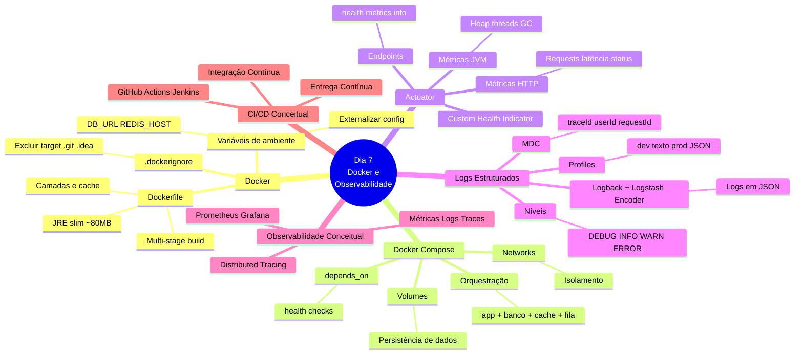

# Slide 1: Abertura e Recap do Dia 6

**Horário:** 09:00 - 09:15

---

## 📝 Recapitulando o Dia 6

No Dia 6 aprendemos a **otimizar performance e desacoplar processos**:

- ✓ **Problema N+1** — Diagnóstico com `show-sql` e correção com JOIN FETCH / @EntityGraph
- ✓ **Projeções DTO** — Records leves para listagens (sem carregar entidades completas)
- ✓ **Flyway** — Versionamento de schema com migrations SQL (adeus `ddl-auto: update`)
- ✓ **RabbitMQ** — Mensageria assíncrona com Producer e Consumer
- ✓ **Redis** — Cache com @Cacheable, TTL e invalidação com @CacheEvict

> **Hoje vamos containerizar, monitorar e preparar para produção!**

### 🧠 Revisão Rápida — Associe os Conceitos

| Dia | Tema Central | Resultado |
|-----|-------------|-----------|
| **Dia 1** | Fundamentos Java Moderno | Records, Sealed Classes, Streams — linguagem expressiva |
| **Dia 2** | Persistência e REST | Spring Data JPA, APIs REST — dados acessíveis |
| **Dia 3** | Qualidade do Código | Clean Code, Arquitetura limpa — código sustentável |
| **Dia 4** | Testes Automatizados | JUnit 5, Mockito, Testcontainers — confiança para evoluir |
| **Dia 5** | Integração e Segurança | Feign, JWT, Swagger — API de produção |
| **Dia 6** | Persistência e Mensageria | N+1, Flyway, RabbitMQ, Redis — performance e desacoplamento |
| **Dia 7** | **Docker e Observabilidade** | Containers, Actuator, Logs JSON — **pronto para produção** |

---

## 🔗 Conexão entre os Dias — A Jornada do Desenvolvedor

```mermaid
flowchart TD
    D1["<b>Dia 1 — Fundamentos da Linguagem</b><br/>☕ Records, Sealed Classes<br/>Text Blocks, Pattern Matching<br/>Stream API"]

    D1 -->|"Records usados como DTOs<br/>Streams para transformar dados"| D2

    D2["<b>Dia 2 — Persistência e APIs REST</b><br/>🗄️ Spring Data JPA<br/>Queries, Paginação, Sorting<br/>REST Controllers, DTOs"]

    D2 -->|"API REST criada<br/>precisa de qualidade"| D3

    D3["<b>Dia 3 — Qualidade do Código</b><br/>🏛️ Clean Code, SOLID<br/>Arquitetura Hexagonal<br/>Validação, Error Handling"]

    D3 -->|"Código limpo<br/>é código testável"| D4

    D4["<b>Dia 4 — Testes Automatizados</b><br/>🧪 JUnit 5, Mockito<br/>Testcontainers, AssertJ<br/>Data Builders, TDD"]

    D4 -->|"API testada e validada<br/>pronta para integrar e proteger"| D5

    D5["<b>Dia 5 — Integração e Segurança</b><br/>🔒 Feign Client + Resilience4j<br/>Spring Security + JWT<br/>CORS + OpenAPI/Swagger"]

    D5 -->|"API segura e integrada<br/>agora precisa de performance"| D6

    D6["<b>Dia 6 — Persistência e Mensageria</b><br/>⚡ N+1, JOIN FETCH, @EntityGraph<br/>📦 Flyway Migrations<br/>🐰 RabbitMQ + 🔴 Redis"]

    D6 -->|"API performática e desacoplada<br/>agora precisa ir para produção"| D7

    D7["<b>⭐ Dia 7 — Docker e Observabilidade</b><br/>🐳 Dockerfile + Docker Compose<br/>📊 Actuator + Métricas<br/>📋 Logs Estruturados (JSON + MDC)"]

    style D1 fill:#4a90d9,color:#fff,stroke:#2c6fad
    style D2 fill:#4a90d9,color:#fff,stroke:#2c6fad
    style D3 fill:#4a90d9,color:#fff,stroke:#2c6fad
    style D4 fill:#4a90d9,color:#fff,stroke:#2c6fad
    style D5 fill:#4a90d9,color:#fff,stroke:#2c6fad
    style D6 fill:#4a90d9,color:#fff,stroke:#2c6fad
    style D7 fill:#1dd1a1,color:#fff,stroke:#10ac84
```

---

## 🧩 Mapa Mental do Dia 7 — Todos os Conceitos

---

## 🎯 Objetivos do Dia 7

Ao final deste dia, você será capaz de:

1. **Criar Dockerfiles otimizados** com multi-stage build (imagem < 100MB)
2. **Orquestrar stack completa** com Docker Compose (app + banco + cache + fila)
3. **Configurar Spring Actuator** para health checks e métricas
4. **Implementar logs estruturados** (JSON) com Logback e MDC
5. **Compreender Observabilidade** em produção e conceitos de CI/CD

> **Frase do dia**: "Na minha máquina funciona" **não é desculpa**. 🐳
