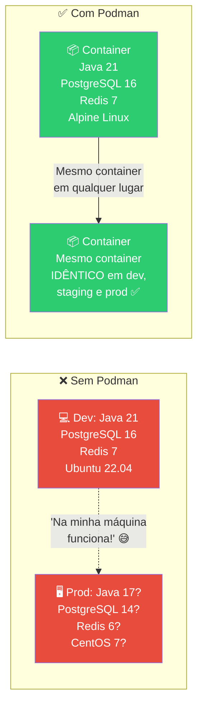
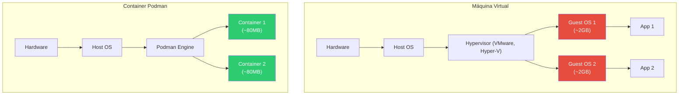
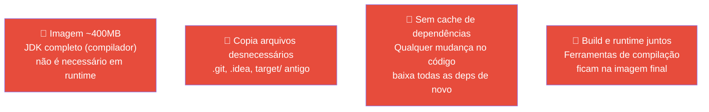
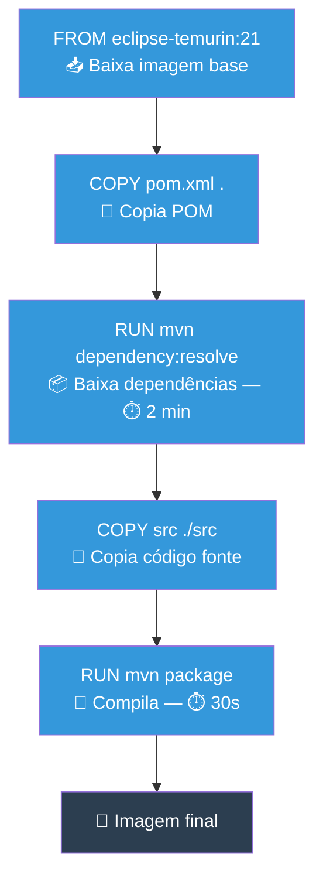
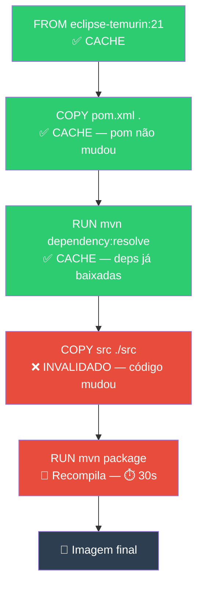

# Slide 2: Podman — Conceitos e Containerfile

**Horário:** 09:15 - 09:45

---

## 🐳 O que é Podman?

Podman é uma plataforma de **containerização** que empacota sua aplicação + todas as dependências em um **container** — um ambiente isolado, leve e reproduzível.



---

## Container vs. VM (Máquina Virtual)



| Aspecto | VM | Container |
|---------|-----|-----------|
| **Tamanho** | GBs (SO completo) | MBs (apenas libs necessárias) |
| **Boot** | Minutos | Segundos |
| **Isolamento** | Completo (SO separado) | Processo isolado (compartilha kernel) |
| **Performance** | Overhead do hypervisor | Quase nativo |
| **Uso** | Ambientes inteiros | Aplicações/serviços |

---

## Containerfile — A Receita do Container

O `Containerfile` é um arquivo de texto com instruções para **construir uma imagem Podman**. Cada instrução cria uma **camada** (layer).

### Containerfile Básico (NÃO otimizado)

```podmanfile
# ❌ Containerfile simples — imagem ~400MB
FROM eclipse-temurin:21-jdk

WORKDIR /app

# Copia TUDO (incluindo .git, .idea, target...)
COPY . .

# Compila dentro do container
RUN ./mvnw clean package -DskipTests

EXPOSE 8080

# Roda com JDK completo (desnecessário em runtime)
ENTRYPOINT ["java", "-jar", "target/app.jar"]
```

### Problemas deste Containerfile



---

## Camadas Podman — Como funciona o cache

Cada instrução do Containerfile cria uma **camada (layer)**. O Podman **cacheia** cada camada. Se nada mudou naquela instrução, ele **reutiliza** o cache — sem re-executar.

### Build 1 — Primeira vez (tudo é construído do zero)



### Build 2 — Só mudou código Java (cache das dependências é reaproveitado)



> **Regra de ouro**: Coloque instruções que mudam **pouco** (dependências) **antes** das que mudam **muito** (código fonte). Assim o Podman reutiliza o cache das dependências e o build leva **30s em vez de 2+ minutos**.

---

## Instruções do Containerfile — Referência

| Instrução | Função | Exemplo |
|-----------|--------|---------|
| `FROM` | Imagem base | `FROM eclipse-temurin:21-jre-alpine` |
| `WORKDIR` | Diretório de trabalho | `WORKDIR /app` |
| `COPY` | Copiar arquivos do host | `COPY target/*.jar app.jar` |
| `RUN` | Executar comando (build time) | `RUN mvn package` |
| `EXPOSE` | Documentar porta | `EXPOSE 8080` |
| `ENV` | Variável de ambiente | `ENV SPRING_PROFILES_ACTIVE=prod` |
| `ENTRYPOINT` | Comando ao iniciar container | `ENTRYPOINT ["java", "-jar", "app.jar"]` |
| `CMD` | Argumentos default | `CMD ["--server.port=8080"]` |
| `ARG` | Argumento de build | `ARG JAR_FILE=app.jar` |
| `HEALTHCHECK` | Health check do container | `HEALTHCHECK CMD curl -f http://localhost:8080/actuator/health` |

---

## 🎯 Quiz Rápido

1. **Por que o Podman é melhor que instalar tudo manualmente?**
   - Ambiente idêntico em dev, staging e produção. "Funciona na minha máquina" deixa de existir.

2. **O que acontece se eu mudar apenas 1 linha de código Java?**
   - Com cache de layers otimizado: só recompila o código (30s). Sem cache: rebaixa tudo (2+ min).

3. **Qual a diferença entre `ENTRYPOINT` e `CMD`?**
   - `ENTRYPOINT` define o executável (não pode ser sobrescrito facilmente). `CMD` define argumentos padrão (pode ser sobrescrito no `podman run`).
