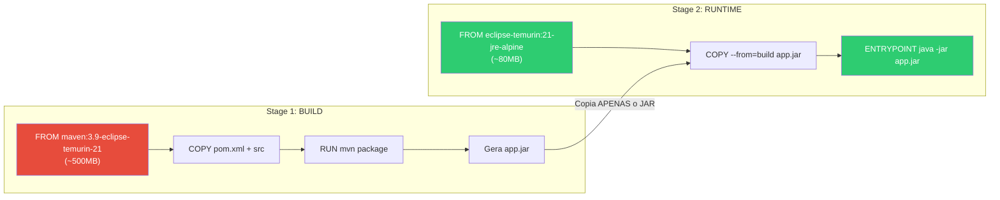
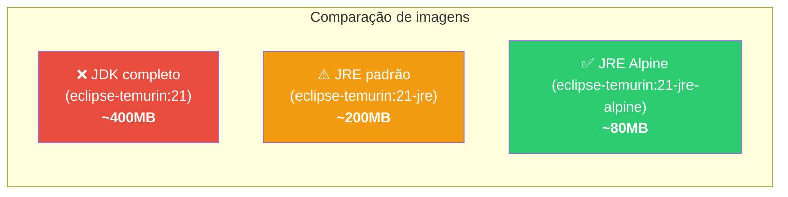
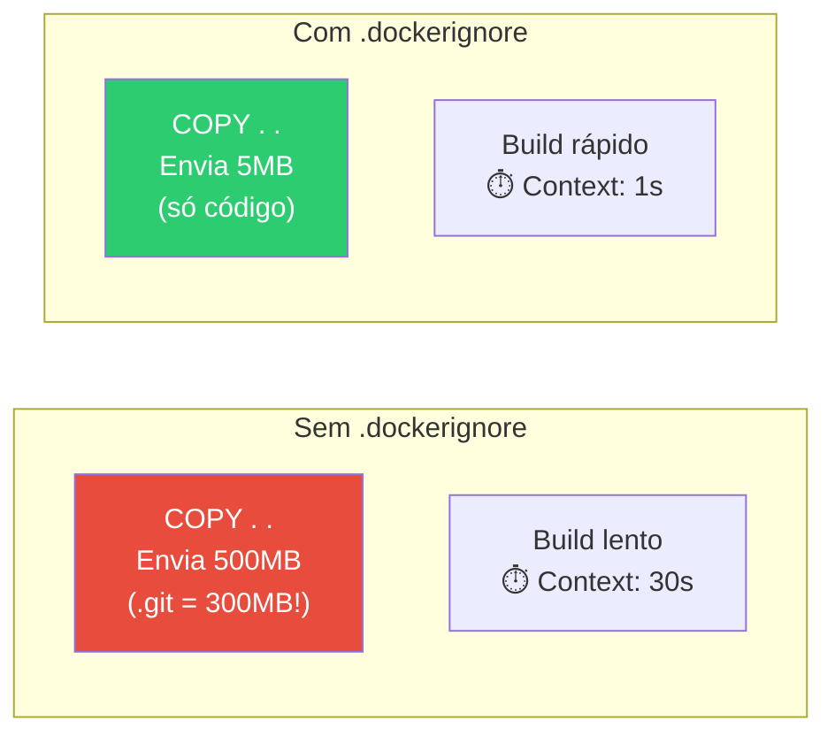

# Slide 3: Dockerfile Multi-Stage Build

**Horário:** 09:45 - 10:15

---

## Multi-Stage Build — O Segredo das Imagens Pequenas

O multi-stage build usa **dois estágios** no mesmo Dockerfile:

1. **Stage `build`**: Usa JDK completo + Maven para compilar
2. **Stage `runtime`**: Usa apenas JRE slim para rodar



> O estágio `build` é **descartado** na imagem final! Sobra apenas o JRE + o JAR.

---

## Dockerfile Otimizado — Multi-Stage

```dockerfile
# ╔═══════════════════════════════════════════════╗
# ║  STAGE 1: BUILD — Compilar a aplicação        ║
# ╚═══════════════════════════════════════════════╝
FROM maven:3.9-eclipse-temurin-21 AS build

WORKDIR /app

# 1. Copia APENAS o pom.xml primeiro (cache de dependências)
COPY pom.xml .

# 2. Baixa dependências (cacheado se pom.xml não mudou)
RUN mvn dependency:resolve -q

# 3. Só agora copia o código fonte
COPY src ./src

# 4. Compila e gera o JAR
RUN mvn clean package -DskipTests -q

# ╔═══════════════════════════════════════════════╗
# ║  STAGE 2: RUNTIME — Imagem final enxuta        ║
# ╚═══════════════════════════════════════════════╝
FROM eclipse-temurin:21-jre-alpine

WORKDIR /app

# Copia APENAS o JAR do stage de build
COPY --from=build /app/target/*.jar app.jar

# Porta da aplicação
EXPOSE 8080

# Variáveis de ambiente padrão
ENV SPRING_PROFILES_ACTIVE=prod
ENV JAVA_OPTS="-Xmx512m -Xms256m"

# Health check
HEALTHCHECK --interval=30s --timeout=10s --retries=3 \
  CMD wget --no-verbose --tries=1 --spider http://localhost:8080/actuator/health || exit 1

# Executa a aplicação
ENTRYPOINT ["sh", "-c", "java $JAVA_OPTS -jar app.jar"]
```

---

## Comparação de Tamanho das Imagens



| Imagem Base | Tamanho | Contém | Uso |
|-------------|---------|--------|-----|
| `eclipse-temurin:21` | ~400MB | JDK + JRE + ferramentas | Build |
| `eclipse-temurin:21-jre` | ~200MB | Apenas JRE (Debian) | Runtime |
| `eclipse-temurin:21-jre-alpine` | ~80MB | Apenas JRE (Alpine Linux) | Runtime otimizado |

> **Alpine Linux** é uma distribuição minimalista (~5MB base). Perfeita para containers em produção.

---

## .dockerignore — Excluir Arquivos do Build Context

O `.dockerignore` funciona como o `.gitignore` — diz ao Docker quais arquivos **não enviar** para o build context.

```text
# .dockerignore
target/
.git/
.idea/
.vscode/
*.iml
.env
docker-compose*.yml
README.md
*.md
.gitignore
```

### Por que é importante?



---

## Variáveis de Ambiente — Externalizando Configuração

Em produção, **nunca** coloque credenciais no `application.yml`. Use variáveis de ambiente:

```yaml
# application.yml — usa variáveis de ambiente com fallback
spring:
  datasource:
    url: ${DB_URL:jdbc:postgresql://localhost:5432/mydb}
    username: ${DB_USER:postgres}
    password: ${DB_PASSWORD:postgres}
  data:
    redis:
      host: ${REDIS_HOST:localhost}
      port: ${REDIS_PORT:6379}
  rabbitmq:
    host: ${RABBITMQ_HOST:localhost}
    port: ${RABBITMQ_PORT:5672}
```

```bash
# Em dev: usa os defaults do application.yml (localhost)
mvn spring-boot:run

# Em Docker: injeta variáveis de ambiente
docker run -e DB_URL=jdbc:postgresql://postgres:5432/mydb \
           -e DB_USER=admin \
           -e DB_PASSWORD=s3cr3t \
           -e REDIS_HOST=redis \
           my-app:latest
```

> **Convenção Spring Boot**: `SPRING_DATASOURCE_URL` sobrescreve `spring.datasource.url` automaticamente. Spring converte `_` para `.` e torna tudo lowercase.

---

## 🎯 Hands-on: Verificar Tamanho da Imagem

```bash
# Build da imagem
docker build -t my-app:v1 .

# Verificar tamanho
docker images my-app
# REPOSITORY   TAG   IMAGE ID       SIZE
# my-app       v1    abc123def456   82.4MB  ← Meta: < 100MB ✅

# Rodar container
docker run -p 8080:8080 my-app:v1

# Ver layers da imagem
docker history my-app:v1
```

---

## 🎯 Quiz Rápido

1. **Quantos stages tem um Dockerfile multi-stage build?**
   - Pelo menos 2: `build` (compilação) e `runtime` (execução).

2. **O que `COPY --from=build` faz?**
   - Copia arquivos de um stage anterior (nomeado `build`) para o stage atual.

3. **Por que Alpine é menor que Debian?**
   - Alpine usa `musl libc` e `busybox` em vez de `glibc` e `coreutils`. Distribuição minimalista (~5MB base).

4. **O que acontece se eu não criar `.dockerignore`?**
   - O Docker envia **todos** os arquivos (incluindo `.git/`, `target/`, `.idea/`) para o build context, tornando o build muito mais lento.
