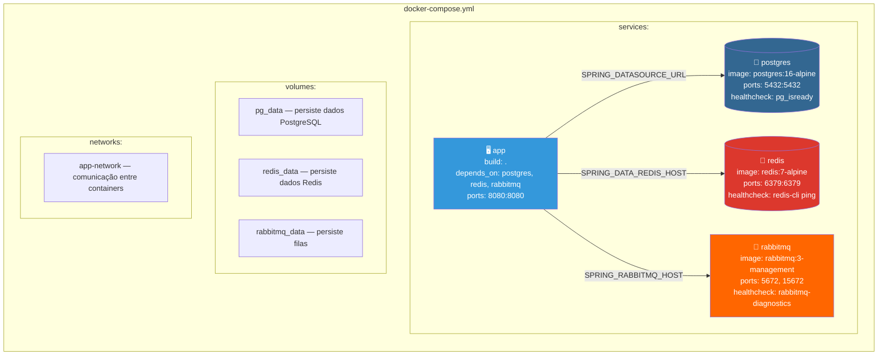
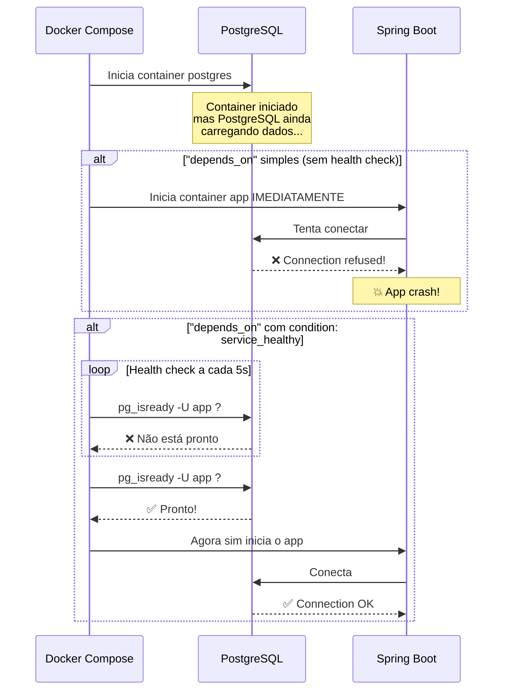
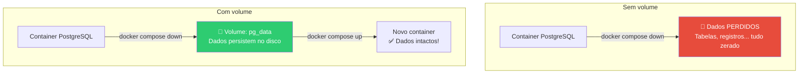
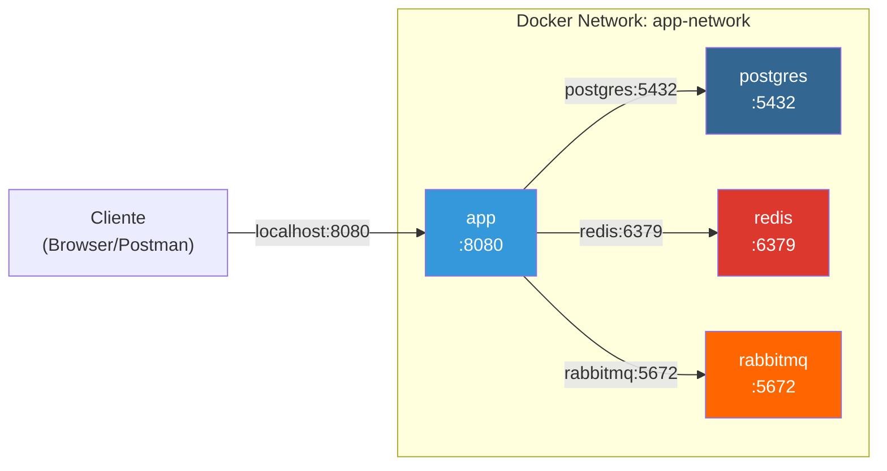

# Slide 4: Docker Compose — Orquestrando a Stack

**Horário:** 10:15 - 10:45

---

## O Problema: Múltiplos Containers

Uma aplicação Spring Boot típica depende de **vários serviços**. Subir cada um manualmente é tedioso:

```bash
# ❌ Subir manualmente cada container
docker run -d --name postgres -e POSTGRES_DB=mydb -p 5432:5432 postgres:16-alpine
docker run -d --name redis -p 6379:6379 redis:7-alpine
docker run -d --name rabbitmq -p 5672:5672 -p 15672:15672 rabbitmq:3-management-alpine
docker build -t my-app .
docker run -d --name app -p 8080:8080 --link postgres --link redis --link rabbitmq my-app

# 😰 E se precisar reiniciar? E as variáveis de ambiente? E a ordem?
```

```bash
# ✅ Com Docker Compose — UM comando
docker compose up -d
# 🎉 Tudo sobe na ordem certa, com health checks, em 30 segundos
```

---

## docker-compose.yml — Anatomia



---

## Docker Compose Completo — Exemplo

```yaml
version: '3.9'

services:
  # ── Aplicação Spring Boot ──
  app:
    build: .                           # Usa o Dockerfile local
    container_name: my-app
    ports:
      - "8080:8080"
    environment:
      SPRING_DATASOURCE_URL: jdbc:postgresql://postgres:5432/appdb
      SPRING_DATASOURCE_USERNAME: app
      SPRING_DATASOURCE_PASSWORD: app123
      SPRING_DATA_REDIS_HOST: redis
      SPRING_RABBITMQ_HOST: rabbitmq
      SPRING_PROFILES_ACTIVE: prod
    depends_on:
      postgres:
        condition: service_healthy     # Espera postgres estar ready
      redis:
        condition: service_healthy
      rabbitmq:
        condition: service_healthy
    networks:
      - app-network

  # ── PostgreSQL ──
  postgres:
    image: postgres:16-alpine
    container_name: app-postgres
    environment:
      POSTGRES_DB: appdb
      POSTGRES_USER: app
      POSTGRES_PASSWORD: app123
    ports:
      - "5432:5432"
    volumes:
      - pg_data:/var/lib/postgresql/data
    healthcheck:
      test: ["CMD-SHELL", "pg_isready -U app -d appdb"]
      interval: 5s
      timeout: 5s
      retries: 5
    networks:
      - app-network

  # ── Redis ──
  redis:
    image: redis:7-alpine
    container_name: app-redis
    ports:
      - "6379:6379"
    volumes:
      - redis_data:/data
    healthcheck:
      test: ["CMD", "redis-cli", "ping"]
      interval: 5s
      timeout: 5s
      retries: 5
    networks:
      - app-network

  # ── RabbitMQ ──
  rabbitmq:
    image: rabbitmq:3-management-alpine
    container_name: app-rabbitmq
    environment:
      RABBITMQ_DEFAULT_USER: guest
      RABBITMQ_DEFAULT_PASS: guest
    ports:
      - "5672:5672"
      - "15672:15672"
    volumes:
      - rabbitmq_data:/var/lib/rabbitmq
    healthcheck:
      test: ["CMD", "rabbitmq-diagnostics", "check_port_connectivity"]
      interval: 10s
      timeout: 10s
      retries: 5
    networks:
      - app-network

volumes:
  pg_data:
  redis_data:
  rabbitmq_data:

networks:
  app-network:
    driver: bridge
```

---

## depends_on + Health Checks

Sem health check, o `depends_on` apenas garante que o container **iniciou**, não que o serviço está **pronto**:



---

## Volumes — Persistindo Dados

Sem volumes, os dados são **perdidos** quando o container para:



---

## Networks — Comunicação entre Containers

Dentro da mesma network Docker, containers se comunicam pelo **nome do serviço**:

```yaml
# No Docker Compose, o nome do serviço vira o hostname
# A app acessa o banco por "postgres" (não "localhost"!)
environment:
  SPRING_DATASOURCE_URL: jdbc:postgresql://postgres:5432/appdb
  #                                       ^^^^^^^^
  #                                       Nome do serviço no docker-compose.yml
```



---

## Comandos Docker Compose Essenciais

| Comando | Função |
|---------|--------|
| `docker compose up -d` | Sobe todos os serviços em background |
| `docker compose down` | Para e remove todos os containers |
| `docker compose ps` | Lista containers rodando |
| `docker compose logs -f app` | Acompanha logs de um serviço |
| `docker compose restart app` | Reinicia um serviço |
| `docker compose build` | Reconstrói imagens |
| `docker compose up -d --build` | Sobe reconstruindo a imagem |
| `docker compose down -v` | Para e remove containers + volumes |

---

## 🎯 Quiz Rápido

1. **Por que usar `condition: service_healthy` no `depends_on`?**
   - Garante que o serviço está realmente pronto (não apenas que o container iniciou).

2. **Se a app roda no container Docker, ela acessa o PostgreSQL por `localhost:5432`?**
   - **Não!** Dentro do Docker, usa o nome do serviço: `postgres:5432`. `localhost` se refere ao próprio container da app.

3. **O que acontece com os dados se eu rodar `docker compose down -v`?**
   - O `-v` remove os **volumes**, então todos os dados do banco, Redis e RabbitMQ são **apagados**.
