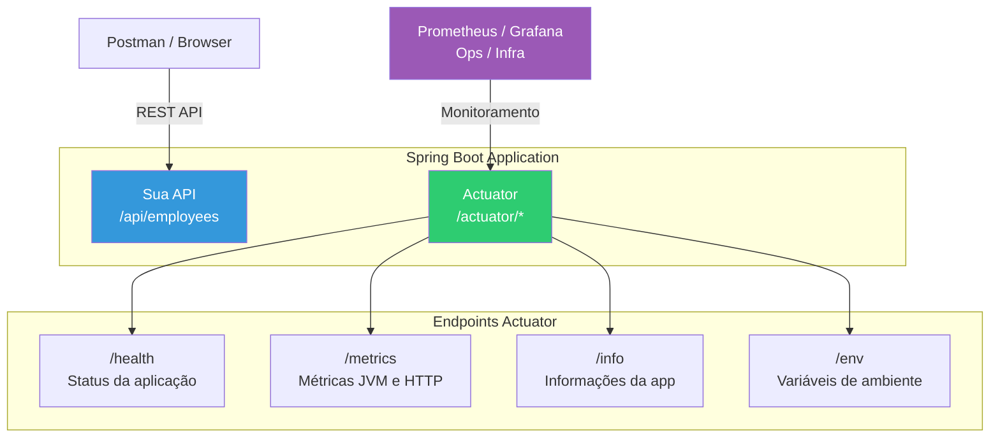
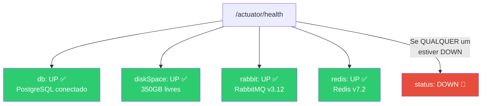
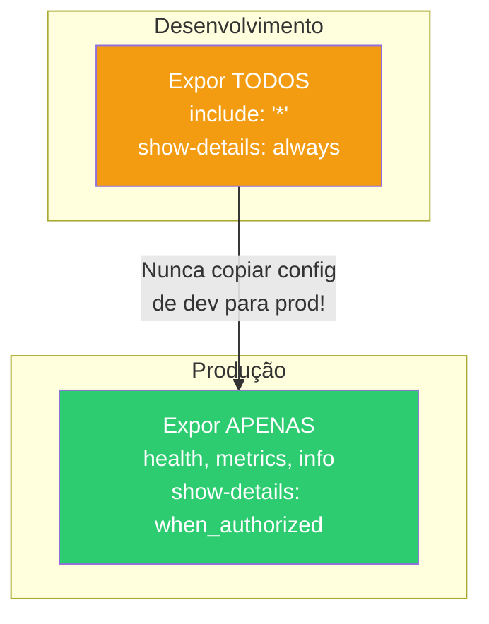

# Slide 5: Spring Actuator — Observabilidade Nativa

**Horário:** 10:45 - 11:15 (após Coffee Break)

---

## O que é o Spring Actuator?

O **Spring Boot Actuator** fornece endpoints HTTP prontos para monitorar e gerenciar sua aplicação em produção. É a observabilidade "de graça" do Spring.



---

## Configurando o Actuator

### 1. Dependência no pom.xml

```xml
<dependency>
    <groupId>org.springframework.boot</groupId>
    <artifactId>spring-boot-starter-actuator</artifactId>
</dependency>
```

### 2. Configuração no application.yml

```yaml
# Configuração do Actuator
management:
  endpoints:
    web:
      exposure:
        # Quais endpoints expor via HTTP
        include: health, metrics, info
        # Para expor todos: include: "*"
  endpoint:
    health:
      # Mostra detalhes dos health indicators
      show-details: always
      # show-details: when_authorized  ← Em produção!
  info:
    env:
      enabled: true

# Informações da aplicação
info:
  app:
    name: Employee API
    version: 1.0.0
    description: API de Gestão de Funcionários
  java:
    version: ${java.version}
```

---

## Endpoint /actuator/health

O endpoint `/health` retorna o status da aplicação e de suas dependências:

```json
{
  "status": "UP",
  "components": {
    "db": {
      "status": "UP",
      "details": {
        "database": "PostgreSQL",
        "validationQuery": "isValid()"
      }
    },
    "diskSpace": {
      "status": "UP",
      "details": {
        "total": 499963174912,
        "free": 350000000000
      }
    },
    "rabbit": {
      "status": "UP",
      "details": {
        "version": "3.12.0"
      }
    },
    "redis": {
      "status": "UP",
      "details": {
        "version": "7.2.0"
      }
    }
  }
}
```



> **Regra**: Se **qualquer** componente estiver `DOWN`, o status geral é `DOWN`. Isso é usado por orquestradores (Podman, Kubernetes) para reiniciar containers.

---

## Endpoint /actuator/metrics

Lista todas as métricas disponíveis:

```bash
# Ver métricas disponíveis
GET /actuator/metrics

# Ver uma métrica específica
GET /actuator/metrics/jvm.memory.used
GET /actuator/metrics/http.server.requests
GET /actuator/metrics/system.cpu.usage
```

### Métricas JVM

| Métrica | Descrição |
|---------|-----------|
| `jvm.memory.used` | Memória heap usada |
| `jvm.memory.max` | Memória heap máxima |
| `jvm.threads.live` | Threads ativas |
| `jvm.gc.pause` | Tempo gasto em Garbage Collection |
| `system.cpu.usage` | Uso de CPU do sistema |
| `process.cpu.usage` | Uso de CPU do processo Java |
| `process.uptime` | Tempo que a app está rodando |

### Métricas HTTP

```json
// GET /actuator/metrics/http.server.requests
{
  "name": "http.server.requests",
  "measurements": [
    { "statistic": "COUNT", "value": 150 },
    { "statistic": "TOTAL_TIME", "value": 12.5 },
    { "statistic": "MAX", "value": 0.85 }
  ],
  "availableTags": [
    { "tag": "uri", "values": ["/api/employees", "/api/departments"] },
    { "tag": "status", "values": ["200", "404", "500"] },
    { "tag": "method", "values": ["GET", "POST", "PUT"] }
  ]
}
```

---

## Custom Health Indicator

Além dos health checks automáticos (db, redis, rabbit), você pode criar os seus:

```java
@Component
public class RabbitMQHealthIndicator implements HealthIndicator {

    private final RabbitTemplate rabbitTemplate;

    public RabbitMQHealthIndicator(RabbitTemplate rabbitTemplate) {
        this.rabbitTemplate = rabbitTemplate;
    }

    @Override
    public Health health() {
        try {
            // Tenta verificar a conexão com RabbitMQ
            rabbitTemplate.execute(channel -> {
                channel.queueDeclarePassive("employee-notifications");
                return null;
            });
            return Health.up()
                    .withDetail("queue", "employee-notifications")
                    .withDetail("status", "accessible")
                    .build();
        } catch (Exception e) {
            return Health.down()
                    .withDetail("error", e.getMessage())
                    .build();
        }
    }
}
```

```json
// Aparece em /actuator/health
{
  "status": "UP",
  "components": {
    "rabbitMQHealthIndicator": {
      "status": "UP",
      "details": {
        "queue": "employee-notifications",
        "status": "accessible"
      }
    }
  }
}
```

---

## Boas Práticas — Actuator em Produção



| Prática | Dev | Produção |
|---------|-----|----------|
| `include` | `"*"` (todos) | `health, metrics, info` |
| `show-details` | `always` | `when_authorized` |
| Porta | Mesma da app (8080) | Porta separada (9090) |
| Segurança | Nenhuma | Spring Security |

```yaml
# Produção: Actuator em porta separada
management:
  server:
    port: 9090   # Actuator na porta 9090 (diferente da app 8080)
  endpoints:
    web:
      exposure:
        include: health, metrics, info
  endpoint:
    health:
      show-details: when_authorized
```

---

## 🎯 Quiz Rápido

1. **Pra que serve o `/actuator/health`?**
   - Verificar se a aplicação e suas dependências (banco, Redis, RabbitMQ) estão funcionando.

2. **O que acontece se o banco cair enquanto a app roda?**
   - `/actuator/health` retorna `status: DOWN`. Orquestradores podem reiniciar o container.

3. **Devo expor todos os endpoints do Actuator em produção?**
   - **Não!** Apenas `health`, `metrics` e `info`. Endpoints como `/env` expõem variáveis sensíveis.
