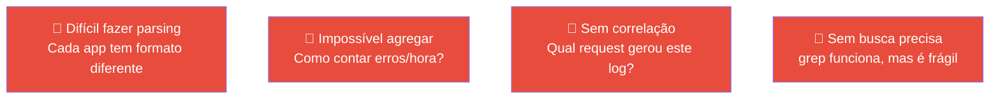
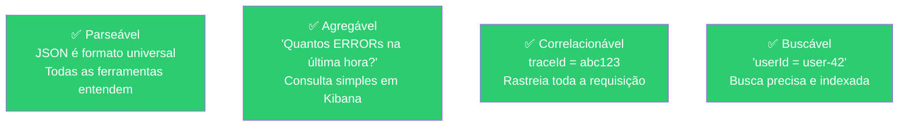
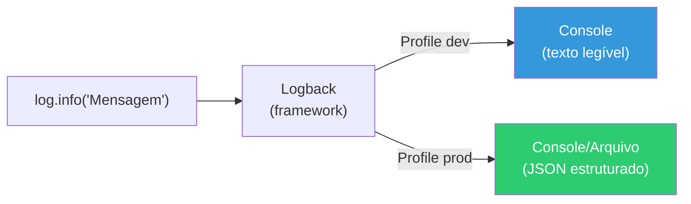
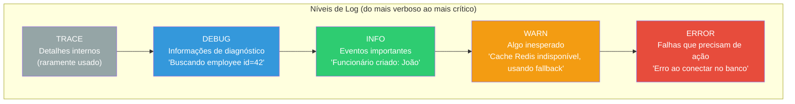
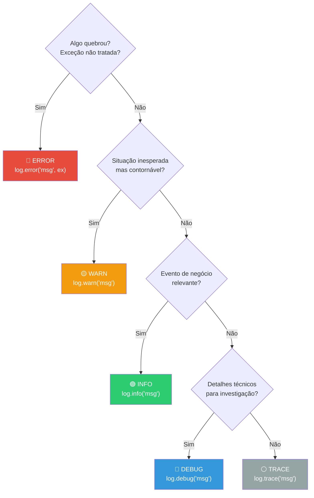
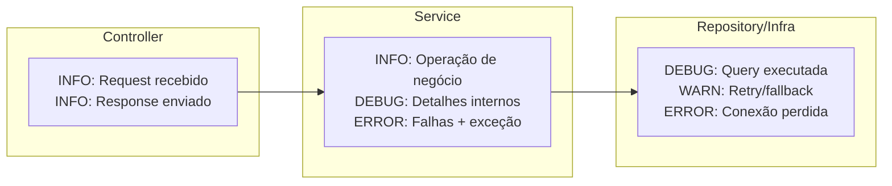

# Slide 6: Logs Estruturados — Conceitos

**Horário:** 11:15 - 11:45

---

## Por que Logs em Texto Puro NÃO Escalam?

```
# ❌ Log em texto puro
2024-03-15 14:30:22.456 INFO  [main] c.e.employee.EmployeeService - Criando funcionário: João Silva
2024-03-15 14:30:22.789 ERROR [main] c.e.employee.EmployeeService - Erro ao buscar funcionário: 42
```

### Problemas do log em texto



---

## Logs em JSON — A Solução

```json
{
  "@timestamp": "2024-03-15T14:30:22.456Z",
  "level": "INFO",
  "logger": "c.e.employee.EmployeeService",
  "message": "Criando funcionário: João Silva",
  "traceId": "abc123def456",
  "userId": "user-42",
  "requestId": "req-789",
  "employeeId": null
}
```

### Vantagens



---

## Logback — O Framework de Log do Spring Boot

O Spring Boot usa **Logback** como framework de log padrão. A configuração fica em `logback-spring.xml`:



### Níveis de Log — Quando usar cada um



| Nível | Quando usar | Exemplo |
|-------|------------|---------|
| `TRACE` | Detalhamento extremo (loop, bytes) — **raramente usado** | `log.trace("Iteração {}: processando item {}", i, item)` |
| `DEBUG` | Diagnóstico técnico — **desligado em produção** | `log.debug("Buscando employee id={}", id)` |
| `INFO` | Eventos de negócio importantes | `log.info("Funcionário criado: {}", name)` |
| `WARN` | Algo fora do normal (mas não fatal) | `log.warn("Cache miss, buscando no banco")` |
| `ERROR` | Falhas que precisam de investigação | `log.error("Erro ao salvar: {}", e.getMessage(), e)` |

---

## 🎯 Boas Práticas de Log em Microsserviços

### Quando usar cada nível — Guia Prático



### O que loggar em cada camada



### Exemplos concretos no microsserviço

```java
// ── Controller ──
@PostMapping
public ResponseEntity<EmployeeResponse> create(@RequestBody EmployeeRequest request) {
    log.info("POST /api/employees — nome={}", request.name());     // ✅ INFO: entrada da API
    var response = employeeService.create(request);
    log.info("Funcionário criado com sucesso: id={}", response.id()); // ✅ INFO: saída com resultado
    return ResponseEntity.status(201).body(response);
}

// ── Service ──
public EmployeeResponse create(EmployeeRequest request) {
    log.debug("Validando request: {}", request);                    // ✅ DEBUG: detalhe técnico
    log.info("Criando funcionário: nome={}, departamento={}",       // ✅ INFO: evento de negócio
             request.name(), request.departmentId());

    try {
        Employee saved = repository.save(employee);
        log.info("Funcionário persistido: id={}", saved.getId());   // ✅ INFO: confirmação
        publisher.publishEvent(saved);
        return EmployeeResponse.from(saved);
    } catch (DataIntegrityViolationException ex) {
        log.error("Erro ao salvar funcionário: email={} — {}",      // ✅ ERROR: com exceção
                  request.email(), ex.getMessage(), ex);
        throw ex;
    }
}

// ── Infraestrutura (cache, fila, etc.) ──
@Cacheable("departments")
public List<DepartmentResponse> findAll() {
    log.info("Cache MISS — buscando departamentos no banco");       // ✅ INFO: cache miss
    return repository.findAll().stream()
            .map(DepartmentResponse::from).toList();
}

// Se chamado e veio do cache, este log NÃO aparece → significa cache HIT
```

### ❌ Erros comuns de log

```java
// ❌ Log sem contexto — inútil para investigação
log.info("Funcionário criado");
log.error("Erro ao salvar");

// ❌ Concatenação de string (cria a string MESMO se o nível estiver desligado)
log.debug("Buscando funcionário: " + id + " no departamento: " + deptId);

// ❌ Loggar dados sensíveis (CPF, senha, token)
log.info("Funcionário criado: cpf={}, senha={}", cpf, senha);

// ❌ Swallow da exceção — perde o stack trace
log.error("Erro: " + ex.getMessage());  // cadê o stack trace?

// ❌ Log dentro de loop com milhares de iterações
for (Employee emp : employees) {
    log.info("Processando: {}", emp.getName());  // 10.000 logs por request!
}
```

### ✅ Boas práticas — Resumo

| Prática | Por quê |
|---------|---------|
| Use placeholders `{}` | Evita concatenação desnecessária |
| Passe a exceção como último argumento | `log.error("msg", ex)` — preserva stack trace |
| Inclua IDs no log | `id=42, email=x@y.com` — facilita busca |
| Não logge dados sensíveis | CPF, senha, token, cartão de crédito |
| Em produção, nível mínimo = **INFO** | DEBUG/TRACE geram volume excessivo |
| Use MDC para `traceId` | Correlaciona todos os logs de uma request |
| Não logge dentro de loops grandes | Um log por request, não 10.000 |
| Prefira `log.warn` a `log.error` para situações recuperáveis | ERROR = precisa de ação humana |

---

## Logstash Encoder — Gerando JSON Automaticamente

O **Logstash Encoder** converte automaticamente todos os logs para formato JSON:

### Dependência

```xml
<dependency>
    <groupId>net.logstash.logback</groupId>
    <artifactId>logstash-logback-encoder</artifactId>
    <version>7.4</version>
</dependency>
```

### logback-spring.xml

```xml
<?xml version="1.0" encoding="UTF-8"?>
<configuration>

    <!-- ── Profile DEV: log em texto legível ── -->
    <springProfile name="dev,default">
        <appender name="CONSOLE" class="ch.qos.logback.core.ConsoleAppender">
            <encoder>
                <pattern>%d{HH:mm:ss.SSS} %highlight(%-5level) [%thread] %cyan(%logger{36}) - %msg%n</pattern>
            </encoder>
        </appender>

        <root level="INFO">
            <appender-ref ref="CONSOLE"/>
        </root>
    </springProfile>

    <!-- ── Profile PROD: log em JSON estruturado ── -->
    <springProfile name="prod">
        <appender name="JSON_CONSOLE" class="ch.qos.logback.core.ConsoleAppender">
            <encoder class="net.logstash.logback.encoder.LogstashEncoder">
                <includeMdcKeyName>traceId</includeMdcKeyName>
                <includeMdcKeyName>userId</includeMdcKeyName>
                <includeMdcKeyName>requestId</includeMdcKeyName>
            </encoder>
        </appender>

        <root level="INFO">
            <appender-ref ref="JSON_CONSOLE"/>
        </root>
    </springProfile>

</configuration>
```

### Resultado

```bash
# Profile dev — texto legível para o desenvolvedor
14:30:22.456 INFO  [http-nio-8080-exec-1] c.e.employee.EmployeeService - Criando funcionário: João Silva

# Profile prod — JSON estruturado para ferramentas
{"@timestamp":"2024-03-15T14:30:22.456Z","level":"INFO","logger_name":"c.e.employee.EmployeeService","message":"Criando funcionário: João Silva","traceId":"abc123","thread_name":"http-nio-8080-exec-1"}
```

---

## 🎯 Quiz Rápido

1. **Por que log em JSON é melhor que texto puro?**
   - Parseável por ferramentas (ELK, Datadog), buscável, agregável e correlacionável.

2. **Qual a diferença entre `INFO` e `DEBUG`?**
   - `INFO` para eventos de negócio relevantes. `DEBUG` para diagnóstico detalhado (desligado em produção).

3. **Como o Profile controla o formato do log?**
   - `<springProfile name="dev">` ativa o formato texto. `<springProfile name="prod">` ativa JSON.
