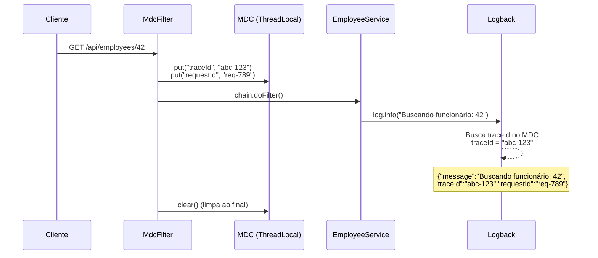

# Slide 7: MDC — Correlação de Requisições

**Horário:** 11:45 - 12:00

---

## O Problema: Logs sem Contexto

Em produção, sua aplicação processa **centenas de requisições simultâneas**. Sem contexto, é impossível saber qual log pertence a qual requisição:

```
14:30:22.456 INFO  Criando funcionário: João Silva
14:30:22.457 INFO  Buscando departamento: 3
14:30:22.458 INFO  Criando funcionário: Maria Oliveira      ← Qual requisição?
14:30:22.459 ERROR Departamento não encontrado: 99         ← De qual request?
14:30:22.460 INFO  Funcionário salvo: 42
14:30:22.461 INFO  Buscando departamento: 1
```

> **Pergunta**: O erro na linha 4 pertence ao João ou à Maria? Impossível saber! 😱

---

## MDC — Mapped Diagnostic Context

O **MDC** permite adicionar **contexto** a cada log dentro de uma thread de requisição:



---

## Implementando o MdcFilter

```java
@Component
@Order(Ordered.HIGHEST_PRECEDENCE)
public class MdcFilter extends OncePerRequestFilter {

    @Override
    protected void doFilterInternal(HttpServletRequest request,
                                    HttpServletResponse response,
                                    FilterChain filterChain) throws ServletException, IOException {
        try {
            // Gera um traceId único para esta requisição
            String traceId = UUID.randomUUID().toString().substring(0, 8);
            String requestId = request.getHeader("X-Request-ID");

            // Adiciona ao MDC (fica disponível em TODOS os logs desta thread)
            MDC.put("traceId", traceId);
            MDC.put("requestId", requestId != null ? requestId : "N/A");
            MDC.put("method", request.getMethod());
            MDC.put("uri", request.getRequestURI());

            // Adiciona traceId no header de resposta (para o cliente rastrear)
            response.setHeader("X-Trace-ID", traceId);

            filterChain.doFilter(request, response);
        } finally {
            // OBRIGATÓRIO: limpar o MDC ao final da requisição
            // ThreadLocal pode vazar entre requisições se não limpar!
            MDC.clear();
        }
    }
}
```

---

## Antes vs. Depois do MDC

### Sem MDC

```
14:30:22 INFO  Criando funcionário: João Silva
14:30:22 INFO  Buscando departamento: 3
14:30:22 INFO  Criando funcionário: Maria Oliveira
14:30:22 ERROR Departamento não encontrado: 99     ← De quem? 🤷
```

### Com MDC

```
14:30:22 INFO  [traceId=a1b2c3d4] Criando funcionário: João Silva
14:30:22 INFO  [traceId=a1b2c3d4] Buscando departamento: 3
14:30:22 INFO  [traceId=e5f6g7h8] Criando funcionário: Maria Oliveira
14:30:22 ERROR [traceId=e5f6g7h8] Departamento não encontrado: 99  ← Da Maria! ✅
```

Em JSON (produção):

```json
{"@timestamp":"2024-03-15T14:30:22.459Z","level":"ERROR","message":"Departamento não encontrado: 99","traceId":"e5f6g7h8","userId":"user-7","requestId":"req-456","method":"POST","uri":"/api/employees"}
```

> Agora você pode buscar **todos os logs de uma requisição** com: `traceId = "e5f6g7h8"`.

---

## MDC no Código de Negócio

Além do traceId automático (no filter), você pode adicionar contexto de negócio em pontos específicos:

```java
@Service
public class EmployeeService {

    private static final Logger log = LoggerFactory.getLogger(EmployeeService.class);

    public EmployeeResponse findById(Long id) {
        // Adiciona contexto de negócio ao MDC
        MDC.put("employeeId", String.valueOf(id));

        log.info("Buscando funcionário por ID");
        // Log gerado: {"message":"Buscando funcionário por ID","traceId":"abc123","employeeId":"42"}

        Employee employee = repository.findById(id)
                .orElseThrow(() -> {
                    log.error("Funcionário não encontrado");
                    // Log: {"message":"Funcionário não encontrado","traceId":"abc123","employeeId":"42"}
                    return new ResourceNotFoundException("Employee", id);
                });

        MDC.remove("employeeId"); // Limpa apenas este campo
        return EmployeeResponse.from(employee);
    }
}
```

---

## 🎯 Quiz Rápido

1. **O que é MDC?**
   - Mapped Diagnostic Context — um mapa key/value associado à thread atual, incluído automaticamente em cada log.

2. **Por que é OBRIGATÓRIO chamar `MDC.clear()` no finally?**
   - Threads são reutilizadas pelo pool. Sem limpar, o traceId de uma requisição pode vazar para a próxima.

3. **Como rastrear todos os logs de uma requisição específica?**
   - Busca pelo `traceId` nos logs: `traceId = "abc123"`.
