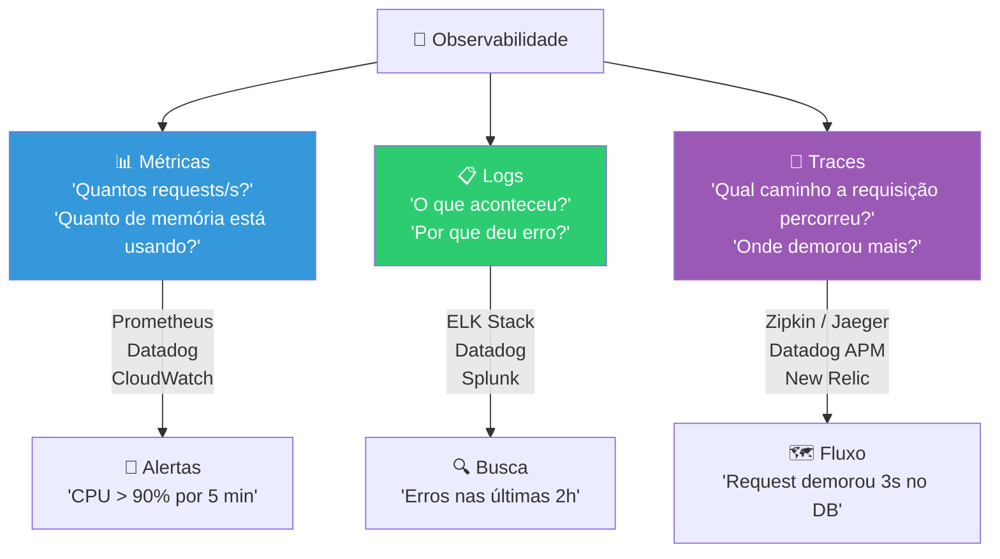
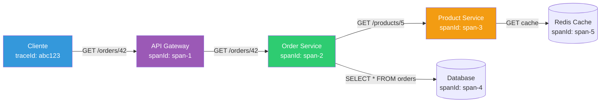
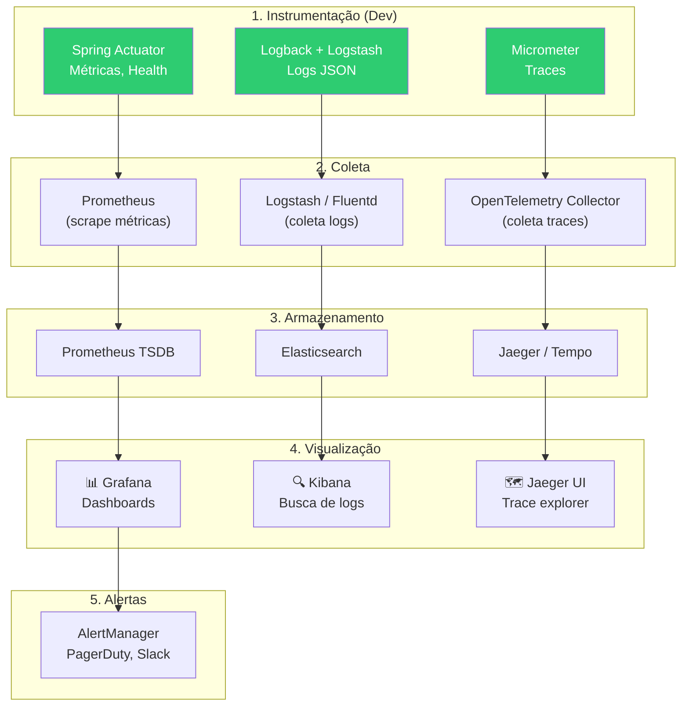
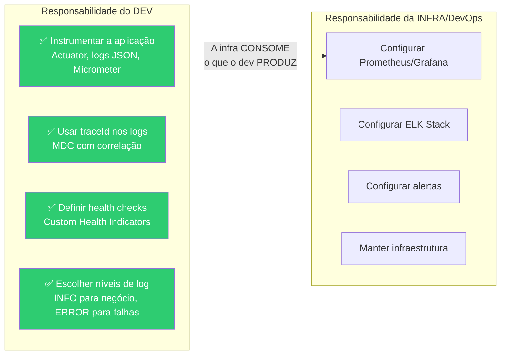

# Slide 8: Observabilidade em Produção (Conceitual)

**Horário:** 13:00 - 13:15

---

## Os 3 Pilares da Observabilidade

---

## O que cada pilar resolve

| Pilar | Pergunta que responde | Exemplo | Ferramenta |
|-------|----------------------|---------|-----------|
| **Métricas** | "Está rápido?" "Está saudável?" | CPU 85%, Latência p99 = 500ms | Prometheus + Grafana |
| **Logs** | "O que aconteceu?" "Por que falhou?" | `ERROR: Connection refused to DB` | ELK Stack, Datadog |
| **Traces** | "Qual o caminho?" "Onde demorou?" | App → DB (200ms) → Redis (5ms) → RabbitMQ (10ms) | Zipkin, Jaeger |

---

## Distributed Tracing — Conceito

Em um sistema com **múltiplos microsserviços**, uma requisição percorre vários serviços. O **Distributed Tracing** rastreia esse caminho:

### Conceitos chave

| Conceito | Descrição |
|----------|-----------|
| **Trace** | O caminho completo de uma requisição (do cliente até a resposta) |
| **Span** | Uma operação individual dentro do trace (chamada HTTP, query SQL, etc.) |
| **TraceId** | ID único do trace — compartilhado entre TODOS os serviços |
| **SpanId** | ID único de cada operação — identifica um passo específico |
| **Parent SpanId** | Quem chamou esta operação — cria a árvore de chamadas |

> **No Java**: O Micrometer (Spring Boot 3) + OpenTelemetry gera e propaga traceId/spanId automaticamente entre serviços.

---

## Stack de Observabilidade — Como as empresas montam

---

## O Papel do Desenvolvedor

> **Mensagem central**: O dev instrumenta (Actuator, logs, traceId). A infra consome (Prometheus, ELK, alertas). **Sem instrumentação do dev, a infra não tem o que monitorar.**

---

## 🎯 Quiz Rápido

1. **Quais são os 3 pilares da observabilidade?**
   - Métricas, Logs e Traces.

2. **Qual a diferença entre traceId e spanId?**
   - `traceId` é compartilhado entre todos os serviços (identifica a requisição). `spanId` identifica uma operação específica dentro do trace.

3. **O que o dev precisa fazer para observabilidade?**
   - Adicionar Actuator, gerar logs JSON estruturados, usar MDC com traceId, criar Health Indicators.
