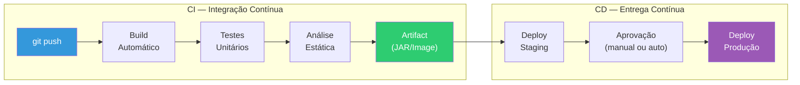
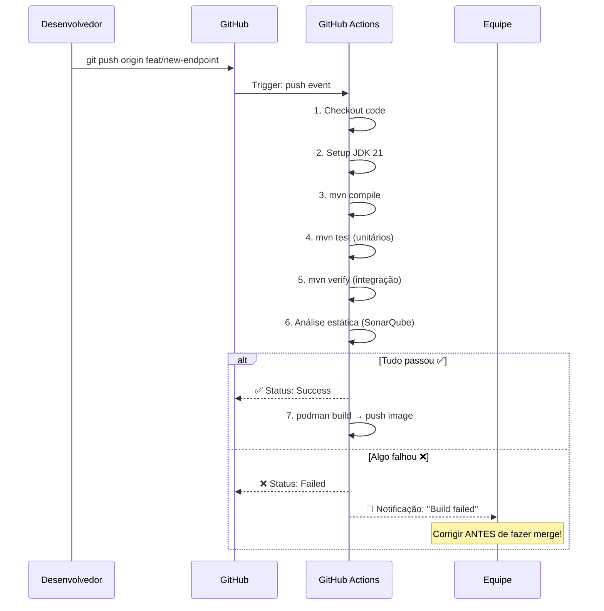
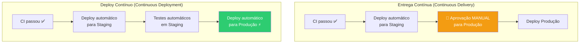
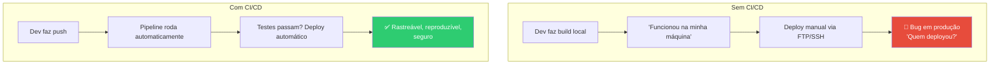

# Slide 9: CI/CD — Conceitos

**Horário:** 13:15 - 13:30

---

## O que é CI/CD?



---

## Integração Contínua (CI)

**O que é**: A cada `git push`, o código é automaticamente compilado e testado. Se algo quebra, a equipe é notificada imediatamente.



> **Regra de ouro**: "Código que não passa no pipeline **não vai para produção**."

---

## Entrega Contínua vs. Deploy Contínuo



| Conceito | Descrição | Aprovação |
|----------|-----------|-----------|
| **Entrega Contínua** | Deploy para staging é automático, para produção é manual | Manual |
| **Deploy Contínuo** | Tudo automático, incluindo produção | Automática |

> A maioria das empresas usa **Entrega Contínua** (com aprovação manual antes de produção).

---

## Pipeline Típico — Etapas

```mermaid
graph LR
    E1["📥 Checkout<br/>Baixa o código"] --> E2["🔨 Build<br/>mvn compile"]
    E2 --> E3["🧪 Testes Unitários<br/>mvn test"]
    E3 --> E4["🔬 Testes Integração<br/>Testcontainers"]
    E4 --> E5["📊 Análise Estática<br/>SonarQube"]
    E5 --> E6["🐳 Podman Build<br/>podman build -t app"]
    E6 --> E7["📦 Push Image<br/>Podman Registry"]
    E7 --> E8["🚀 Deploy<br/>Staging → Prod"]

    style E1 fill:#3498db,color:#fff
    style E3 fill:#2ecc71,color:#fff
    style E4 fill:#2ecc71,color:#fff
    style E5 fill:#9b59b6,color:#fff
    style E6 fill:#f39c12,color:#fff
    style E8 fill:#e74c3c,color:#fff
```



---

## Ferramentas de CI/CD

| Ferramenta | Tipo | Destaque |
|------------|------|----------|
| **GitHub Actions** | Cloud (GitHub) | Integrado com GitHub, YAML simples |
| **GitLab CI** | Cloud (GitLab) | Pipeline como código, runners próprios |
| **Jenkins** | Self-hosted | Mais flexível, mais complexo |
| **Azure DevOps** | Cloud (Microsoft) | Integrado com Azure, boards + repos + pipelines |
| **CircleCI** | Cloud | Rápido, orbs pré-configurados |

### Exemplo: GitHub Actions (`.github/workflows/ci.yml`)

```yaml
name: CI Pipeline

on:
  push:
    branches: [main, develop]
  pull_request:
    branches: [main]

jobs:
  build:
    runs-on: ubuntu-latest

    services:
      postgres:
        image: postgres:16-alpine
        env:
          POSTGRES_DB: testdb
          POSTGRES_USER: test
          POSTGRES_PASSWORD: test
        ports:
          - 5432:5432
        options: >-
          --health-cmd pg_isready
          --health-interval 10s
          --health-timeout 5s
          --health-retries 5

    steps:
      - uses: actions/checkout@v4

      - name: Setup JDK 21
        uses: actions/setup-java@v4
        with:
          java-version: '21'
          distribution: 'temurin'

      - name: Cache Maven packages
        uses: actions/cache@v3
        with:
          path: ~/.m2
          key: ${{ runner.os }}-maven-${{ hashFiles('**/pom.xml') }}

      - name: Build & Test
        run: mvn clean verify
        env:
          SPRING_DATASOURCE_URL: jdbc:postgresql://localhost:5432/testdb

      - name: Build Podman Image
        run: podman build -t my-app:${{ github.sha }} .
```

---

## Por que CI/CD é Obrigatório



---

## 🎯 Quiz Rápido

1. **Qual a diferença entre CI e CD?**
   - CI: build e teste automáticos a cada push. CD: deploy automático ou semi-automático.

2. **Se os testes falham no pipeline, o que acontece?**
   - O merge/deploy é **bloqueado**. O dev precisa corrigir antes.

3. **Por que cachear dependências Maven no CI?**
   - Para não baixar todas as dependências a cada build (~2min economizados).
