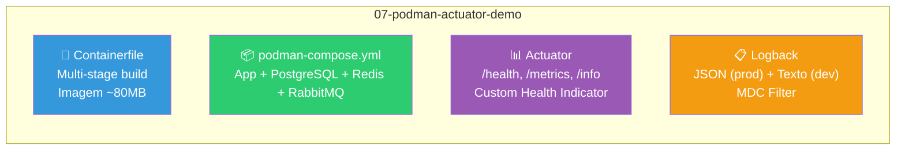

# Slide 10: Walkthrough — 07-podman-actuator-demo

**Horário:** 13:30 - 14:00

---

## 🔍 O que vamos explorar

O projeto `07-podman-actuator-demo` é uma aplicação Spring Boot **completa e funcionando** que demonstra todos os conceitos práticos do dia:



---

## Estrutura do Projeto

```
07-podman-actuator-demo/
├── .containerignore                         ← Arquivos excluídos do build
├── .vscode/
│   ├── launch.json
│   └── tasks.json
├── Containerfile                            ← Multi-stage build otimizado
├── podman-compose.yml                    ← Stack completa com health checks
├── pom.xml
├── api-requests.http                     ← Testes dos endpoints
├── README.md
└── src/main/
    ├── java/com/example/demo/
    │   ├── PodmanActuatorDemoApplication.java
    │   ├── config/
    │   │   ├── CacheConfig.java
    │   │   └── RabbitMQConfig.java
    │   ├── controller/
    │   │   └── ProductController.java
    │   ├── dto/
    │   │   ├── ProductRequest.java
    │   │   ├── ProductResponse.java
    │   │   └── ProductCreatedEvent.java
    │   ├── filter/
    │   │   └── MdcFilter.java            ← Adiciona traceId ao MDC
    │   ├── health/
    │   │   └── RabbitMQHealthIndicator.java ← Custom Health Check
    │   ├── messaging/
    │   │   ├── ProductEventPublisher.java
    │   │   └── ProductNotificationConsumer.java
    │   ├── model/
    │   │   └── Product.java
    │   ├── repository/
    │   │   └── ProductRepository.java
    │   └── service/
    │       └── ProductService.java       ← Logging contextual com MDC
    └── resources/
        ├── application.yml               ← Config com variáveis de ambiente
        ├── logback-spring.xml            ← JSON (prod) + Texto (dev)
        └── db/migration/
            ├── V1__create_products.sql
            └── V2__seed_products.sql
```

---

## Roteiro de Demonstração

### 1. Mostrar o Containerfile Multi-Stage

```bash
# Tamanho da imagem
podman images 07-podman-actuator-demo
# REPOSITORY                TAG      SIZE
# 07-podman-actuator-demo   latest   82MB  ← < 100MB ✅
```

### 2. Subir tudo com Podman Compose

```bash
cd 07-podman-actuator-demo
podman compose up -d
podman compose ps    # Verificar que tudo subiu
podman compose logs -f app   # Acompanhar logs
```

### 3. Testar Actuator

```bash
# Health check
curl http://localhost:8080/actuator/health | jq

# Métricas
curl http://localhost:8080/actuator/metrics
curl http://localhost:8080/actuator/metrics/jvm.memory.used | jq

# Info
curl http://localhost:8080/actuator/info | jq
```

### 4. Observar Logs Estruturados

```bash
# Profile dev (texto legível)
# Rodar com: mvn spring-boot:run (sem Podman)
# 14:30:22 INFO [traceId=abc123] Criando produto: Notebook

# Profile prod (JSON — dentro do Podman)
podman compose logs -f app
# {"@timestamp":"...","level":"INFO","message":"Criando produto: Notebook","traceId":"abc123"}
```

### 5. Testar MDC

```bash
# Criar produto e observar traceId nos logs
curl -X POST http://localhost:8080/api/products \
  -H "Content-Type: application/json" \
  -d '{"name":"Notebook","price":4999.90}'

# No log: traceId aparece em TODAS as linhas desta requisição
```

---

## Pontos de Atenção para o Instrutor

- Mostrar o **antes** (texto) e **depois** (JSON) mudando o profile
- Demonstrar que o **traceId é o mesmo** em todas as linhas de uma requisição
- Mostrar o health check retornando **DOWN** ao parar um container (`podman stop app-redis`)
- Mostrar o tamanho da imagem (`podman images`) e comparar com a versão não otimizada

---

## 🎯 O que o aluno deve observar

1. **Containerfile**: Como o multi-stage build reduz o tamanho de ~400MB para ~80MB
2. **Podman Compose**: Tudo sobe com `podman compose up -d`, health checks garantem a ordem
3. **Actuator**: `/health` mostra status de todas as dependências
4. **Logs**: JSON em produção, texto em desenvolvimento
5. **MDC**: traceId correlaciona todos os logs de uma requisição
