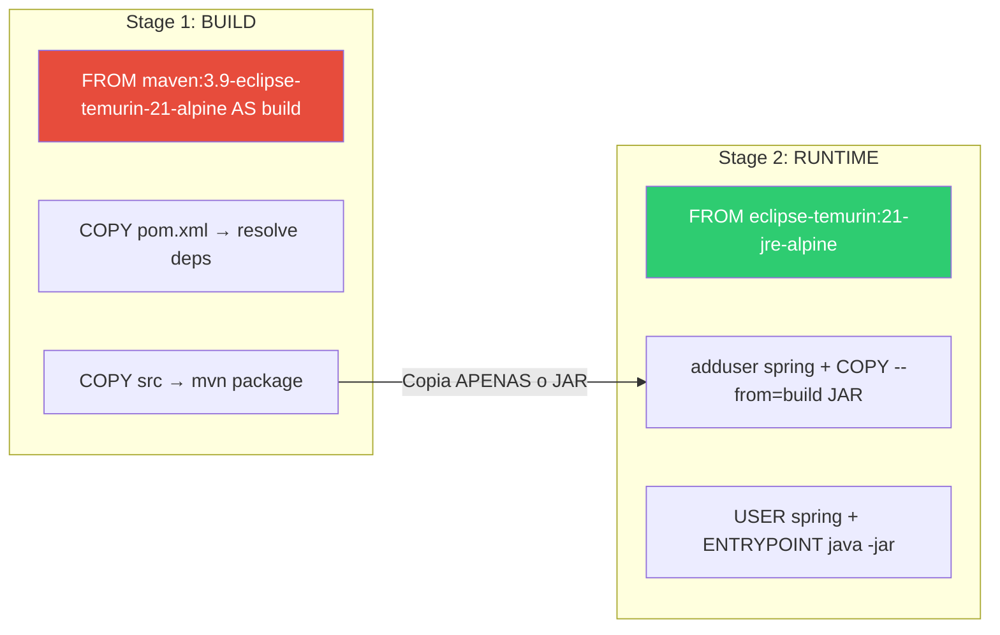

# Slide 11: Exercício — TODO 1 e TODO 2 (Dockerfile + .dockerignore)

**Horário:** 14:00 - 14:30

---

## TODO 1: Otimizar Dockerfile com Multi-Stage Build

**Arquivo**: `Dockerfile`

### O que já vem pronto (NÃO otimizado)

```dockerfile
# ❌ Dockerfile básico — imagem ~800MB
FROM docker.io/library/eclipse-temurin:21-jdk
WORKDIR /app
COPY . .
RUN chmod +x mvnw && ./mvnw clean package -DskipTests -q
EXPOSE 8092
ENTRYPOINT ["java", "-jar", "target/employee-api-production-0.0.1-SNAPSHOT.jar"]
```

### O que implementar


```mermaid
graph LR
    subgraph "Stage 1: BUILD"
        B1["FROM maven:3.9-eclipse-temurin-21-alpine AS build"]
        B2["COPY pom.xml → resolve deps"]
        B3["COPY src → mvn package"]
    end

    subgraph "Stage 2: RUNTIME"
        R1["FROM eclipse-temurin:21-jre-alpine"]
        R2["adduser spring + COPY --from=build JAR"]
        R3["USER spring + ENTRYPOINT java -jar"]
    end

    B3 -->|"Copia APENAS o JAR"| R2

    style B1 fill:#e74c3c,color:#fff
    style R1 fill:#2ecc71,color:#fff
```

### Implementação

```dockerfile
# ╔═══════════════════════════════════════════════╗
# ║  STAGE 1: BUILD — Compilar a aplicação        ║
# ╚═══════════════════════════════════════════════╝
FROM docker.io/library/maven:3.9-eclipse-temurin-21-alpine AS build

WORKDIR /app

# 1. Copia APENAS o pom.xml primeiro (cache de dependências)
COPY pom.xml .

# 2. Baixa dependências (esta camada é cacheada se pom.xml não mudou)
RUN mvn dependency:resolve -q

# 3. Copia o código fonte
COPY src ./src

# 4. Compila e gera o JAR
RUN mvn clean package -DskipTests -q

# ╔═══════════════════════════════════════════════╗
# ║  STAGE 2: RUNTIME — Imagem final enxuta        ║
# ╚═══════════════════════════════════════════════╝
FROM docker.io/library/eclipse-temurin:21-jre-alpine

WORKDIR /app

# Criar usuário não-root
RUN addgroup -S spring && adduser -S spring -G spring

# Copia APENAS o JAR do stage de build
COPY --from=build /app/target/*.jar app.jar

# Trocar para usuário não-root
USER spring:spring

EXPOSE 8092

HEALTHCHECK --interval=30s --timeout=3s --start-period=40s --retries=3 \
  CMD wget --quiet --tries=1 --spider http://localhost:8092/actuator/health || exit 1

ENTRYPOINT ["java", "-jar", "app.jar"]
```

### Verificação

```bash
# Build da imagem
docker build -t employee-api:v1 .

# Verificar tamanho
docker images employee-api
# REPOSITORY       TAG   SIZE
# employee-api     v1    ~85MB  ← Meta: < 100MB ✅
```

---

## TODO 2: Criar .dockerignore

**Arquivo**: `.dockerignore`

### Implementação

```text
# Build artifacts
target/
*.jar
*.war

# Git
.git/
.gitignore

# IDE
.idea/
.vscode/
*.iml
*.code-workspace

# Docker
docker-compose*.yml
Dockerfile

# Documentação
README.md
*.md

# Configuração local
.env
.env.local
```

### Por que cada exclusão importa

| Arquivo/Pasta | Tamanho típico | Por que excluir |
|---------------|---------------|-----------------|
| `.git/` | 50-500MB | Histórico git inteiro |
| `target/` | 50-200MB | Build anterior |
| `.idea/` | 10-50MB | Configurações da IDE |
| `*.md` | < 1MB | Não é necessário no runtime |

---

## 🎯 Critérios de Aceite

- [ ] Dockerfile com 2 stages (build + runtime)
- [ ] Stage build: `maven:3.9-eclipse-temurin-21-alpine`
- [ ] Stage runtime: `eclipse-temurin:21-jre-alpine`
- [ ] Usuário não-root (`addgroup`/`adduser`/`USER`)
- [ ] Cache de dependências (COPY pom.xml antes do código)
- [ ] `HEALTHCHECK` configurado
- [ ] `.dockerignore` criado com pelo menos `target/`, `.git/`, `.idea/`
- [ ] Imagem final < 100MB
