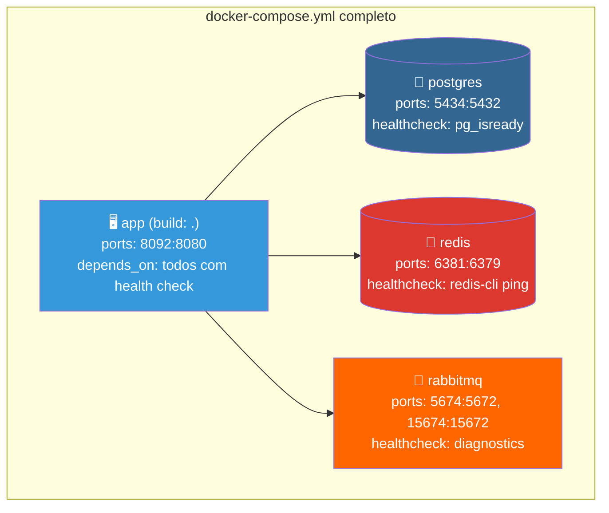

# Slide 12: Exercício — TODO 3 (Docker Compose)

**Horário:** 14:30 - 15:00

---

## TODO 3: Completar docker-compose.yml

**Arquivo**: `docker-compose.yml`

### O que já vem pronto

```yaml
# ❌ Incompleto — apenas PostgreSQL
version: '3.9'

services:
  postgres:
    image: postgres:16-alpine
    container_name: prod-postgres
    environment:
      POSTGRES_DB: employeedb
      POSTGRES_USER: employee
      POSTGRES_PASSWORD: employee123
    ports:
      - "5434:5432"
    volumes:
      - pg_data:/var/lib/postgresql/data

volumes:
  pg_data:
```

### O que implementar


```mermaid
graph TB
    subgraph "docker-compose.yml completo"
        APP["🖥️ app (build: .)<br/>ports: 8092:8080<br/>depends_on: todos com health check"]
        PG[("🐘 postgres<br/>ports: 5434:5432<br/>healthcheck: pg_isready")]
        REDIS[("🔴 redis<br/>ports: 6381:6379<br/>healthcheck: redis-cli ping")]
        RMQ["🐰 rabbitmq<br/>ports: 5674:5672, 15674:15672<br/>healthcheck: diagnostics"]
    end

    APP --> PG
    APP --> REDIS
    APP --> RMQ

    style APP fill:#3498db,color:#fff
    style PG fill:#336791,color:#fff
    style REDIS fill:#dc382d,color:#fff
    style RMQ fill:#ff6600,color:#fff
```

### Implementação

```yaml
version: '3.9'

services:
  # ── Aplicação Spring Boot ──
  app:
    build: .
    container_name: employee-prod-app
    ports:
      - "8092:8092"
    environment:
      SPRING_PROFILES_ACTIVE: prod
      SPRING_DATASOURCE_URL: jdbc:postgresql://postgres:5432/employeedb
      SPRING_DATASOURCE_USERNAME: employee
      SPRING_DATASOURCE_PASSWORD: employee123
      SPRING_RABBITMQ_HOST: rabbitmq
      SPRING_RABBITMQ_PORT: 5672
      SPRING_RABBITMQ_USERNAME: guest
      SPRING_RABBITMQ_PASSWORD: guest
      SPRING_DATA_REDIS_HOST: redis
      SPRING_DATA_REDIS_PORT: 6379
    depends_on:
      postgres:
        condition: service_healthy
      redis:
        condition: service_healthy
      rabbitmq:
        condition: service_healthy
    networks:
      - employee-network

  # ── PostgreSQL ──
  postgres:
    image: docker.io/library/postgres:16-alpine
    container_name: employee-prod-postgres
    environment:
      POSTGRES_DB: employeedb
      POSTGRES_USER: employee
      POSTGRES_PASSWORD: employee123
    ports:
      - "5434:5432"
    volumes:
      - pg_data:/var/lib/postgresql/data
    healthcheck:
      test: ["CMD-SHELL", "pg_isready -U employee -d employeedb"]
      interval: 10s
      timeout: 5s
      retries: 5
      start_period: 10s
    networks:
      - employee-network

  # ── Redis ──
  redis:
    image: docker.io/library/redis:7-alpine
    container_name: employee-prod-redis
    ports:
      - "6381:6379"
    volumes:
      - redis_data:/data
    healthcheck:
      test: ["CMD", "redis-cli", "ping"]
      interval: 10s
      timeout: 5s
      retries: 5
    networks:
      - employee-network

  # ── RabbitMQ ──
  rabbitmq:
    image: docker.io/library/rabbitmq:3-management-alpine
    container_name: employee-prod-rabbitmq
    environment:
      RABBITMQ_DEFAULT_USER: guest
      RABBITMQ_DEFAULT_PASS: guest
    ports:
      - "5674:5672"
      - "15674:15672"
    volumes:
      - rabbitmq_data:/var/lib/rabbitmq
    healthcheck:
      test: ["CMD", "rabbitmq-diagnostics", "check_port_connectivity"]
      interval: 10s
      timeout: 5s
      retries: 5
      start_period: 20s
    networks:
      - employee-network

volumes:
  pg_data:
  redis_data:
  rabbitmq_data:

networks:
  employee-network:
    driver: bridge
```

> **Nota**: As portas são diferentes dos projetos anteriores (5434, 6381, 5674, 15674, 8092) para evitar conflitos.

---

## Testando o Docker Compose

```bash
# 1. Subir tudo
docker compose up -d

# 2. Verificar status
docker compose ps

# 3. Verificar logs
docker compose logs -f app

# 4. Testar health
curl http://localhost:8092/actuator/health | jq

# 5. Parar tudo
docker compose down
```

---

## 🎯 Critérios de Aceite

- [ ] Serviço `app` com build local e depends_on com health checks
- [ ] Serviço `redis` com health check `redis-cli ping`
- [ ] Serviço `rabbitmq` com health check e Management UI
- [ ] Variáveis de ambiente corretamente configuradas (nomes de serviço, não localhost)
- [ ] Volumes para persistência de dados
- [ ] Networks configuradas (`employee-network`)
- [ ] `docker compose up -d` sobe tudo sem erros
