# Slide 13: Exercício — TODO 4 e TODO 5 (Actuator + Custom Health)

**Horário:** 15:00 - 15:30

---

## TODO 4: Configurar Actuator

**Arquivo**: `application.yml`

### O que já vem pronto

```yaml
# Actuator — nenhum endpoint exposto
management:
  endpoints:
    web:
      exposure:
        include: ""  # ← Nada exposto!
```

### O que implementar

```yaml
# Actuator — endpoints de produção
management:
  endpoints:
    web:
      exposure:
        include: health, metrics, info
  endpoint:
    health:
      show-details: always
      # Em produção: when_authorized
  info:
    env:
      enabled: true

info:
  app:
    name: Employee API Production
    version: 1.0.0
    description: API de Gestão de Funcionários — Dia 7
    environment: ${SPRING_PROFILES_ACTIVE:dev}
  java:
    version: ${java.version}
```

### Verificação

```bash
# Health completo
curl http://localhost:8092/actuator/health | jq
# Deve mostrar: db (UP), redis (UP), rabbit (UP)

# Métricas
curl http://localhost:8092/actuator/metrics | jq
# Deve listar: jvm.memory.used, http.server.requests, etc.

# Info
curl http://localhost:8092/actuator/info | jq
# Deve mostrar: app.name, version, java.version
```

---

## TODO 5: Criar Custom HealthIndicator para RabbitMQ

**Arquivo**: `health/RabbitMQHealthIndicator.java`

### Conceito

```mermaid
graph TD
    HEALTH["/actuator/health"]

    HEALTH --> AUTO["Health Checks Automáticos<br/>(Spring Boot detecta)"]
    HEALTH --> CUSTOM["Health Checks Customizados<br/>(você implementa)"]

    AUTO --> DB["db: UP ✅"]
    AUTO --> REDIS["redis: UP ✅"]

    CUSTOM --> RMQ["rabbitMQCustom: UP ✅<br/>queue: employee-notifications<br/>status: accessible"]

    style AUTO fill:#3498db,color:#fff
    style CUSTOM fill:#2ecc71,color:#fff
```



### Implementação

```java
package com.example.employee.health;

import org.springframework.amqp.rabbit.core.RabbitTemplate;
import org.springframework.boot.actuate.health.Health;
import org.springframework.boot.actuate.health.HealthIndicator;
import org.springframework.stereotype.Component;

@Component
public class RabbitMQHealthIndicator implements HealthIndicator {

    private final RabbitTemplate rabbitTemplate;

    public RabbitMQHealthIndicator(RabbitTemplate rabbitTemplate) {
        this.rabbitTemplate = rabbitTemplate;
    }

    @Override
    public Health health() {
        try {
            // Verifica se a conexão com o RabbitMQ está ativa
            rabbitTemplate.execute(channel -> {
                // Verifica se a queue existe (passiva = não cria)
                channel.queueDeclarePassive("employee-notifications");
                return null;
            });
            return Health.up()
                    .withDetail("queue", "employee-notifications")
                    .withDetail("status", "accessible")
                    .build();
        } catch (Exception e) {
            return Health.down()
                    .withDetail("error", e.getMessage())
                    .withDetail("queue", "employee-notifications")
                    .build();
        }
    }
}
```

### Verificação

```bash
# Health com custom indicator
curl http://localhost:8092/actuator/health | jq

# Parar RabbitMQ e verificar que fica DOWN
docker stop prod-rabbitmq
curl http://localhost:8092/actuator/health | jq
# status: DOWN, rabbitMQHealthIndicator: DOWN

# Reiniciar
docker start prod-rabbitmq
```

---

## 🎯 Critérios de Aceite

- [ ] `GET /actuator/health` retorna status de db, redis e rabbit
- [ ] `GET /actuator/metrics` lista métricas disponíveis
- [ ] `GET /actuator/info` retorna nome, versão e Java
- [ ] Custom HealthIndicator para RabbitMQ implementado
- [ ] Ao parar RabbitMQ, health retorna DOWN
