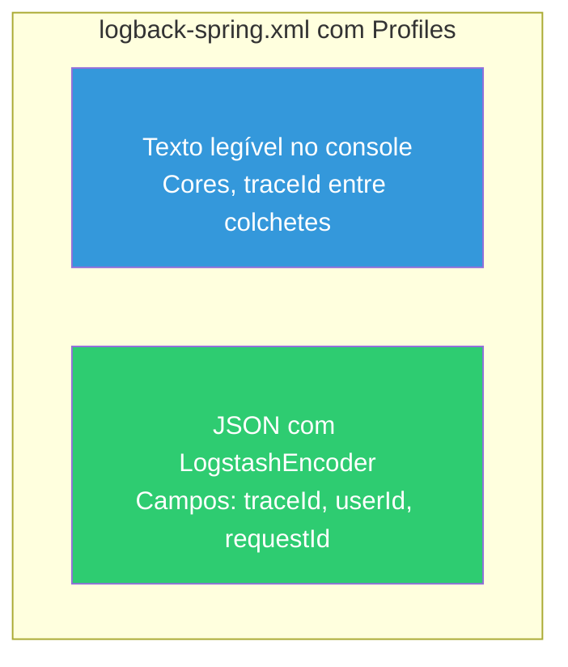

# Slide 14: Exercício — TODO 6 (Logs Estruturados)

**Horário:** 15:30 - 16:00

---

## TODO 6: Configurar Logs Estruturados

**Arquivos**: `logback-spring.xml`, `MdcFilter.java`

### O que já vem pronto

```xml
<!-- logback-spring.xml — apenas texto puro -->
<configuration>
    <appender name="CONSOLE" class="ch.qos.logback.core.ConsoleAppender">
        <encoder>
            <pattern>%d{HH:mm:ss.SSS} %-5level [%thread] %logger{36} - %msg%n</pattern>
        </encoder>
    </appender>

    <root level="INFO">
        <appender-ref ref="CONSOLE"/>
    </root>
</configuration>
```

### O que implementar



### Implementação — logback-spring.xml

```xml
<?xml version="1.0" encoding="UTF-8"?>
<configuration>

    <!-- ── Profile DEV: log em texto legível ── -->
    <springProfile name="dev,default">
        <appender name="CONSOLE" class="ch.qos.logback.core.ConsoleAppender">
            <encoder>
                <pattern>%d{HH:mm:ss.SSS} %highlight(%-5level) [%X{traceId:-N/A}] [%thread] %cyan(%logger{36}) - %msg%n</pattern>
            </encoder>
        </appender>

        <logger name="com.example.employee" level="DEBUG"/>
        <logger name="org.hibernate.SQL" level="DEBUG"/>

        <root level="INFO">
            <appender-ref ref="CONSOLE"/>
        </root>
    </springProfile>

    <!-- ── Profile PROD: log em JSON estruturado ── -->
    <springProfile name="prod">
        <appender name="JSON_CONSOLE" class="ch.qos.logback.core.ConsoleAppender">
            <encoder class="net.logstash.logback.encoder.LogstashEncoder">
                <includeMdcKeyName>traceId</includeMdcKeyName>
                <includeMdcKeyName>userId</includeMdcKeyName>
                <includeMdcKeyName>requestId</includeMdcKeyName>
                <includeMdcKeyName>method</includeMdcKeyName>
                <includeMdcKeyName>uri</includeMdcKeyName>
                <includeMdcKeyName>employeeId</includeMdcKeyName>
            </encoder>
        </appender>

        <logger name="com.example.employee" level="INFO"/>

        <root level="INFO">
            <appender-ref ref="JSON_CONSOLE"/>
        </root>
    </springProfile>

</configuration>
```

### Implementação — MdcFilter.java

```java
package com.example.employee.filter;

import jakarta.servlet.FilterChain;
import jakarta.servlet.ServletException;
import jakarta.servlet.http.HttpServletRequest;
import jakarta.servlet.http.HttpServletResponse;
import org.slf4j.MDC;
import org.springframework.core.Ordered;
import org.springframework.core.annotation.Order;
import org.springframework.stereotype.Component;
import org.springframework.web.filter.OncePerRequestFilter;

import java.io.IOException;
import java.util.UUID;

@Component
@Order(Ordered.HIGHEST_PRECEDENCE)
public class MdcFilter extends OncePerRequestFilter {

    @Override
    protected void doFilterInternal(HttpServletRequest request,
                                    HttpServletResponse response,
                                    FilterChain filterChain)
            throws ServletException, IOException {
        try {
            // Gera traceId único para esta requisição
            String traceId = UUID.randomUUID().toString().substring(0, 8);
            String requestId = request.getHeader("X-Request-ID");

            MDC.put("traceId", traceId);
            MDC.put("requestId", requestId != null ? requestId : "N/A");
            MDC.put("method", request.getMethod());
            MDC.put("uri", request.getRequestURI());

            // Adiciona traceId no header de resposta
            response.setHeader("X-Trace-ID", traceId);

            filterChain.doFilter(request, response);
        } finally {
            MDC.clear();  // OBRIGATÓRIO!
        }
    }
}
```

---

## Verificação

### Dev (texto)

```bash
# Rodar em modo dev (sem Docker)
mvn spring-boot:run

# Log gerado:
# 14:30:22.456 INFO  [abc12345] [http-nio-8080-exec-1] c.e.e.EmployeeService - Criando funcionário: João
```

### Prod (JSON) — dentro do Docker

```bash
# Rodar com profile prod (Docker Compose define SPRING_PROFILES_ACTIVE=prod)
docker compose up -d
docker compose logs -f app

# Log gerado:
# {"@timestamp":"2024-03-15T14:30:22.456Z","level":"INFO",
#  "logger_name":"c.e.employee.service.EmployeeService",
#  "message":"Criando funcionário: João",
#  "traceId":"abc12345","method":"POST","uri":"/api/employees"}
```

---

## 🎯 Critérios de Aceite

- [ ] `logback-spring.xml` com dois profiles: `dev` (texto) e `prod` (JSON)
- [ ] `MdcFilter` implementado com traceId e requestId
- [ ] Em modo dev: logs em texto com traceId entre colchetes
- [ ] Em modo prod (Docker): logs em JSON com campos MDC
- [ ] Resposta HTTP inclui header `X-Trace-ID`
