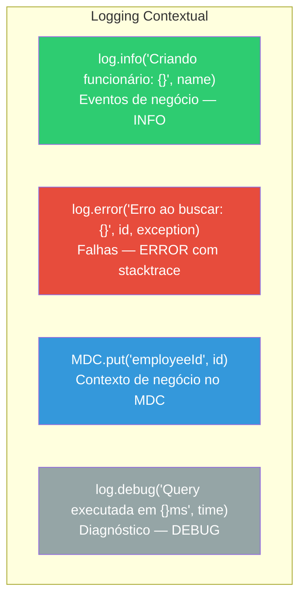

# Slide 15: Exercício — TODO 7 (Logging Contextual nos Services)

**Horário:** 16:00 - 16:30

---

## TODO 7: Adicionar Logging Contextual nos Services

**Arquivo**: `service/EmployeeService.java`

### Conceito — O que vamos adicionar



---

### Implementação

```java
@Service
public class EmployeeService {

    private static final Logger log = LoggerFactory.getLogger(EmployeeService.class);

    // ... constructor

    @Transactional(readOnly = true)
    public List<EmployeeResponse> findAll() {
        log.info("Listando todos os funcionários");  // ← TODO 7a
        List<Employee> employees = employeeRepository.findAllWithDepartment();
        log.debug("Total de funcionários encontrados: {}", employees.size());  // ← TODO 7b
        return employees.stream()
                .map(EmployeeResponse::from)
                .toList();
    }

    @Transactional(readOnly = true)
    public EmployeeResponse findById(Long id) {
        MDC.put("employeeId", String.valueOf(id));  // ← TODO 7c: contexto no MDC
        log.info("Buscando funcionário por ID");

        Employee employee = employeeRepository.findById(id)
                .orElseThrow(() -> {
                    log.error("Funcionário não encontrado com ID: {}", id);  // ← TODO 7d
                    return new ResourceNotFoundException("Employee", id);
                });

        MDC.remove("employeeId");
        return EmployeeResponse.from(employee);
    }

    @Transactional
    public EmployeeResponse create(EmployeeRequest request) {
        log.info("Criando funcionário: {}", request.name());  // ← TODO 7e

        Department department = departmentRepository.findById(request.departmentId())
                .orElseThrow(() -> {
                    log.error("Departamento não encontrado: {}", request.departmentId());
                    return new ResourceNotFoundException("Department", request.departmentId());
                });

        Employee employee = new Employee(
                request.name(), request.email(), request.cpf(),
                request.salary(), department
        );

        Employee saved = employeeRepository.save(employee);
        MDC.put("employeeId", String.valueOf(saved.getId()));
        log.info("Funcionário criado com sucesso: {} ({})", saved.getName(), saved.getEmail());

        // Publicar evento...
        MDC.remove("employeeId");
        return EmployeeResponse.from(saved);
    }

    @Transactional
    public EmployeeResponse update(Long id, EmployeeRequest request) {
        MDC.put("employeeId", String.valueOf(id));
        log.info("Atualizando funcionário: {}", request.name());

        // ... lógica de update ...

        log.info("Funcionário atualizado com sucesso");
        MDC.remove("employeeId");
        return EmployeeResponse.from(updated);
    }

    @Transactional
    public void delete(Long id) {
        MDC.put("employeeId", String.valueOf(id));
        log.info("Deletando funcionário");

        if (!employeeRepository.existsById(id)) {
            log.error("Tentativa de deletar funcionário inexistente: {}", id);
            throw new ResourceNotFoundException("Employee", id);
        }

        employeeRepository.deleteById(id);
        log.info("Funcionário deletado com sucesso");
        MDC.remove("employeeId");
    }
}
```

---

### Boas Práticas de Logging

| Prática | ✅ Certo | ❌ Errado |
|---------|---------|----------|
| Usar placeholders | `log.info("ID: {}", id)` | `log.info("ID: " + id)` |
| Exception no ERROR | `log.error("Erro: {}", msg, ex)` | `log.error("Erro: " + ex.getMessage())` |
| Nível adequado | `log.debug("query result size")` | `log.info("query result size")` |
| Dados sensíveis | `log.info("Funcionário criado")` | `log.info("Senha: {}", password)` |
| MDC para contexto | `MDC.put("employeeId", id)` | `log.info("ID=" + id + " buscando...")` |

---

## Verificação

```bash
# Criar funcionário e observar logs completos
curl -X POST http://localhost:8092/api/employees \
  -H "Content-Type: application/json" \
  -d '{"name":"Maria Teste","email":"maria@test.com","cpf":"123.456.789-00","salary":5000,"departmentId":1}'

# Logs esperados (modo prod/JSON):
# {"level":"INFO","message":"Criando funcionário: Maria Teste","traceId":"abc12345","method":"POST","uri":"/api/employees"}
# {"level":"INFO","message":"Funcionário criado com sucesso: Maria Teste (maria@test.com)","traceId":"abc12345","employeeId":"42"}

# Buscar funcionário inexistente
curl http://localhost:8092/api/employees/999

# Log esperado:
# {"level":"ERROR","message":"Funcionário não encontrado com ID: 999","traceId":"def67890","employeeId":"999"}
```

---

## 🎯 Critérios de Aceite

- [ ] `log.info()` em todos os métodos principais (findAll, findById, create, update, delete)
- [ ] `log.error()` em situações de falha (not found, exceptions)
- [ ] `MDC.put("employeeId", id)` nos métodos que operam em um employee específico
- [ ] Uso de placeholders `{}` (nunca concatenação de strings)
- [ ] `MDC.remove()` após uso para evitar vazamento
