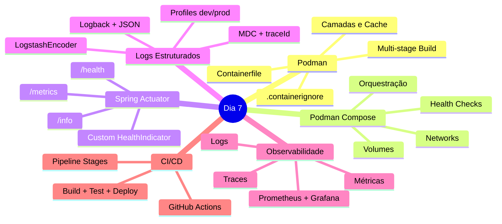
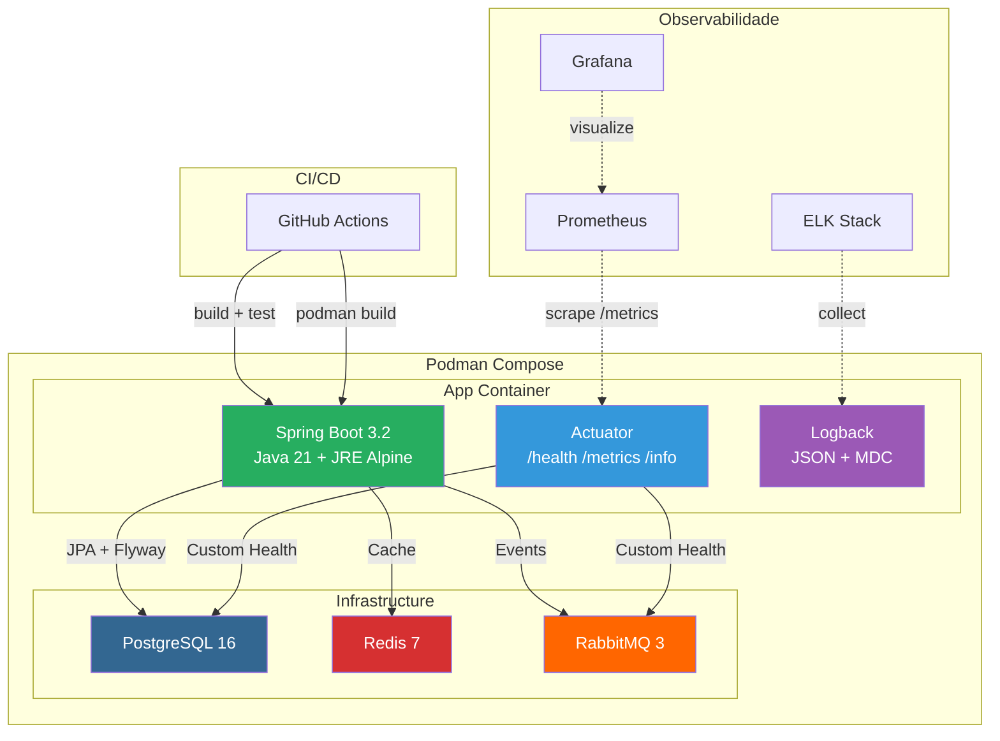
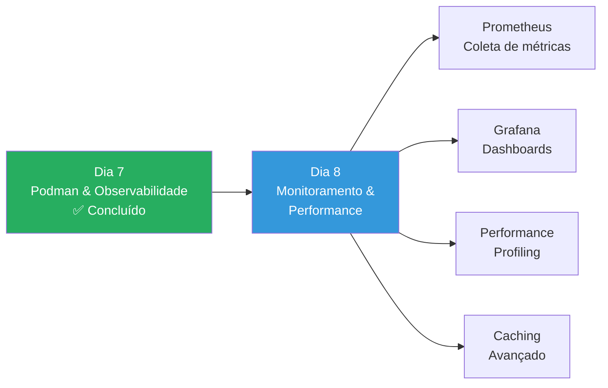

# Slide 16: Revisão e Encerramento

**Horário:** 16:30 - 17:00

---

## Revisão do Dia 7



---

## Arquitetura Completa — O que Construímos



---

## Resumo dos Conceitos

| Conceito | O que aprendemos | Por que importa |
|----------|------------------|-----------------|
| **Containerfile** | Multi-stage build com JRE Alpine | Imagens menores (~200MB vs ~800MB) |
| **Podman Compose** | Orquestrar app + dependências | Ambiente local reproduzível |
| **Health Checks** | `depends_on` + `healthcheck` | Startup ordenado e confiável |
| **.containerignore** | Excluir arquivos desnecessários | Build mais rápido e seguro |
| **Actuator** | Endpoints /health, /metrics, /info | Monitoramento em produção |
| **Custom Health** | HealthIndicator personalizado | Verificar dependências específicas |
| **Logback JSON** | LogstashEncoder por profile | Logs legíveis (dev) e parseáveis (prod) |
| **MDC** | traceId e contexto de negócio | Correlacionar logs entre requests |
| **Observabilidade** | Métricas + Logs + Traces | Visibilidade do sistema em produção |
| **CI/CD** | Pipeline automatizado | Deploy confiável e repetível |

---

## Resumo dos TODOs do Exercício

| TODO | Descrição | Arquivo |
|------|-----------|---------|
| 1 | Multi-stage Containerfile | `Containerfile` |
| 2 | .containerignore completo | `.containerignore` |
| 3 | Podman Compose (app + DB + Redis + RMQ) | `podman-compose.yml` |
| 4 | Configurar Actuator | `application.yml` |
| 5 | Custom HealthIndicator para RabbitMQ | `RabbitMQHealthIndicator.java` |
| 6 | Logs estruturados + MdcFilter | `logback-spring.xml` + `MdcFilter.java` |
| 7 | Logging contextual nos services | `EmployeeService.java` |

---

## Checklist de Verificação Final

```bash
# 1. Build e subir com Podman Compose
podman compose up --build -d

# 2. Verificar containers rodando
podman compose ps

# 3. Testar health endpoint
curl http://localhost:8092/actuator/health | jq .

# 4. Testar métricas
curl http://localhost:8092/actuator/metrics/jvm.memory.used | jq .

# 5. Testar API
curl http://localhost:8092/api/employees | jq .

# 6. Verificar logs JSON
podman compose logs app --tail=20

# 7. Verificar tamanho da imagem
podman images | grep employee
```

---

## Preview — Dia 8



---

## 🎯 Perguntas?

> **"Containerização é garantir que o software funciona da mesma forma em qualquer lugar — do notebook do dev ao cluster de produção."**

### Links Úteis
- [Podman Documentation](https://docs.podman.com/)
- [Podman Compose Reference](https://docs.podman.com/compose/compose-file/)
- [Spring Boot Actuator](https://docs.spring.io/spring-boot/docs/current/reference/html/actuator.html)
- [Logback Documentation](https://logback.qos.ch/documentation.html)
- [12-Factor App](https://12factor.net/)
