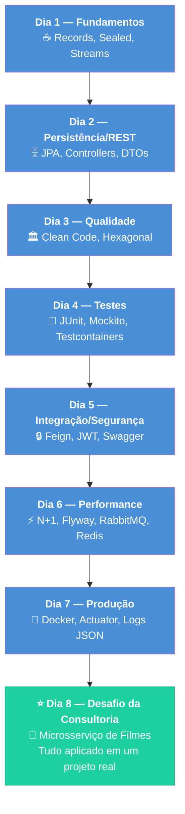

# Slide 1: Abertura e Recap dos Dias 1-7

**Horário:** 09:00 - 09:15

---

## 📝 Recapitulando a Jornada

Nos últimos 7 dias construímos uma **base sólida de desenvolvimento Java profissional**:

- ✓ **Dia 1** — Java Moderno: Records, Sealed Classes, Streams, Pattern Matching
- ✓ **Dia 2** — Spring Data JPA, REST Controllers, DTOs, Paginação
- ✓ **Dia 3** — Clean Code, Arquitetura Hexagonal, Validação, Error Handling
- ✓ **Dia 4** — Testes: JUnit 5, Mockito, Testcontainers, Data Builders
- ✓ **Dia 5** — Feign Client, Resilience4j, JWT, CORS, Swagger
- ✓ **Dia 6** — N+1, Flyway, RabbitMQ, Redis
- ✓ **Dia 7** — Docker, Docker Compose, Actuator, Logs Estruturados

> **Hoje e amanhã: tudo junto em um projeto real — O Desafio da Consultoria!**

---

## 🧠 Revisão Rápida — A Jornada Completa

| Dia | Tema Central | Resultado |
|-----|-------------|-----------|
| **Dia 1** | Fundamentos Java Moderno | Records, Sealed Classes, Streams — linguagem expressiva |
| **Dia 2** | Persistência e REST | Spring Data JPA, APIs REST — dados acessíveis |
| **Dia 3** | Qualidade do Código | Clean Code, Arquitetura limpa — código sustentável |
| **Dia 4** | Testes Automatizados | JUnit 5, Mockito, Testcontainers — confiança para evoluir |
| **Dia 5** | Integração e Segurança | Feign, JWT, Swagger — API de produção |
| **Dia 6** | Persistência e Mensageria | N+1, Flyway, RabbitMQ, Redis — performance |
| **Dia 7** | Docker e Observabilidade | Containers, Actuator, Logs JSON — pronto para produção |
| **Dia 8** | **Desafio da Consultoria** | **Tudo junto em um projeto real!** |

---

## 🔗 Conexão entre os Dias — A Jornada do Desenvolvedor

---

## 🎯 O que muda hoje?

| Dias 1-7 | Dia 8 (Hoje) |
|----------|-------------|
| Conceitos apresentados isoladamente | Tudo integrado em um projeto completo |
| Exercícios guiados passo a passo | Contrato Swagger entregue — você decide o "como" |
| Estrutura do projeto já montada | Você constrói do zero a partir do template |
| Foco em aprender | Foco em **entregar como um profissional** |

> **Simulação de consultoria**: vocês são desenvolvedores recebendo um projeto real de um cliente.
