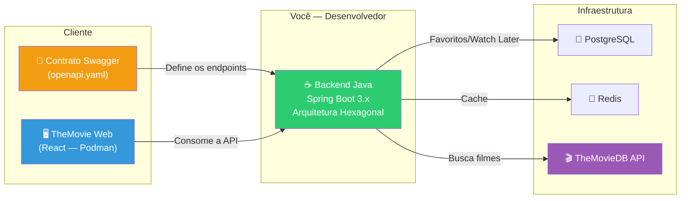
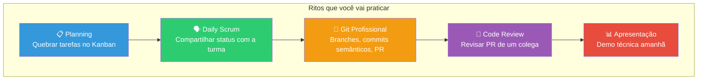

# Slide 2: O Desafio da Consultoria — Briefing

**Horário:** 09:00 - 09:30

---

## 🎯 O Cenário

Vocês são desenvolvedores Java em uma consultoria. O cliente entregou:

1. Um **contrato Swagger/OpenAPI** com os endpoints que o backend deve implementar
2. Um **frontend pronto** (TheMovie Web — React) que consome esses endpoints
3. Prazo: **2 dias** (hoje + amanhã de manhã)

---

## 🎬 O Projeto: Microsserviço de Filmes

Você vai construir um **backend que integra com a API do TheMovieDB** e expõe endpoints para o frontend:

| Funcionalidade | Endpoint | O que faz |
|---------------|----------|-----------|
| Buscar filmes | `GET /api/movies/search?query={q}` | Busca no TheMovieDB |
| Detalhes | `GET /api/movies/{id}` | Detalhes + status de favorito |
| Populares | `GET /api/movies/popular` | Lista populares (cacheado) |
| Favoritar | `POST /api/movies/{id}/favorite` | Salva no banco local |
| Desfavoritar | `DELETE /api/movies/{id}/favorite` | Remove do banco |
| Assistir depois | `POST /api/movies/{id}/watch-later` | Salva no banco local |
| Listar favoritos | `GET /api/movies/favorites` | Lista paginada do banco |
| Login | `POST /auth/login` | Retorna JWT |

---

## ⚠️ Desafio Individual — Ritos de Consultoria

> O desafio é **individual**, mas cada aluno segue todos os ritos como se estivesse em um time profissional.

---

## 🤔 Perguntas ao "Cliente" (Instrutor)

Antes de codar, faça as perguntas certas:

- Qual a **prioridade** dos endpoints? (Busca > Favoritos > Login?)
- O que é "pronto"? (Frontend funcionando = aceite)
- Tem limite de favoritos por usuário? (Sim: máximo 20)
- Precisa de autenticação em todos os endpoints? (Só favoritos e watch-later)
- E se o TheMovieDB cair? (Fallback: retornar cache ou lista vazia)

> **Na consultoria real**: quem não pergunta, assume errado e retrabalha.
