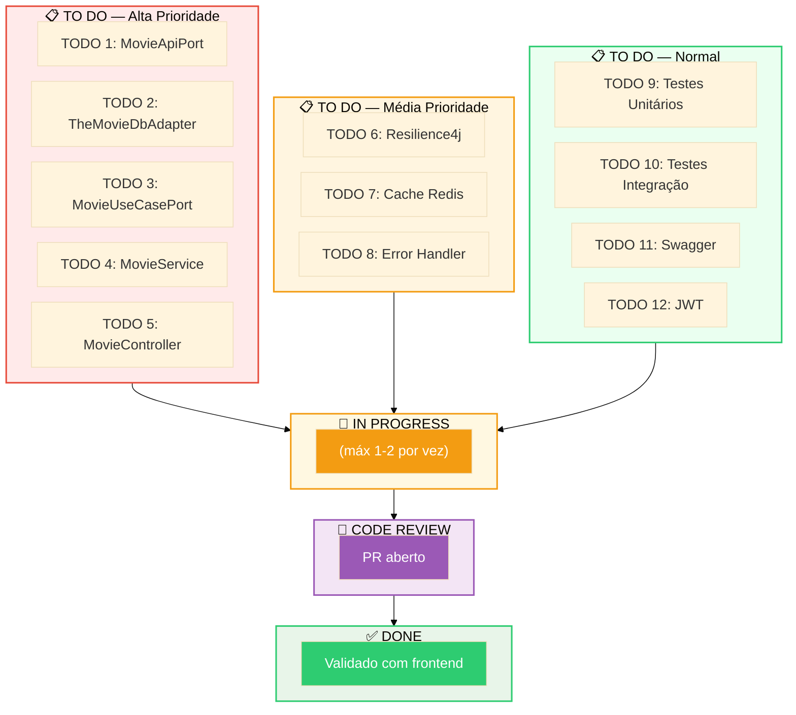
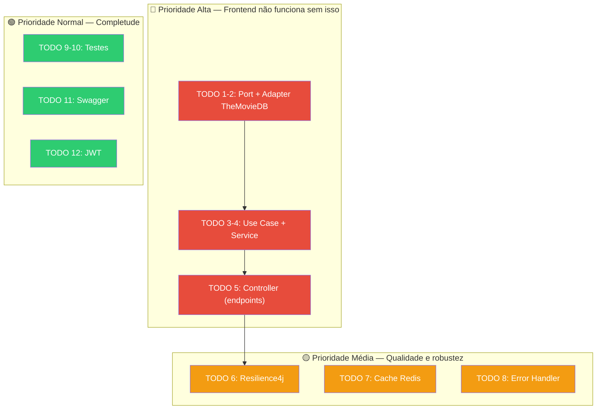

# Slide 3: Planning — Quebrando Tarefas e Setup Git

**Horário:** 09:30 - 10:00

---

## 📋 Kanban Individual

Organize suas tarefas em um quadro Kanban (GitHub Projects, Trello ou até papel):



---

## 🎯 Estratégia de Priorização

Nem todos os TODOs têm o mesmo valor. Priorize pelo **impacto no frontend**:



> **Dica de consultoria**: entregue o que funciona primeiro. Depois melhore.

---

## 🔀 Setup Git — Fluxo Profissional

```bash
# 1. Fork do template
# (Feito no GitHub — botão "Fork")

# 2. Clonar o fork
git clone https://github.com/SEU-USUARIO/08-movie-service.git
cd 08-movie-service

# 3. Criar branch de desenvolvimento
git checkout -b feat/movie-search

# 4. Desenvolver com commits semânticos
git add .
git commit -m "feat: criar MovieApiPort com operações de busca"

# 5. Subir e abrir PR
git push origin feat/movie-search
```

---

## Commits Semânticos — Cheat Sheet

| Prefixo | Quando usar | Exemplo |
|---------|-------------|---------|
| `feat:` | Nova funcionalidade | `feat: criar endpoint GET /api/movies/search` |
| `fix:` | Correção de bug | `fix: corrigir mapeamento de poster_path` |
| `refactor:` | Refatoração sem mudar comportamento | `refactor: extrair mapeamento para MovieMapper` |
| `test:` | Adicionar ou corrigir testes | `test: adicionar testes para MovieService` |
| `docs:` | Documentação | `docs: documentar endpoints no Swagger` |
| `chore:` | Configuração/infra | `chore: configurar Resilience4j no application.yml` |

```bash
# ❌ Ruim
git commit -m "ajustes"
git commit -m "fix"
git commit -m "wip"

# ✅ Bom
git commit -m "feat: implementar busca de filmes via TheMovieDB"
git commit -m "fix: tratar erro 404 quando filme não existe no TheMovieDB"
git commit -m "test: adicionar 5 cenários de teste para MovieService"
```
