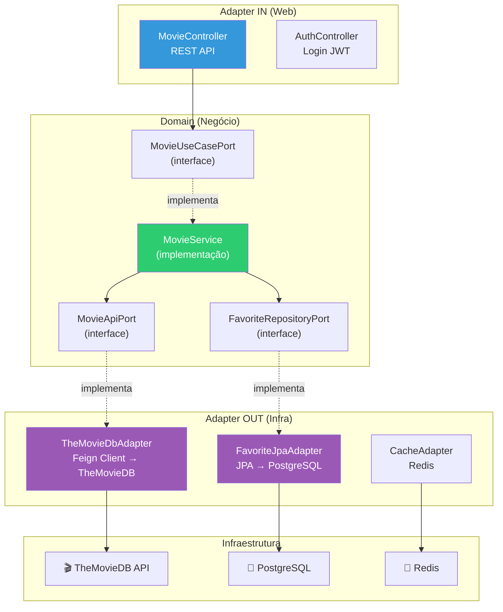
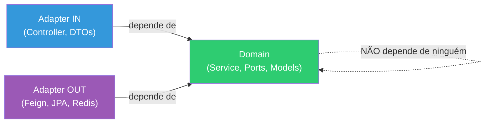

# Slide 4: Arquitetura Hexagonal — Revisão Aplicada

**Horário:** 09:30 - 10:00 (continuação do Planning)

---

## 🏛️ Arquitetura do `08-movie-service`



---

## 📁 Estrutura de Pacotes

```
08-movie-service/
├── docker-compose.yml          ← PostgreSQL + Redis + TheMovie Web
├── openapi.yaml                ← Contrato Swagger (do cliente)
├── src/main/java/com/example/movieservice/
│   ├── domain/                 ← Regras de negócio (sem dependências externas)
│   │   ├── model/
│   │   │   ├── Movie.java
│   │   │   ├── Favorite.java
│   │   │   └── WatchLater.java
│   │   ├── port/
│   │   │   ├── in/
│   │   │   │   └── MovieUseCasePort.java       ← TODO 3
│   │   │   └── out/
│   │   │       ├── MovieApiPort.java            ← TODO 1
│   │   │       └── FavoriteRepositoryPort.java
│   │   └── service/
│   │       └── MovieService.java                ← TODO 4
│   ├── adapter/
│   │   ├── in/
│   │   │   └── web/
│   │   │       ├── MovieController.java         ← TODO 5
│   │   │       ├── AuthController.java          ← TODO 12
│   │   │       ├── dto/
│   │   │       │   ├── MovieSearchResponse.java
│   │   │       │   ├── MovieDetailResponse.java
│   │   │       │   └── LoginRequest.java
│   │   │       └── handler/
│   │   │           └── GlobalExceptionHandler.java ← TODO 8
│   │   └── out/
│   │       ├── rest/
│   │       │   ├── TheMovieDbAdapter.java        ← TODO 2
│   │       │   └── dto/
│   │       │       ├── TmdbSearchResponse.java
│   │       │       └── TmdbMovieDetail.java
│   │       └── persistence/
│   │           ├── FavoriteJpaAdapter.java
│   │           ├── entity/
│   │           └── repository/
│   └── config/
│       ├── SecurityConfig.java
│       ├── CacheConfig.java
│       └── ResilienceConfig.java                 ← TODO 6
└── src/test/java/
    ├── MovieServiceTest.java                     ← TODO 9
    └── FavoriteRepositoryIT.java                 ← TODO 10
```

---

## 🔑 Regra de Ouro da Hexagonal



> O **domain** nunca importa classes de Spring, JPA, Feign ou Redis. Ele só conhece **interfaces (ports)**.
