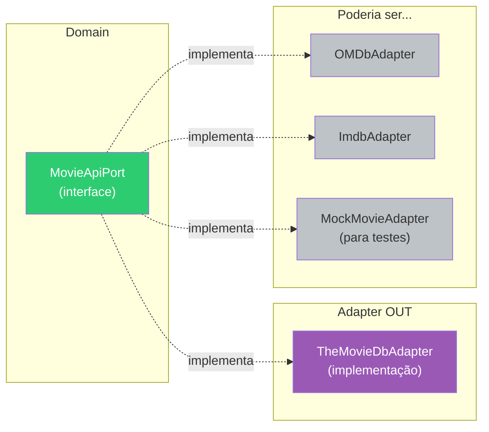

# Slide 5: TODO 1 — MovieApiPort (Port de Saída)

**Horário:** 10:00 - 10:45

---

## TODO 1: Criar o Port de Saída — `MovieApiPort`

O Port de saída é uma **interface no domínio** que define o que precisamos de uma API externa, **sem saber qual API é**.



---

## Implementação

**Arquivo**: `domain/port/out/MovieApiPort.java`

```java
public interface MovieApiPort {

    /**
     * Busca filmes por texto.
     * @param query texto de busca (ex: "Matrix")
     * @param page número da página (começa em 1)
     * @return resultado paginado com lista de filmes
     */
    MovieSearchResult searchMovies(String query, int page);

    /**
     * Retorna detalhes de um filme específico.
     * @param movieId ID do filme no TheMovieDB
     * @return detalhes completos do filme
     */
    MovieDetail getMovieDetails(Long movieId);

    /**
     * Lista filmes populares.
     * @param page número da página
     * @return resultado paginado
     */
    MovieSearchResult getPopularMovies(int page);

    /**
     * Retorna elenco e equipe de um filme.
     * @param movieId ID do filme
     * @return créditos do filme
     */
    MovieCredits getMovieCredits(Long movieId);
}
```

> **Observe**: Nenhuma referência a TheMovieDB, Feign, HTTP ou JSON. Apenas objetos do **domínio**.

---

## Modelos do Domínio

```java
// domain/model/MovieSearchResult.java
public record MovieSearchResult(
    int page,
    int totalPages,
    int totalResults,
    List<MovieSummary> results
) {}

// domain/model/MovieSummary.java
public record MovieSummary(
    Long id,
    String title,
    String overview,
    String posterPath,
    Double voteAverage,
    LocalDate releaseDate
) {}

// domain/model/MovieDetail.java
public record MovieDetail(
    Long id,
    String title,
    String overview,
    String posterPath,
    String backdropPath,
    Double voteAverage,
    int runtime,
    List<String> genres,
    LocalDate releaseDate,
    boolean favorite,      // ← preenchido pelo Service
    boolean watchLater     // ← preenchido pelo Service
) {}
```

> **Records do Dia 1** em ação! Imutáveis, compactos e perfeitos para objetos de transferência no domínio.
