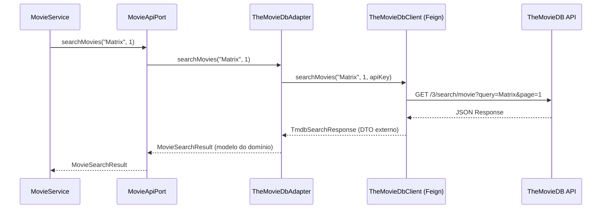

# Slide 6: TODO 2 — TheMovieDbAdapter (Feign Client)

**Horário:** 10:00 - 10:45 (continuação)

---

## TODO 2: Implementar o Adapter REST — `TheMovieDbAdapter`

O Adapter implementa o Port usando **Feign Client** para consumir a API do TheMovieDB:



---

## Feign Client — Interface Declarativa

**Arquivo**: `adapter/out/rest/client/TheMovieDbClient.java`

```java
@FeignClient(
    name = "themoviedb",
    url = "${themoviedb.api.url}",
    configuration = TheMovieDbClientConfig.class
)
public interface TheMovieDbClient {

    @GetMapping("/3/search/movie")
    TmdbSearchResponse searchMovies(
        @RequestParam("query") String query,
        @RequestParam("page") int page
    );

    @GetMapping("/3/movie/{movieId}")
    TmdbMovieDetail getMovieDetails(
        @PathVariable("movieId") Long movieId
    );

    @GetMapping("/3/movie/popular")
    TmdbSearchResponse getPopularMovies(
        @RequestParam("page") int page
    );

    @GetMapping("/3/movie/{movieId}/credits")
    TmdbCreditsResponse getMovieCredits(
        @PathVariable("movieId") Long movieId
    );
}
```

---

## Configuração do Client — API Key

**Arquivo**: `adapter/out/rest/config/TheMovieDbClientConfig.java`

```java
@Configuration
public class TheMovieDbClientConfig {

    @Value("${themoviedb.api.key}")
    private String apiKey;

    @Bean
    public RequestInterceptor authInterceptor() {
        return template -> template.header(
            "Authorization", "Bearer " + apiKey
        );
    }
}
```

**Arquivo**: `application.yml`

```yaml
themoviedb:
  api:
    url: https://api.themoviedb.org
    key: ${TMDB_API_KEY:sua-api-key-aqui}
```

---

## Adapter — Implementando o Port

**Arquivo**: `adapter/out/rest/TheMovieDbAdapter.java`

```java
@Component
public class TheMovieDbAdapter implements MovieApiPort {

    private final TheMovieDbClient client;
    private final TmdbMovieMapper mapper;

    public TheMovieDbAdapter(TheMovieDbClient client, TmdbMovieMapper mapper) {
        this.client = client;
        this.mapper = mapper;
    }

    @Override
    public MovieSearchResult searchMovies(String query, int page) {
        TmdbSearchResponse response = client.searchMovies(query, page);
        return mapper.toMovieSearchResult(response);  // DTO externo → domínio
    }

    @Override
    public MovieDetail getMovieDetails(Long movieId) {
        TmdbMovieDetail response = client.getMovieDetails(movieId);
        return mapper.toMovieDetail(response);  // DTO externo → domínio
    }

    // ... getPopularMovies, getMovieCredits
}
```

> **Dois mundos**: `TmdbSearchResponse` (DTO da API externa) → `MovieSearchResult` (modelo do domínio). O domínio nunca conhece o formato do TheMovieDB.
