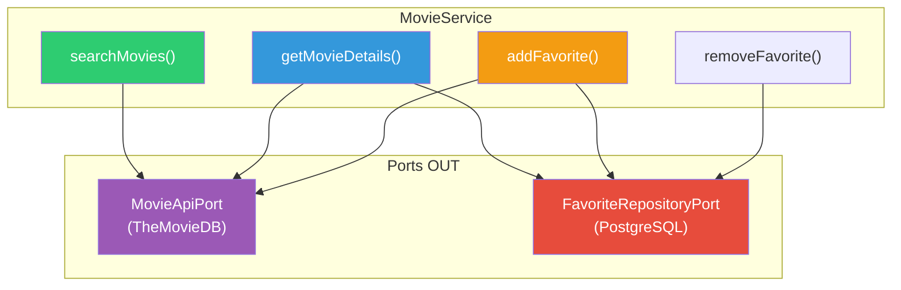

# Slide 7: TODOs 3-4 — Use Case Port e MovieService

**Horário:** 10:00 - 10:45 (continuação)

---

## TODO 3: Port de Entrada — `MovieUseCasePort`

O Port de entrada define as **operações de negócio** que o Controller pode chamar:

```java
// domain/port/in/MovieUseCasePort.java
public interface MovieUseCasePort {

    MovieSearchResult searchMovies(String query, int page);

    MovieDetail getMovieDetails(Long movieId);

    MovieSearchResult getPopularMovies(int page);

    void addFavorite(Long movieId);

    void removeFavorite(Long movieId);

    void addWatchLater(Long movieId);

    Page<MovieSummary> getFavorites(Pageable pageable);
}
```

---

## TODO 4: MovieService — Orquestrando Tudo



---

## Implementação do MovieService

```java
@Service
public class MovieService implements MovieUseCasePort {

    private static final int MAX_FAVORITES = 20;

    private final MovieApiPort movieApiPort;
    private final FavoriteRepositoryPort favoriteRepository;

    public MovieService(MovieApiPort movieApiPort,
                       FavoriteRepositoryPort favoriteRepository) {
        this.movieApiPort = movieApiPort;
        this.favoriteRepository = favoriteRepository;
    }

    @Override
    public MovieSearchResult searchMovies(String query, int page) {
        return movieApiPort.searchMovies(query, page);
    }

    @Override
    public MovieDetail getMovieDetails(Long movieId) {
        MovieDetail detail = movieApiPort.getMovieDetails(movieId);

        // Enriquecer com status local (favorito/watch-later)
        boolean isFavorite = favoriteRepository.existsByMovieId(movieId);
        boolean isWatchLater = favoriteRepository.existsWatchLaterByMovieId(movieId);

        return detail.withFavorite(isFavorite).withWatchLater(isWatchLater);
    }

    @Override
    public void addFavorite(Long movieId) {
        // Regra de negócio: máximo 20 favoritos
        long currentCount = favoriteRepository.countFavorites();
        if (currentCount >= MAX_FAVORITES) {
            throw new MaxFavoritesExceededException(
                "Limite de " + MAX_FAVORITES + " favoritos atingido"
            );
        }

        // Buscar dados do filme para salvar localmente
        MovieDetail movie = movieApiPort.getMovieDetails(movieId);
        favoriteRepository.saveFavorite(movieId, movie.title(), movie.posterPath());
    }

    @Override
    public void removeFavorite(Long movieId) {
        if (!favoriteRepository.existsByMovieId(movieId)) {
            throw new MovieNotFoundException("Filme " + movieId + " não está nos favoritos");
        }
        favoriteRepository.removeFavorite(movieId);
    }

    // ... getPopularMovies, addWatchLater, getFavorites
}
```

---

## Regras de Negócio no Service

| Regra | Onde | Validação |
|-------|------|-----------|
| Máximo 20 favoritos | `addFavorite()` | `countFavorites() >= MAX_FAVORITES` → exceção |
| Filme deve existir no TheMovieDB | `addFavorite()` | `getMovieDetails()` lança exceção se 404 |
| Não favoritar duplicado | `addFavorite()` | `existsByMovieId()` → ignorar ou exceção |
| Enriquecer detalhes com status local | `getMovieDetails()` | Combina dados do TheMovieDB + banco |

> **Lembra do Dia 3?** Regras de negócio ficam no **Service**, nunca no Controller ou no Repository.
