# Slide 8: TODO 5 — MovieController

**Horário:** 11:00 - 12:00

---

## TODO 5: Criar o Controller seguindo o Contrato Swagger

O Controller é o **Adapter IN** — recebe HTTP e delega para o Use Case:

```mermaid
graph LR
    HTTP["🌐 HTTP Request"] --> MC["MovieController"]
    MC --> MUC["MovieUseCasePort"]
    MUC --> RESP["HTTP Response"]

    style MC fill:#3498db,color:#fff
    style MUC fill:#2ecc71,color:#fff
```



---

## Implementação

```java
@RestController
@RequestMapping("/api/movies")
public class MovieController {

    private final MovieUseCasePort movieUseCase;

    public MovieController(MovieUseCasePort movieUseCase) {
        this.movieUseCase = movieUseCase;
    }

    @GetMapping("/search")
    public ResponseEntity<MovieSearchResult> search(
            @RequestParam String query,
            @RequestParam(defaultValue = "1") int page) {
        return ResponseEntity.ok(movieUseCase.searchMovies(query, page));
    }

    @GetMapping("/{id}")
    public ResponseEntity<MovieDetail> getDetails(@PathVariable Long id) {
        return ResponseEntity.ok(movieUseCase.getMovieDetails(id));
    }

    @GetMapping("/popular")
    public ResponseEntity<MovieSearchResult> getPopular(
            @RequestParam(defaultValue = "1") int page) {
        return ResponseEntity.ok(movieUseCase.getPopularMovies(page));
    }

    @PostMapping("/{id}/favorite")
    public ResponseEntity<Void> addFavorite(@PathVariable Long id) {
        movieUseCase.addFavorite(id);
        return ResponseEntity.ok().build();
    }

    @DeleteMapping("/{id}/favorite")
    public ResponseEntity<Void> removeFavorite(@PathVariable Long id) {
        movieUseCase.removeFavorite(id);
        return ResponseEntity.noContent().build();
    }

    @PostMapping("/{id}/watch-later")
    public ResponseEntity<Void> addWatchLater(@PathVariable Long id) {
        movieUseCase.addWatchLater(id);
        return ResponseEntity.ok().build();
    }

    @GetMapping("/favorites")
    public ResponseEntity<Page<MovieSummary>> getFavorites(
            @RequestParam(defaultValue = "0") int page,
            @RequestParam(defaultValue = "10") int size) {
        return ResponseEntity.ok(
            movieUseCase.getFavorites(PageRequest.of(page, size))
        );
    }
}
```

---

## Validando com o Frontend

Após implementar o Controller, é hora de **validar com o TheMovie Web**:

```bash
# 1. Subir a stack completa
podman compose up -d

# 2. Verificar que o backend responde
curl http://localhost:8080/api/movies/popular

# 3. Abrir o frontend
# http://localhost:3000
```



```mermaid
graph LR
    BROWSER["🌐 Browser<br/>localhost:3000"] --> FRONT["TheMovie Web<br/>(React)"]
    FRONT -->|"GET /api/movies/popular"| BACK["Seu Backend<br/>localhost:8080"]
    BACK -->|"Feign Client"| TMDB["TheMovieDB API"]

    style BROWSER fill:#3498db,color:#fff
    style FRONT fill:#f39c12,color:#fff
    style BACK fill:#2ecc71,color:#fff
    style TMDB fill:#9b59b6,color:#fff
```

> **Critério de aceite**: o carrossel de filmes populares aparece no frontend? Se sim, os TODOs 1-5 estão funcionando!
