# Slide 9: TODO 6 — Resilience4j

**Horário:** 13:15 - 15:00

---

## TODO 6: Resiliência para Chamadas ao TheMovieDB

O TheMovieDB é uma API externa — pode cair, demorar ou ter rate limit. **Sem resiliência, seu backend cai junto.**

```mermaid
graph TD
    subgraph "❌ Sem Resilience4j"
        REQ1["Request do Frontend"] --> BACK1["Backend"]
        BACK1 --> TMDB1["TheMovieDB<br/>💥 FORA DO AR"]
        TMDB1 -.->|"Timeout 30s"| BACK1
        BACK1 -.->|"500 Internal Error"| REQ1
    end

    subgraph "✅ Com Resilience4j"
        REQ2["Request do Frontend"] --> BACK2["Backend"]
        BACK2 --> RETRY["Retry<br/>(3 tentativas)"]
        RETRY --> CB["Circuit Breaker<br/>(abre se 50% falhar)"]
        CB --> FALLBACK["Fallback<br/>(cache ou lista vazia)"]
        FALLBACK -->|"200 OK (dados cacheados)"| REQ2
    end

    style TMDB1 fill:#e74c3c,color:#fff
    style RETRY fill:#f39c12,color:#fff
    style CB fill:#e74c3c,color:#fff
    style FALLBACK fill:#2ecc71,color:#fff
```



---

## Configuração no `application.yml`

```yaml
resilience4j:
  retry:
    instances:
      themoviedb:
        max-attempts: 3
        wait-duration: 500ms
        retry-exceptions:
          - feign.FeignException
          - java.net.ConnectException

  circuitbreaker:
    instances:
      themoviedb:
        failure-rate-threshold: 50
        sliding-window-size: 10
        wait-duration-in-open-state: 10s
        permitted-number-of-calls-in-half-open-state: 3
```

---

## Implementação — Adapter com Resiliência

```java
@Component
public class TheMovieDbAdapter implements MovieApiPort {

    private static final Logger log = LoggerFactory.getLogger(TheMovieDbAdapter.class);

    private final TheMovieDbClient client;
    private final TmdbMovieMapper mapper;

    // ...

    @Override
    @Retry(name = "themoviedb", fallbackMethod = "searchMoviesFallback")
    @CircuitBreaker(name = "themoviedb", fallbackMethod = "searchMoviesFallback")
    public MovieSearchResult searchMovies(String query, int page) {
        TmdbSearchResponse response = client.searchMovies(query, page);
        return mapper.toMovieSearchResult(response);
    }

    // Fallback — chamado quando retry + circuit breaker falham
    private MovieSearchResult searchMoviesFallback(String query, int page, Exception ex) {
        log.warn("TheMovieDB indisponível. Retornando resultado vazio. Erro: {}", ex.getMessage());
        return new MovieSearchResult(page, 0, 0, List.of());
    }

    @Override
    @Retry(name = "themoviedb")
    @CircuitBreaker(name = "themoviedb", fallbackMethod = "getPopularMoviesFallback")
    public MovieSearchResult getPopularMovies(int page) {
        return mapper.toMovieSearchResult(client.getPopularMovies(page));
    }

    private MovieSearchResult getPopularMoviesFallback(int page, Exception ex) {
        log.warn("Fallback: retornando populares do cache ou lista vazia");
        return new MovieSearchResult(page, 0, 0, List.of());
    }
}
```

---

## Circuit Breaker — Estados


> **Lembra do Dia 5?** Resilience4j em ação — agora aplicado no projeto real.
