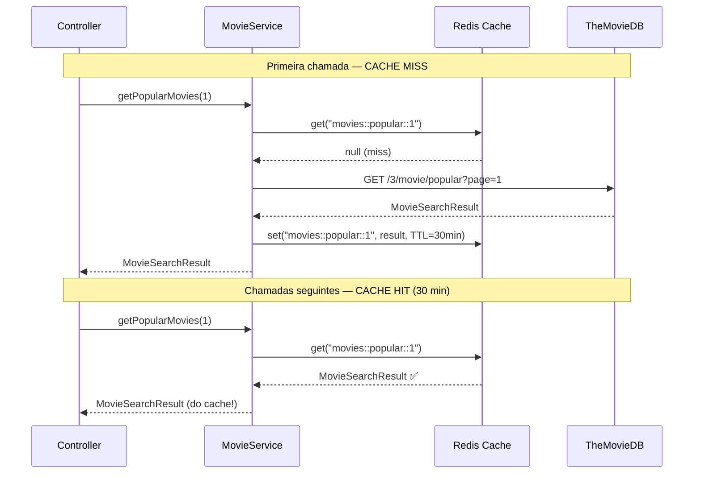

# Slide 10: TODO 7 — Cache com Redis

**Horário:** 13:15 - 15:00 (continuação)

---

## TODO 7: Cachear Filmes Populares com Redis

Filmes populares mudam pouco — não faz sentido chamar o TheMovieDB a cada request.



---

## Implementação

```java
@Service
public class MovieService implements MovieUseCasePort {

    // ...

    @Override
    @Cacheable(value = "movies", key = "'popular::' + #page")
    public MovieSearchResult getPopularMovies(int page) {
        return movieApiPort.getPopularMovies(page);
    }

    @Override
    @CacheEvict(value = "movies", key = "'popular::' + #page")
    public void evictPopularCache(int page) {
        // Chamado quando necessário invalidar
    }
}
```

---

## Configuração do Redis

**Arquivo**: `application.yml`

```yaml
spring:
  data:
    redis:
      host: ${REDIS_HOST:localhost}
      port: ${REDIS_PORT:6379}
  cache:
    type: redis
    redis:
      time-to-live: 30m    # TTL de 30 minutos
      cache-null-values: false
```

**Arquivo**: `config/CacheConfig.java`

```java
@Configuration
@EnableCaching
public class CacheConfig {

    @Bean
    public RedisCacheConfiguration cacheConfiguration() {
        return RedisCacheConfiguration.defaultCacheConfig()
            .entryTtl(Duration.ofMinutes(30))
            .disableCachingNullValues()
            .serializeValuesWith(
                RedisSerializationContext.SerializationPair
                    .fromSerializer(new GenericJackson2JsonRedisSerializer())
            );
    }
}
```

---

## Resultado

```
# Sem cache (cada request = chamada ao TheMovieDB)
GET /api/movies/popular  → 350ms (API externa)
GET /api/movies/popular  → 380ms (API externa)
GET /api/movies/popular  → 420ms (API externa)

# Com cache Redis (primeira chamada armazena, demais leem do cache)
GET /api/movies/popular  → 350ms (API externa + salva no cache)
GET /api/movies/popular  →  12ms ✅ (Redis cache hit!)
GET /api/movies/popular  →   8ms ✅ (Redis cache hit!)
# Após 30 min: cache expira, próxima chamada vai ao TheMovieDB novamente
```

> **Lembra do Dia 6?** `@Cacheable` com Redis — agora cacheando filmes populares do TheMovieDB.
