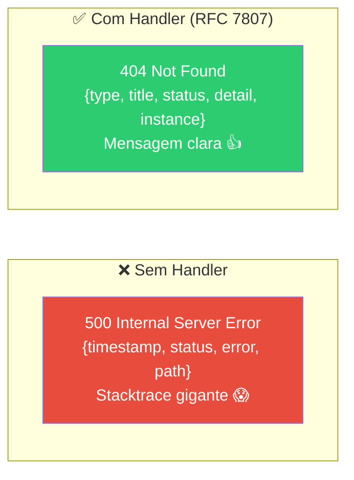

# Slide 11: TODO 8 — GlobalExceptionHandler

**Horário:** 13:15 - 15:00 (continuação)

---

## TODO 8: Tratamento de Erros com Problem Details

Erros devem ser padronizados — o frontend precisa saber o que deu errado.



---

## Implementação

```java
@RestControllerAdvice
public class GlobalExceptionHandler {

    @ExceptionHandler(MovieNotFoundException.class)
    public ResponseEntity<ProblemDetail> handleMovieNotFound(MovieNotFoundException ex) {
        ProblemDetail problem = ProblemDetail.forStatus(HttpStatus.NOT_FOUND);
        problem.setTitle("Filme não encontrado");
        problem.setDetail(ex.getMessage());
        problem.setType(URI.create("https://api.movies.com/errors/movie-not-found"));
        return ResponseEntity.status(HttpStatus.NOT_FOUND).body(problem);
    }

    @ExceptionHandler(MaxFavoritesExceededException.class)
    public ResponseEntity<ProblemDetail> handleMaxFavorites(MaxFavoritesExceededException ex) {
        ProblemDetail problem = ProblemDetail.forStatus(HttpStatus.UNPROCESSABLE_ENTITY);
        problem.setTitle("Limite de favoritos excedido");
        problem.setDetail(ex.getMessage());
        problem.setType(URI.create("https://api.movies.com/errors/max-favorites"));
        return ResponseEntity.status(HttpStatus.UNPROCESSABLE_ENTITY).body(problem);
    }

    @ExceptionHandler(FeignException.class)
    public ResponseEntity<ProblemDetail> handleFeignException(FeignException ex) {
        ProblemDetail problem = ProblemDetail.forStatus(HttpStatus.BAD_GATEWAY);
        problem.setTitle("Erro ao comunicar com serviço externo");
        problem.setDetail("TheMovieDB não respondeu corretamente");
        return ResponseEntity.status(HttpStatus.BAD_GATEWAY).body(problem);
    }

    @ExceptionHandler(MethodArgumentNotValidException.class)
    public ResponseEntity<ProblemDetail> handleValidation(MethodArgumentNotValidException ex) {
        ProblemDetail problem = ProblemDetail.forStatus(HttpStatus.BAD_REQUEST);
        problem.setTitle("Erro de validação");

        Map<String, String> errors = new HashMap<>();
        ex.getBindingResult().getFieldErrors().forEach(error ->
            errors.put(error.getField(), error.getDefaultMessage())
        );
        problem.setProperty("errors", errors);

        return ResponseEntity.badRequest().body(problem);
    }
}
```

---

## Exceções de Negócio

```java
// domain/exception/MovieNotFoundException.java
public class MovieNotFoundException extends RuntimeException {
    public MovieNotFoundException(String message) {
        super(message);
    }
}

// domain/exception/MaxFavoritesExceededException.java
public class MaxFavoritesExceededException extends RuntimeException {
    public MaxFavoritesExceededException(String message) {
        super(message);
    }
}

// domain/exception/DuplicateFavoriteException.java
public class DuplicateFavoriteException extends RuntimeException {
    public DuplicateFavoriteException(String message) {
        super(message);
    }
}
```

---

## Resposta — Formato Problem Details (RFC 7807)

```json
// 404 — Filme não encontrado
{
  "type": "https://api.movies.com/errors/movie-not-found",
  "title": "Filme não encontrado",
  "status": 404,
  "detail": "Filme 999999 não encontrado no TheMovieDB",
  "instance": "/api/movies/999999"
}

// 422 — Limite de favoritos
{
  "type": "https://api.movies.com/errors/max-favorites",
  "title": "Limite de favoritos excedido",
  "status": 422,
  "detail": "Limite de 20 favoritos atingido"
}
```

> **Lembra do Dia 3?** `@ControllerAdvice` + Problem Details — agora com exceções do mundo real.
