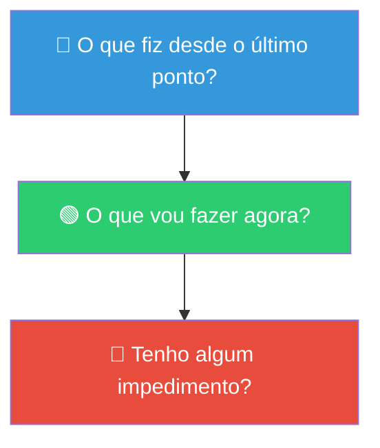

# Slide 12: Daily Scrum Simulado

**Horário:** 13:00 - 13:15

---

## 🗣️ Daily Scrum — Como Funciona

Cada aluno compartilha brevemente com a turma (máximo 2 minutos cada):



---

## Exemplo de Daily

```
👤 João:
   🔵 Fiz: Implementei o MovieApiPort e o TheMovieDbAdapter (TODOs 1-2).
           O Feign Client está consumindo o TheMovieDB com sucesso.
   🟢 Farei: Começar o MovieService (TODO 4) e o Controller (TODO 5).
   🔴 Impedimento: Nenhum.

👤 Maria:
   🔵 Fiz: TODOs 1-5 prontos. O endpoint de busca já funciona no frontend.
   🟢 Farei: Resilience4j (TODO 6) e Cache Redis (TODO 7).
   🔴 Impedimento: Estou tendo erro de CORS no frontend quando chamo 
                    o endpoint de favoritos.

👤 Pedro:
   🔵 Fiz: TODOs 1-3. Estou no TODO 4 (MovieService).
   🟢 Farei: Terminar o Service e começar o Controller.
   🔴 Impedimento: A API Key do TheMovieDB está dando 401. 
                    Preciso verificar se está correta.
```

---

## Dicas para uma Boa Daily

| ✅ Faça | ❌ Não faça |
|---------|-----------|
| Seja breve (2 min máximo) | Não explique o código em detalhes |
| Fale sobre **resultados** | Não diga "estou trabalhando nisso" sem resultado |
| Peça ajuda nos impedimentos | Não tente resolver tudo sozinho em silêncio |
| Use números (TODOs concluídos) | Não fale em porcentagem vaga ("quase pronto") |
| Mencione o que **funciona** | Não liste só problemas |

---

## 📊 Acompanhamento de Progresso

```mermaid
gantt
    title Progresso Esperado — Dia 8
    dateFormat HH:mm
    axisFormat %H:%M

    section TODOs
    TODO 1-2 (Ports + Adapter)     :done, 10:00, 45min
    TODO 3-4 (UseCase + Service)   :active, 11:00, 60min
    TODO 5 (Controller)            :11:30, 30min
    TODO 6 (Resilience4j)          :13:15, 30min
    TODO 7 (Cache Redis)           :13:45, 30min
    TODO 8 (Error Handler)         :14:15, 30min
    TODO 9-10 (Testes)             :14:45, 45min
    TODO 11-12 (Swagger + JWT)     :15:30, 60min
```



> **Não se preocupe se não terminar tudo hoje** — amanhã de manhã há mais 1h30 para finalizar.
