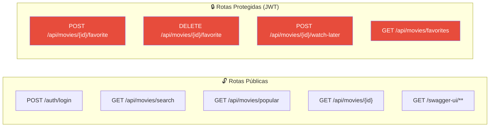

# Slide 14: TODOs 11-12 — Swagger e JWT

**Horário:** 15:00 - 16:30

---

## TODO 11: Documentar Endpoints com OpenAPI/Swagger

```java
@RestController
@RequestMapping("/api/movies")
@Tag(name = "Movies", description = "Operações de busca, favoritos e watch-later")
public class MovieController {

    @Operation(
        summary = "Buscar filmes por título",
        description = "Busca na API do TheMovieDB e retorna resultados paginados"
    )
    @ApiResponses({
        @ApiResponse(responseCode = "200", description = "Busca realizada com sucesso"),
        @ApiResponse(responseCode = "502", description = "Erro ao comunicar com TheMovieDB")
    })
    @GetMapping("/search")
    public ResponseEntity<MovieSearchResult> search(
            @Parameter(description = "Texto de busca", example = "Matrix")
            @RequestParam String query,
            @Parameter(description = "Número da página", example = "1")
            @RequestParam(defaultValue = "1") int page) {
        return ResponseEntity.ok(movieUseCase.searchMovies(query, page));
    }

    @Operation(summary = "Favoritar filme", description = "Adiciona filme aos favoritos (máx 20)")
    @ApiResponses({
        @ApiResponse(responseCode = "200", description = "Filme favoritado"),
        @ApiResponse(responseCode = "401", description = "Não autenticado"),
        @ApiResponse(responseCode = "422", description = "Limite de favoritos excedido")
    })
    @PostMapping("/{id}/favorite")
    public ResponseEntity<Void> addFavorite(
            @Parameter(description = "ID do filme no TheMovieDB") @PathVariable Long id) {
        movieUseCase.addFavorite(id);
        return ResponseEntity.ok().build();
    }
}
```

> Acesse **http://localhost:8080/swagger-ui.html** para ver a documentação.

---

## TODO 12: Proteger Endpoints com JWT



---

## SecurityConfig

```java
@Configuration
@EnableWebSecurity
public class SecurityConfig {

    private final JwtAuthenticationFilter jwtFilter;

    @Bean
    public SecurityFilterChain filterChain(HttpSecurity http) throws Exception {
        return http
            .csrf(csrf -> csrf.disable())
            .sessionManagement(session ->
                session.sessionCreationPolicy(SessionCreationPolicy.STATELESS))
            .authorizeHttpRequests(auth -> auth
                .requestMatchers("/auth/**").permitAll()
                .requestMatchers("/swagger-ui/**", "/v3/api-docs/**").permitAll()
                .requestMatchers(HttpMethod.GET, "/api/movies/**").permitAll()
                .requestMatchers(HttpMethod.POST, "/api/movies/*/favorite").authenticated()
                .requestMatchers(HttpMethod.DELETE, "/api/movies/*/favorite").authenticated()
                .requestMatchers(HttpMethod.POST, "/api/movies/*/watch-later").authenticated()
                .requestMatchers(HttpMethod.GET, "/api/movies/favorites").authenticated()
                .anyRequest().authenticated()
            )
            .addFilterBefore(jwtFilter, UsernamePasswordAuthenticationFilter.class)
            .build();
    }
}
```

---

## AuthController

```java
@RestController
@RequestMapping("/auth")
@Tag(name = "Auth", description = "Autenticação e geração de JWT")
public class AuthController {

    private final JwtUtil jwtUtil;

    @PostMapping("/login")
    @Operation(summary = "Login e geração de token JWT")
    public ResponseEntity<TokenResponse> login(@RequestBody @Valid LoginRequest request) {
        // Validação simplificada (em produção, usaria UserDetailsService + BCrypt)
        if ("admin@movies.com".equals(request.email())
                && "password".equals(request.password())) {
            String token = jwtUtil.generateToken(request.email());
            return ResponseEntity.ok(new TokenResponse(token));
        }
        return ResponseEntity.status(HttpStatus.UNAUTHORIZED).build();
    }
}
```

> **Lembra do Dia 5?** Security + JWT — agora protegendo os endpoints de favoritos e watch-later.
