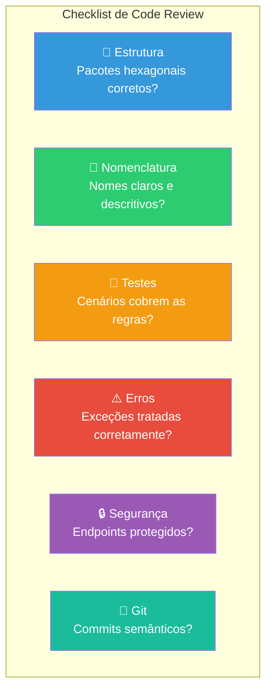

# Slide 15: Code Review entre Colegas

**Horário:** 15:00 - 15:30

---

## 👀 Code Review — O que avaliar

Cada aluno abre um PR e revisa o PR de pelo menos um colega.



---

## Tipos de Comentários em Code Review

| Tipo | Prefixo | Exemplo |
|------|---------|---------|
| Sugestão | `suggestion:` | "suggestion: usar `@Slf4j` do Lombok ao invés de declarar Logger manual" |
| Pergunta | `question:` | "question: por que o fallback retorna null ao invés de lista vazia?" |
| Bloqueio | `blocker:` | "blocker: o Controller está retornando a Entity JPA diretamente" |
| Elogio | `praise:` | "praise: boa separação dos DTOs de request e response!" |
| Nitpick | `nit:` | "nit: variável `m` poderia se chamar `movie`" |

---

## Exemplo de Review Profissional

```java
// 🔴 BLOCKER — Não pode ir para produção assim
@GetMapping("/{id}")
public ResponseEntity<FavoriteEntity> getFavorite(@PathVariable Long id) {
    //                  ^^^^^^^^^^^^^^^^
    // ⚠️ blocker: Está retornando a Entity JPA diretamente.
    // Crie um FavoriteResponse (DTO) e use um Mapper.
    return ResponseEntity.ok(favoriteRepository.findById(id).get());
    //                                                        ^^^
    // ⚠️ blocker: .get() sem verificação lança NoSuchElementException.
    // Use .orElseThrow(() -> new MovieNotFoundException(...))
}
```

```java
// 🟡 SUGGESTION — Melhoria, mas não é bloqueante
@Override
public MovieSearchResult searchMovies(String query, int page) {
    TmdbSearchResponse response = client.searchMovies(query, page);
    // suggestion: considere logar a busca para métricas:
    // log.info("Buscando filmes: query='{}', page={}", query, page);
    return mapper.toMovieSearchResult(response);
}
```

---

## Feedback Construtivo

| ❌ Não faça | ✅ Faça |
|------------|--------|
| "Esse código está errado" | "Aqui temos um risco de NullPointerException. Que tal usar Optional?" |
| "Por que você fez isso?" (tom acusatório) | "question: qual o motivo de cachear por 60min? No requisito pede 30min" |
| Reescrever o código do colega | Sugerir uma alternativa e explicar o porquê |
| Ignorar os acertos | "praise: excelente uso do Circuit Breaker com fallback!" |

> **Na consultoria real**: Code Review é a principal forma de aprendizado coletivo. Não é sobre criticar — é sobre melhorar junto.
