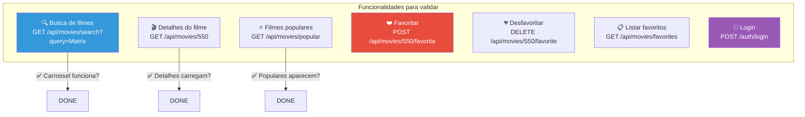

# Slide 16: Frontend TheMovie Web — Validação e Debug

**Horário:** 15:30 - 16:30

---

## 🖥️ Validando com o Frontend

O verdadeiro critério de aceite: **o frontend funciona com o seu backend?**

```bash
# 1. Subir tudo com Docker Compose
docker compose up -d

# 2. Verificar que os serviços estão rodando
docker compose ps

# 3. Abrir no navegador
# http://localhost:3000
```

---

## Checklist de Validação



---

## Problemas Comuns e Soluções

| Problema | Causa Provável | Solução |
|----------|---------------|---------|
| Frontend mostra tela branca | Backend não está rodando | `docker compose logs app` |
| Erro de CORS no console | CORS não configurado | Adicionar `@CrossOrigin` ou `WebMvcConfigurer` |
| Filmes não aparecem | Endpoint não retorna dados | Testar com `curl` primeiro |
| 401 ao favoritar | JWT não configurado ou expirado | Verificar `SecurityConfig` |
| Poster sem imagem | `poster_path` não mapeado | Verificar o Mapper (prefixo `https://image.tmdb.org/t/p/w500`) |
| Timeout no backend | TheMovieDB lento | Verificar Resilience4j retry/timeout |

---

## Debug — Testando Endpoint por Endpoint

```bash
# Testar busca
curl -s http://localhost:8080/api/movies/search?query=Matrix | jq .

# Testar populares
curl -s http://localhost:8080/api/movies/popular | jq .

# Testar detalhes
curl -s http://localhost:8080/api/movies/550 | jq .

# Testar login
curl -s -X POST http://localhost:8080/auth/login \
  -H "Content-Type: application/json" \
  -d '{"email":"admin@movies.com","password":"password"}' | jq .

# Testar favoritar (com JWT)
TOKEN=$(curl -s -X POST http://localhost:8080/auth/login \
  -H "Content-Type: application/json" \
  -d '{"email":"admin@movies.com","password":"password"}' | jq -r .token)

curl -s -X POST http://localhost:8080/api/movies/550/favorite \
  -H "Authorization: Bearer $TOKEN"
```

> **Dica**: resolva primeiro os endpoints de busca e populares — são os que o frontend mais usa no carregamento inicial.
