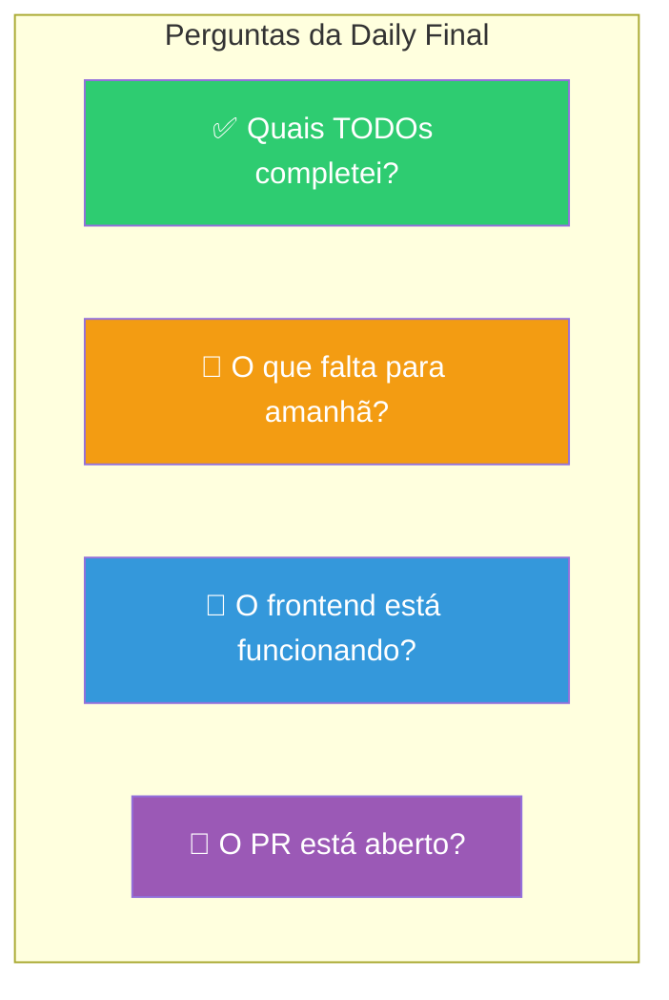
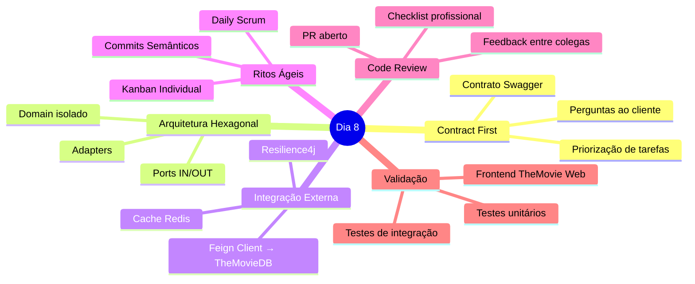

# Slide 17: Daily Final e Encerramento do Dia 8

**Horário:** 16:30 - 17:00

---

## 🗣️ Daily Final — Status de Cada Aluno



---

## Revisão do Dia 8



---

## O que aplicamos de cada dia

| Dia | Conceito | Onde usamos hoje |
|-----|---------|-----------------|
| **Dia 1** | Records | `MovieSummary`, `MovieDetail`, DTOs imutáveis |
| **Dia 2** | JPA + REST | `FavoriteEntity`, `MovieController`, paginação |
| **Dia 3** | Hexagonal + Error Handling | Pacotes `domain/`, `adapter/`, `GlobalExceptionHandler` |
| **Dia 4** | Testes | `MovieServiceTest`, `FavoriteRepositoryIT`, Testcontainers |
| **Dia 5** | Feign + JWT + Swagger | `TheMovieDbClient`, `SecurityConfig`, OpenAPI |
| **Dia 6** | Redis + Flyway | `@Cacheable` populares, migrations SQL |
| **Dia 7** | Podman | `podman-compose.yml` com PostgreSQL, Redis, frontend |

---

## 📋 Para Amanhã (Dia 9)

1. **Manhã (1h30)**: Finalizar TODOs restantes
2. **Refactoring ao vivo**: Instrutores refatoram código de alunos
3. **Apresentação individual**: Demo ao vivo + decisões técnicas (10-15 min)
4. **Soft Skills**: Carreira, consultoria, certificações
5. **Encerramento**: Feedback, retrospectiva, certificados

> **Dica**: Prepare-se para a apresentação — tenha o Podman Compose rodando e saiba explicar suas decisões.

### Commit final do dia:

```bash
git add .
git commit -m "feat: implementar microsserviço de filmes com arquitetura hexagonal"
git push origin feat/movie-service
```
