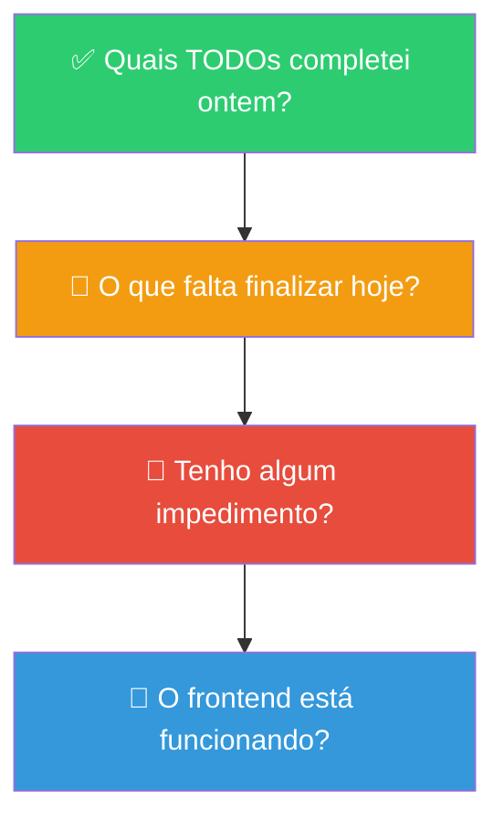
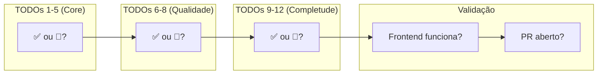

# Slide 1: Abertura e Daily Scrum

**Horário:** 09:00 - 09:15

---

## 🗣️ Daily Scrum — Último Dia!

Cada aluno compartilha seu status rapidamente:

---

## 📊 Checklist — Onde você está?

---

## 🎯 Plano do Dia 9

| Horário | Duração | O que vamos fazer |
|---------|---------|-------------------|
| 09:00 - 09:15 | 15min | Daily Scrum |
| 09:15 - 10:45 | 1h30 | **Finalização** — TODOs restantes |
| 10:45 - 11:00 | 15min | ☕ Coffee Break |
| 11:00 - 11:45 | 45min | **Refactoring ao vivo** — código de alunos |
| 11:45 - 12:00 | 15min | Preparar apresentação |
| 12:00 - 13:00 | 1h | 🍽️ Almoço |
| 13:00 - 13:45 | 45min | **Soft Skills** para consultoria |
| 13:45 - 15:15 | 1h30 | **Apresentações individuais** |
| 15:15 - 15:45 | 30min | Feedback dos instrutores |
| 15:45 - 16:15 | 30min | Retrospectiva + próximos passos |
| 16:15 - 17:00 | 45min | 🎓 Encerramento + certificados |

> **Prioridade da manhã**: garantir que o frontend funciona com pelo menos busca, detalhes e populares.
