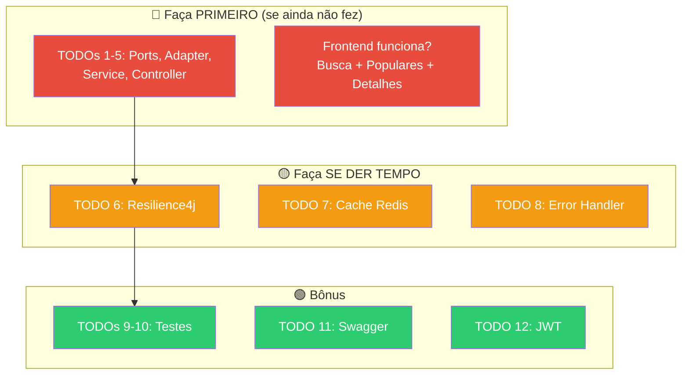

# Slide 2: Finalização do Projeto

**Horário:** 09:15 - 10:45

---

## 🔧 Finalização — Últimos Ajustes

Esta é a última janela de desenvolvimento. Priorize pelo impacto:



---

## Checklist Final Antes da Apresentação

```
□ docker compose up -d  → todos os containers rodando?
□ mvn spring-boot:run   → aplicação sobe sem erros?
□ curl /api/movies/popular → retorna JSON com filmes?
□ http://localhost:3000  → frontend carrega e mostra filmes?
□ Buscar "Matrix"        → resultados aparecem?
□ Clicar em um filme     → detalhes carregam?
□ Favoritar              → coração fica preenchido?
□ git add + commit + push → PR atualizado?
```

---

## Problemas de Última Hora — Soluções Rápidas

| Sintoma | Solução |
|---------|---------|
| `docker compose up` falha | `docker compose down -v` e subir de novo |
| App não conecta no PostgreSQL | Verificar `SPRING_DATASOURCE_URL` no compose |
| CORS bloqueando o frontend | Adicionar `@CrossOrigin("*")` no Controller |
| TheMovieDB retorna 401 | Verificar API Key no `application.yml` |
| Flyway falha na migration | `docker compose down -v` limpa o volume do banco |
| Redis connection refused | Verificar se o container Redis está rodando |

---

## Dica: Não Quebre o que Funciona

```bash
# Antes de qualquer mudança, verifique que está verde
mvn test

# Faça a mudança

# Verifique de novo
mvn test

# Se quebrou → git stash ou git checkout -- arquivo
```

> **Ciclo seguro**: Green → Change → Green → Commit
