# Slide 2: Finalização do Projeto

**Horário:** 09:15 - 10:45

---

## 🔧 Finalização — Últimos Ajustes

Esta é a última janela de desenvolvimento. Priorize pelo impacto:

```mermaid
graph TD
    subgraph "🔴 Faça PRIMEIRO (se ainda não fez)"
        P1["TODOs 1-5: Ports, Adapter,<br/>Service, Controller"]
        P2["Frontend funciona?<br/>Busca + Populares + Detalhes"]
    end

    subgraph "🟡 Faça SE DER TEMPO"
        P3["TODO 6: Resilience4j"]
        P4["TODO 7: Cache Redis"]
        P5["TODO 8: Error Handler"]
    end

    subgraph "🟢 Bônus"
        P6["TODOs 9-10: Testes"]
        P7["TODO 11: Swagger"]
        P8["TODO 12: JWT"]
    end

    P1 --> P3 --> P6

    style P1 fill:#e74c3c,color:#fff
    style P2 fill:#e74c3c,color:#fff
    style P3 fill:#f39c12,color:#fff
    style P4 fill:#f39c12,color:#fff
    style P5 fill:#f39c12,color:#fff
    style P6 fill:#2ecc71,color:#fff
    style P7 fill:#2ecc71,color:#fff
    style P8 fill:#2ecc71,color:#fff
```



---

## Checklist Final Antes da Apresentação

```
□ docker compose up -d  → todos os containers rodando?
□ mvn spring-boot:run   → aplicação sobe sem erros?
□ curl /api/movies/popular → retorna JSON com filmes?
□ http://localhost:3000  → frontend carrega e mostra filmes?
□ Buscar "Matrix"        → resultados aparecem?
□ Clicar em um filme     → detalhes carregam?
□ Favoritar              → coração fica preenchido?
□ git add + commit + push → PR atualizado?
```

---

## Problemas de Última Hora — Soluções Rápidas

| Sintoma | Solução |
|---------|---------|
| `docker compose up` falha | `docker compose down -v` e subir de novo |
| App não conecta no PostgreSQL | Verificar `SPRING_DATASOURCE_URL` no compose |
| CORS bloqueando o frontend | Adicionar `@CrossOrigin("*")` no Controller |
| TheMovieDB retorna 401 | Verificar API Key no `application.yml` |
| Flyway falha na migration | `docker compose down -v` limpa o volume do banco |
| Redis connection refused | Verificar se o container Redis está rodando |

---

## Dica: Não Quebre o que Funciona

```bash
# Antes de qualquer mudança, verifique que está verde
mvn test

# Faça a mudança

# Verifique de novo
mvn test

# Se quebrou → git stash ou git checkout -- arquivo
```

> **Ciclo seguro**: Green → Change → Green → Commit
