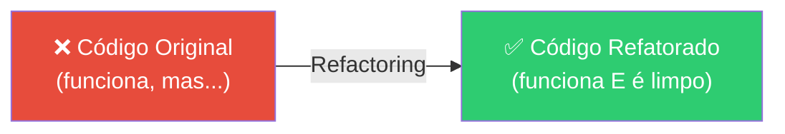

# Slide 3: Refactoring ao Vivo

**Horário:** 11:00 - 11:45

---

## 🔧 Refactoring ao Vivo — Antes e Depois

Os instrutores selecionam trechos de código dos alunos (com permissão) e refatoram ao vivo.



---

## Exemplo 1: God Method no Controller

```java
// ❌ ANTES — Controller fazendo tudo
@PostMapping("/{id}/favorite")
public ResponseEntity<?> addFavorite(@PathVariable Long id) {
    // Buscar filme no TheMovieDB
    var response = restTemplate.getForObject(
        "https://api.themoviedb.org/3/movie/" + id + "?api_key=" + apiKey,
        Map.class
    );
    if (response == null) {
        return ResponseEntity.notFound().build();
    }

    // Verificar limite
    var count = favoriteRepository.count();
    if (count >= 20) {
        return ResponseEntity.status(422).body("Limite excedido");
    }

    // Salvar
    var favorite = new FavoriteEntity();
    favorite.setMovieId(id);
    favorite.setTitle((String) response.get("title"));
    favoriteRepository.save(favorite);

    return ResponseEntity.ok().build();
}
```

```java
// ✅ DEPOIS — Controller delega, Service orquestra
@PostMapping("/{id}/favorite")
public ResponseEntity<Void> addFavorite(@PathVariable Long id) {
    movieUseCase.addFavorite(id);
    return ResponseEntity.ok().build();
}
```

> O Controller tem **1 linha** de lógica. Toda a regra está no Service.

---

## Exemplo 2: Tratamento de Erros Genérico

```java
// ❌ ANTES — catch genérico que engole erros
try {
    var movie = movieApiPort.getMovieDetails(movieId);
    return movie;
} catch (Exception e) {
    System.out.println("Erro: " + e.getMessage());
    return null;  // 💥 NullPointerException no próximo acesso
}
```

```java
// ✅ DEPOIS — exceções específicas + logging estruturado
public MovieDetail getMovieDetails(Long movieId) {
    try {
        var movie = movieApiPort.getMovieDetails(movieId);
        boolean isFavorite = favoriteRepository.existsByMovieId(movieId);
        return movie.withFavorite(isFavorite);
    } catch (FeignException.NotFound ex) {
        throw new MovieNotFoundException("Filme " + movieId + " não encontrado");
    }
    // Outras exceções propagam para o GlobalExceptionHandler
}
```

---

## Exemplo 3: Falta de DTOs

```java
// ❌ ANTES — retornando Map cru da API externa
@GetMapping("/{id}")
public ResponseEntity<Map<String, Object>> getDetails(@PathVariable Long id) {
    Map<String, Object> raw = theMovieDbClient.getMovieRaw(id);
    return ResponseEntity.ok(raw);  // Frontend recebe JSON imprevisível
}
```

```java
// ✅ DEPOIS — DTO tipado e controlado
@GetMapping("/{id}")
public ResponseEntity<MovieDetailResponse> getDetails(@PathVariable Long id) {
    MovieDetail detail = movieUseCase.getMovieDetails(id);
    return ResponseEntity.ok(MovieDetailResponse.from(detail));
}
```

> **Aprendizado**: O frontend precisa de um **contrato estável**. DTOs garantem isso.

---

## Discussão Aberta

- O que vocês fariam diferente?
- Alguém resolveu de outra forma?
- Alguma dúvida sobre as refatorações?

> **Regra do refactoring**: sempre com testes passando — Green → Refactor → Green.
