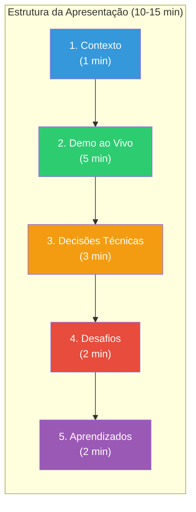

# Slide 4: Preparação das Apresentações

**Horário:** 11:45 - 12:00

---

## 🎤 Preparando sua Apresentação (10-15 min)

Cada aluno apresentará individualmente. Use esta estrutura:



---

## O que mostrar em cada parte

### 1. Contexto (1 min)
- "Recebi o contrato Swagger com X endpoints"
- "O frontend TheMovie Web consome esses endpoints"
- "Meu objetivo foi implementar o backend com arquitetura hexagonal"

### 2. Demo ao Vivo (5 min)
- Abrir http://localhost:3000
- Mostrar filmes populares carregando
- Buscar um filme ("Matrix")
- Abrir detalhes de um filme
- Favoritar e mostrar na lista de favoritos
- **Dica**: tenha tudo rodando ANTES da apresentação

### 3. Decisões Técnicas (3 min)
- Mostrar a estrutura de pacotes (hexagonal)
- Mostrar um trecho relevante: o Port, o Adapter ou o Service
- Explicar uma decisão: "optei por cachear X porque..."

### 4. Desafios (2 min)
- "Tive dificuldade com..."
- "Resolvi da seguinte forma..."
- "Se tivesse mais tempo, faria..."

### 5. Aprendizados (2 min)
- O que levaria para o dia a dia?
- O que mudou na forma de programar?

---

## Checklist Pré-Apresentação

```
□ Podman Compose rodando (podman compose up -d)
□ Backend rodando e respondendo
□ Frontend acessível em localhost:3000
□ Filmes carregam na tela
□ IDE aberta no projeto (para mostrar código)
□ Terminal pronto (para mostrar logs, se necessário)
```

---

## Dicas para uma Boa Apresentação

| ✅ Faça | ❌ Não faça |
|---------|-----------|
| Mostre o que **funciona** | Não peça desculpas pelo que falta |
| Fale sobre **decisões** | Não leia o código linha por linha |
| Seja breve e objetivo | Não ultrapasse o tempo (10-15 min) |
| Responda "não sei" quando não souber | Não invente respostas |
| Pratique antes (1x pelo menos) | Não improvise na hora |

> **Dica de ouro**: Se algo der errado na demo, mantenha a calma. Mostre os logs, explique o que deveria acontecer e siga em frente.
